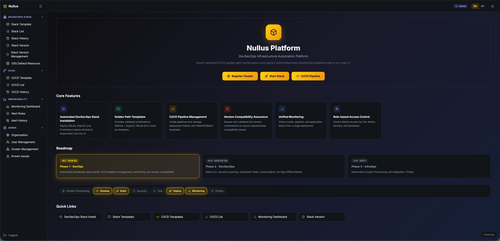
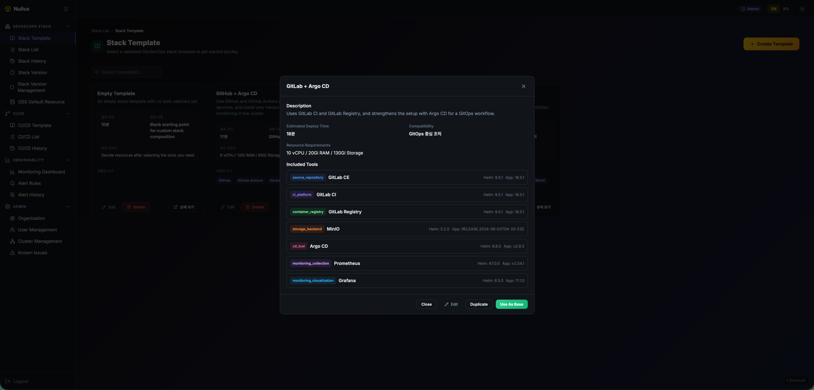
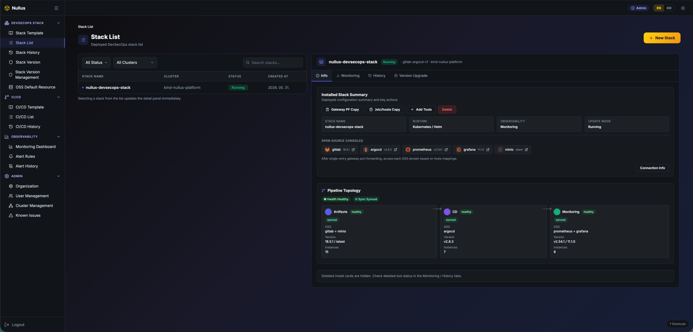
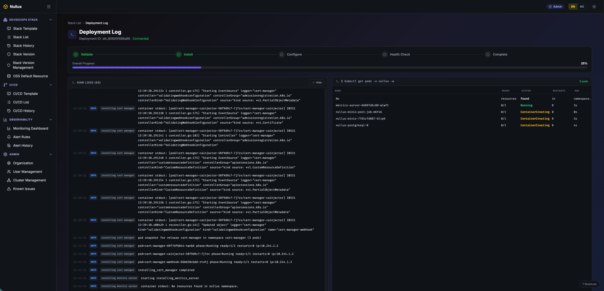

# Nullus Platform

Kubernetes 기반 DevSecOps 자동화 오픈소스 플랫폼

## 개요

Nullus는 DevOps 엔지니어가 검증된 CI/CD 베스트 프랙티스 조합을 선택하고, 웹 UI에서 노코드로 설정한 후 한 번의 버튼 클릭으로 Kubernetes 클러스터에 전체 DevSecOps 스택을 자동 설치할 수 있도록 하는 오픈소스 플랫폼입니다.

Nullus는 "클러스터 준비 -> 스택 선택/설치 -> 배포 관측"의 흐름을 하나의 일관된 사용자 경험으로 제공하는 데 집중합니다. 플랫폼 팀은 표준화된 템플릿과 버전 호환성 정책을 운영하고, 개발 팀은 반복적인 인프라 구성 작업 없이 검증된 파이프라인을 빠르게 사용할 수 있습니다.

사내에서 여러 프로젝트가 병렬로 운영되면 프로젝트별 Kubernetes 클러스터에 파이프라인을 반복 설치해야 하고, 팀마다 설치 절차와 운영 방식이 달라 표준화가 어려워집니다. 또한 GitLab, Argo CD, Prometheus, Grafana, MinIO 등 OSS 조합은 버전 호환성과 의존 관계를 함께 검토해야 해서 "어떤 조합이 실제로 안전하게 동작하는지"를 판단하는 데 많은 시간이 소요됩니다.

Nullus는 이 문제를 해결하기 위해 검증된 OSS 조합을 Golden Path 템플릿으로 제공하고, 설치/연동 절차를 UI 기반 워크플로우로 통일하며, 배포 진행률과 로그를 단일 화면에서 추적할 수 있게 설계되었습니다. 이를 통해 신규 프로젝트 온보딩 시간을 줄이고, 환경별 편차로 인한 장애 가능성을 낮추며, 플랫폼 팀의 반복 작업을 자동화합니다.

> 참고: 현재 스택 자동화는 GitLab 기반 워크플로우를 중심으로 구현되어 있습니다. GitHub 호환성은 Phase 2에서 추가할 예정이며, CI/CD 영역은 현재 안정화 작업을 계속 진행 중입니다.

### 주요 기능

- **Golden Path 템플릿 카탈로그**: 검증된 OSS 조합을 템플릿으로 제공해 설치 의사결정 시간을 줄입니다.
- **노코드 스택 설치 워크플로우**: UI 기반 단계형 설정으로 DevSecOps 스택을 배포합니다.
- **스택 상태/이력 가시화**: 스택 목록, 상태, 설치 이력, 핵심 구성 정보를 한 화면에서 확인합니다.
- **실시간 배포 로그 추적**: 단계별 진행률과 로그 스트림으로 설치/장애 상황을 빠르게 파악합니다.
- **클러스터 등록 및 연결 검증**: 다중 Kubernetes 클러스터를 등록하고 API 기반 연결 상태를 검증합니다.
- **버전 호환성 관리**: 검증된 도구 버전 조합을 기준으로 배포 안정성을 높입니다.
- **통합 관측/알림 관리**: 대시보드와 알림 규칙 관리로 운영 상태를 지속적으로 모니터링합니다.
- **역할 기반 접근 제어(RBAC)**: Admin/DevOps/Developer 권한 분리로 기능 접근 범위를 제어합니다.

### 핵심 가치

- **Golden Path 템플릿**: 검증된 CI/CD 도구 조합으로 선택의 어려움 제거
- **노코드 설정**: 웹 UI의 체크박스/드롭다운으로 5단계 설정 워크플로우
- **자동 설치**: 한 번의 Deploy로 전체 스택 자동 설치 및 연동
- **버전 호환성 보장**: 테스트 완료된 도구 버전 조합만 제공

## 프로젝트 미리보기

### 1) 메인 대시보드



- Nullus의 핵심 가치(자동 설치, Golden Path, 모니터링, RBAC)를 한 화면에서 요약합니다.
- 빠른 시작 액션(클러스터 등록, 스택 시작, CI/CD 진입)으로 초기 온보딩 시간을 줄입니다.

### 2) Stack Template 카탈로그



- GitLab/Argo CD/Prometheus/Grafana/MinIO 같은 도구 조합을 템플릿으로 표준화합니다.
- 예상 배포 시간, 리소스 요구사항, Helm/App 버전을 함께 보여 의사결정을 돕습니다.

### 3) Stack List 및 설치 결과 요약



- 배포된 스택 목록과 상태(Running 등)를 확인하고, 선택한 스택의 상세 정보를 우측 패널에서 즉시 조회합니다.
- OSS 콘솔 링크, 토폴로지, 설치 요약 정보를 제공해 운영 가시성을 높입니다.

### 4) 실시간 설치 로그/진행 상태



- Validate -> Install -> Configure -> Health Check -> Complete 단계로 설치 파이프라인 진행률을 추적합니다.
- Raw 로그와 kubectl 스냅샷을 동시에 노출해 문제 진단 속도를 개선합니다.

## 기술 스택

- **Frontend**: React 19 + TypeScript + Vite + Tailwind CSS 4 + shadcn/ui
- **Backend**: Go 1.24+ (Echo v4) + PostgreSQL 18+
- **Auth**: Keycloak OIDC + JWT + 3단계 RBAC (Admin/DevOps/Developer)
- **Infrastructure**: Docker, Docker Compose, Helm v3, Kubernetes 1.26+, kind (로컬 테스트)

## Quick Start

### 요구사항

- Docker + Docker Compose
- Go 1.24+
- Node.js 22+
- kind (K8s 로컬 테스트 시)

### 1. 인프라 기동

```bash
./scripts/runbook_local.sh up
```

Docker Compose로 PostgreSQL(:5433), Redis(:6380), MinIO(:9000/:9001), Keycloak(:8180)을 기동하고 DB 마이그레이션을 실행합니다.

### 환경변수

```bash
cp .env.example .env.dev
# .env.dev는 make run 시 자동 로드 (ENCRYPTION_KEY 포함)
```

### 샘플데이터 마이그레이션 (DevSecOps Stack 목업)

`000023_seed_devsecops_stack_mock` 마이그레이션으로 스택 목록/이력 화면 검증용 샘플 데이터를 추가할 수 있습니다.

```bash
# 1) 로컬 인프라 실행 (PostgreSQL 포함)
make dev-up

# 2) 최신 마이그레이션 전체 적용 (000023 포함)
make migrate-up

# 3) 샘플 데이터 확인
docker compose -f docker-compose.dev.yaml exec postgres \
  psql -U nullus -d nullus \
  -c "SELECT id, name, state, namespace FROM stacks WHERE id LIKE 'mock-devsecops-%' ORDER BY id;"
```

롤백이 필요하면 마지막 마이그레이션 1개를 되돌립니다.

```bash
make migrate-down
```

### 2. 백엔드 실행

```bash
make run
```

`.env.dev`에서 환경변수(`ENCRYPTION_KEY` 포함)를 자동 로드합니다.
수동 실행 시:

```bash
ENCRYPTION_KEY="nullus-dev-key-32bytes-padding!!" go run ./cmd/api
```

API 서버: `http://localhost:8090`. `ENCRYPTION_KEY`는 kubeconfig 암호화에 사용되며 32바이트 필수.

설정 파일: `configs/config.yaml`

### 3. 프론트엔드 개발 서버

```bash
cd web && npm run dev
```

Vite 개발 서버가 `http://localhost:5173`에서 실행됩니다.

### 4. K8s 테스트 클러스터 (선택)

기본 클러스터 구조(dual kind):

- `nullus-platform(플랫폼 설치 클러스터)`: control-plane 1 + worker(data-plane) 1
- `nullus-develop(애플리케이션 배포 클러스터)`: control-plane 1 + worker(data-plane) 1
- Kubernetes 버전: `kindest/node:v1.35.1`

생성(권장):

```bash
./scripts/runbook_local.sh kind-up
kind get clusters
```

상태 확인:

```bash
kubectl get nodes --context kind-nullus-platform
kubectl get nodes --context kind-nullus-develop
```

삭제:

```bash
./scripts/runbook_local.sh kind-down
```

직접 kind 명령으로 생성하려면 아래를 사용할 수 있습니다.

```bash
kind create cluster --config scripts/kind-cluster.yaml
```

상세 가이드: [kind E2E 테스트 가이드](./docs/guides/kind-e2e-testing-guide.md)

### 5. 클러스터 등록/검증 가이드 (팀 공통)

스택 설치 전에 반드시 클러스터를 등록하고 연결 검증(Verify)을 완료하세요.

#### 사전 조건

- API 서버가 실행 중이어야 합니다 (`http://localhost:8090/health` = healthy)
- `ENCRYPTION_KEY`가 **32바이트**로 설정되어 있어야 kubeconfig 저장/복호화가 정상 동작합니다

#### A) UI에서 등록 (권장)

1. `http://localhost:5173` 접속 → **Cluster Management** 이동
2. **Register Cluster** 클릭
3. 아래 값 입력
   - Name: 예) `kind-nullus-platform-fresh`
   - Type: `Kubernetes`(UI) / 백엔드 기준 `pipeline` 또는 `target`
   - kubeconfig: 파일 업로드 또는 YAML 붙여넣기
4. 저장 후 상세 패널에서 **Verify Connection** 실행
5. 상태가 `Connected`로 바뀌면 스택 설치 진행

#### B) API로 등록 (자동화/스크립트용)

kind 클러스터 예시:

```bash
kind get kubeconfig --name nullus-platform > /tmp/nullus-platform.kubeconfig

curl -X POST http://localhost:8090/api/v1/admin/clusters \
  -H 'Content-Type: application/json' \
  -d "$(jq -n \
    --arg name 'kind-nullus-platform-fresh' \
    --arg type 'pipeline' \
    --arg org '11111111-1111-1111-1111-111111111111' \
    --arg kubeconfig "$(cat /tmp/nullus-platform.kubeconfig)" \
    '{name:$name,type:$type,org_id:$org,kubeconfig:$kubeconfig}')"
```

응답으로 받은 `id`를 사용해 연결 검증:

```bash
curl -X POST http://localhost:8090/api/v1/admin/clusters/<cluster-id>/verify
```

성공 시 응답 예시:

```json
{"status":"connected","version":"v1.35.1"}
```

#### C) 검증 체크리스트

- `GET /api/v1/admin/clusters`에서 `connection_status=connected`
- `GET /api/v1/admin/clusters/:id/namespaces`가 정상 조회
- 스택 생성 시 해당 `cluster_id` 선택 가능

#### D) 운영 팁 / 자주 막히는 지점

- Verify 502/연결 실패: kubeconfig의 API endpoint가 폐기된 kind 포트를 가리키는 경우가 많습니다. 클러스터 재생성 후 kubeconfig를 다시 등록하세요.
- `kubeconfig is not registered for this cluster`: 등록 시 kubeconfig를 비워서 저장한 경우입니다.
- 클러스터 삭제 409(`CLUSTER_IN_USE`): 해당 클러스터를 참조하는 스택/파이프라인을 먼저 삭제해야 합니다.

## 테스트 계정

### 프론트엔드 (Mock Auth, development 모드)

| 역할 | 이메일 | 비밀번호 | 홈 페이지 |
|------|--------|----------|-----------|
| Admin | admin@nullus.dev | admin123 | /admin/organization |
| DevOps | devops@nullus.dev | devops123 | /stack/templates |
| Developer | developer@nullus.dev | developer123 | /cicd/developer-deploy |

### Keycloak OIDC (production 모드)

| 역할 | 이메일 | 비밀번호 |
|------|--------|----------|
| Admin | admin@nullus.io | nullus123! |
| DevOps | devops@nullus.io | nullus123! |
| Developer | dev@nullus.io | nullus123! |

### 인프라 서비스

| 서비스 | URL | 사용자 | 비밀번호 |
|--------|-----|--------|----------|
| PostgreSQL | localhost:5433 | nullus | nullus_dev |
| Keycloak Admin | localhost:8180 | admin | admin |
| MinIO Console | localhost:9001 | nullus | nullus_dev |
| Redis | localhost:6380 | - | - |

## 테스트

### Go 단위/통합 테스트

```bash
go test ./... -count=1
```

### React 단위 테스트 (Vitest)

```bash
cd web && npx vitest run
```

### E2E 테스트 (Playwright)

프론트엔드 개발 서버(`localhost:5173`)와 API 서버(`localhost:8090`)가 실행 중이어야 합니다.

```bash
cd web && npx playwright test --reporter=list
```

### API Smoke Test

```bash
./scripts/runbook_local.sh smoke
```

## API 엔드포인트

API 서버: `http://localhost:8090`

### Admin (`/api/v1/admin`)

| 메서드 | 경로 | 설명 |
|--------|------|------|
| GET | `/admin/organization` | 현재 Organization 조회 |
| PATCH | `/admin/organization` | Organization 수정 |
| POST | `/admin/orgs` | Organization 생성 |
| GET/POST | `/admin/clusters` | 클러스터 목록 / 등록 |
| GET/PATCH/DELETE | `/admin/clusters/:id` | 클러스터 상세 / 수정 / 삭제 |
| POST | `/admin/clusters/:id/verify` | 클러스터 연결 검증 (K8s API 실연동) |
| GET/POST | `/admin/organizations/:orgId/members` | 멤버 목록 / 초대 (기존 사용자 추가 포함) |
| DELETE/PATCH | `/admin/organizations/:orgId/members/:id` | 멤버 제거 / 역할 변경 |
| GET | `/admin/users/search?email=` | 기존 사용자 검색 |
| GET | `/admin/clusters/:id/namespaces` | 클러스터 네임스페이스 목록 (K8s API) |
| GET | `/admin/known-issues` | Known Issues 목록 |
| GET | `/admin/audit-logs` | 감사 로그 |
| GET/POST | `/admin/notifications/configs` | 알림 설정 |
| GET | `/admin/notifications/history` | 알림 이력 |

### Stack (`/api/v1/stacks`)

| 메서드 | 경로 | 설명 |
|--------|------|------|
| GET/POST | `/stacks` | 스택 목록 / 생성 (namespace 지정 가능) |
| DELETE | `/stacks/:id` | 스택 삭제 (Helm uninstall 포함) |
| GET | `/stacks/templates` | Golden Path 템플릿 목록 |
| GET | `/stacks/compatibility` | 도구 호환성 매트릭스 |
| GET | `/stacks/resource-defaults` | OSS별 리소스 request/limit 기본값 목록 |
| POST | `/stacks/resource-defaults` | OSS 리소스 request/limit 업서트 (`tool_key` 기준, idempotent) |
| POST | `/stacks/:id/deploy` | 스택 배포 (Helm SDK) |
| GET | `/stacks/:id/status` | 배포 상태 조회 |

### CI/CD (`/api/v1/cicd`)

| 메서드 | 경로 | 설명 |
|--------|------|------|
| GET | `/cicd/templates` | CI/CD 파이프라인 템플릿 |
| GET/POST | `/cicd/pipelines` | 파이프라인 목록 / 생성 |
| POST | `/cicd/pipelines/:id/deploy` | 파이프라인 배포 |
| GET | `/cicd/deployments` | 배포 이력 |
| GET | `/cicd/app-templates` | Developer Self-Service 앱 템플릿 |
| POST | `/cicd/deploy-app` | 앱 배포 |

### Observability (`/api/v1/observability`)

| 메서드 | 경로 | 설명 |
|--------|------|------|
| GET | `/observability/dashboard` | 모니터링 대시보드 |
| GET/POST | `/observability/alert-rules` | 알림 규칙 목록 / 생성 |
| PATCH/DELETE | `/observability/alert-rules/:id` | 알림 규칙 수정 / 삭제 |
| GET | `/observability/alert-history` | 알림 이력 |

### 기타

| 메서드 | 경로 | 설명 |
|--------|------|------|
| GET | `/health` | 서버 + DB 상태 |
| WS | `/ws/deployments/:id/logs` | 배포 로그 실시간 스트리밍 |

## 기능 구현 현황 (PRD v1.3 Phase 1)

| 기능 | 설명 | 상태 |
|------|------|------|
| F0 | Organization 설정 등록 (Postgres Repository, CRUD API) | 구현됨 |
| F1 | K8S Cluster 등록/검증 (client-go, kubeconfig 암호화) | 구현됨 |
| F2 | 노코드 DevSecOps Stack 설정 UI (React Wizard, RHF+Zod) | 구현됨 |
| F3 | Golden Path 템플릿 (템플릿 카탈로그, Postgres Seed) | 구현됨 |
| F4 | 스택 자동 설치/배포/이력 (Helm DAG, rollback, WS 로그) | 구현됨 |
| F5 | CI/CD Pipeline 템플릿 (템플릿, Manifest Generator) | 안정화 진행 중 |
| F6 | CI/CD Pipeline 배포/이력 (Manifest Applier, 배포 추적) | 안정화 진행 중 |
| F7 | 모니터링/알림 관리 (Dashboard, Alert CRUD) | 구현됨 |
| F8 | 버전 호환성 관리 (호환성 매트릭스, 검증 API) | 구현됨 |
| F9 | UI 권한 체계 (OIDC/JWT, 라우트 RBAC) | 구현됨 |
| F10 | 리소스 예상량 계산 (리소스 계산, 비용 추정) | 구현됨 |
| F11 | 기존 사용자 추가 (멀티 조직 멤버십, 이메일 검색) | 구현됨 |
| F12 | 네임스페이스 선택/생성 (K8s API 조회, 스택별 namespace) | 구현됨 |

전체 기능 명세: [PRD v1.3](./docs/10_제품기획/nullus_PRD_1.3.md)

## 프로젝트 구조

```
nullus/
├── cmd/api/                # API 서버 진입점
├── configs/                # 설정 파일 (config.yaml)
├── db/migrations/          # DB 마이그레이션
├── deploy/helm/nullus/     # Helm 차트
├── internal/               # 내부 모듈 (Clean Architecture)
│   ├── admin/              # 조직/클러스터/사용자 관리
│   ├── auth/               # Keycloak OIDC/JWT/RBAC
│   ├── cicd/               # CI/CD 파이프라인
│   ├── observability/      # 모니터링/알림
│   ├── stack/              # DevSecOps 스택 설치
│   └── shared/             # 공유 미들웨어, audit, 알림
├── pkg/crypto/             # AES-256 암호화
├── scripts/                # 운영 스크립트 (runbook, keycloak, kind)
├── web/                    # React 프론트엔드
│   ├── src/features/       # 기능별 모듈 (admin, auth, cicd, observability, stack)
│   └── e2e/                # Playwright E2E 테스트
├── e2e/                    # Go E2E 테스트
├── CHANGELOG.md            # 변경 이력
├── docs/70_전략/ROADMAP.md # 로드맵
└── Makefile                # 개발 명령어
```

## 아키텍처

### 설계 원칙

**Modular Monolith**: 모놀리스로 시작하되, 모듈 경계를 명확히 하여 향후 마이크로서비스로 전환 가능하도록 설계합니다.

**Clean Architecture**: 의존성은 항상 안쪽(도메인)을 향합니다.

```
[Handler/Controller] → [UseCase/Service] → [Domain/Entity]
        ↓                      ↓
  [Repository Interface]  [Domain Logic]
        ↓
  [Repository Impl (DB/API)]
```

**Domain-Driven Design (DDD)**: 5개 Bounded Context로 구성됩니다.

| Context | 모듈 | 핵심 기능 |
|---------|------|----------|
| Stack Management | `internal/stack/` | DevSecOps 스택 설치/관리 (Helm SDK) |
| CI/CD Pipeline | `internal/cicd/` | 파이프라인 템플릿/배포 |
| Observability | `internal/observability/` | Prometheus 대시보드, 알림 |
| Organization | `internal/admin/` | 조직/사용자/클러스터 관리, 감사 로그 |
| Auth | `internal/auth/` | Keycloak OIDC, JWT, RBAC, SSO 프로비저닝 |

## 역할 체계

| 역할 | API 접근 | 주요 기능 |
|------|---------|----------|
| Admin | 전체 | 조직 설정, 사용자 관리, 클러스터 등록/검증, Known Issues |
| DevOps | stacks, cicd, observability | 스택 설치/배포, 파이프라인 관리, 알림 규칙 CRUD |
| Developer | cicd, observability (읽기) | 파이프라인 배포, 모니터링 대시보드 조회 |

## Helm 차트

```bash
# 린트
helm lint deploy/helm/nullus/

# 템플릿 확인
helm template nullus deploy/helm/nullus/ --values deploy/helm/nullus/values.yaml
```

## 라이선스

Apache License 2.0

## 커뮤니티

- **GitHub**: [cloud-nullus/nullus](https://github.com/cloud-nullus/nullus)
- **Issues**: 기능 요청 및 버그 리포트는 GitHub Issues를 이용
- **Discussions**: 아이디어 및 질문은 GitHub Discussions에서 논의

## 참고 문서

- [CHANGELOG.md](./CHANGELOG.md) — 변경 이력
- [ROADMAP.md](./ROADMAP.md) — 개발 로드맵
- [CLAUDE.md](./CLAUDE.md) — 아키텍처 원칙 및 개발 규칙
- [kind E2E 테스트 가이드](./docs/guides/kind-e2e-testing-guide.md) — K8s 클러스터 대상 시나리오 테스트
- [PRD v1.3](./docs/10_제품기획/nullus_PRD_1.3.md) — 제품 요구사항 명세
- [API 설계](./docs/20_아키텍처/Nullus_API_설계.md) — API 상세 설계
- [로컬 개발환경 세팅](./docs/50_운영/Nullus%20로컬%20개발환경%20세팅%20가이드.md) — 개발 환경 설정
