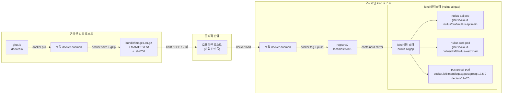

# Nullus Air-Gap 아키텍처
> 오프라인 kind 클러스터 배포 시스템의 데이터 흐름, 컴포넌트 구성, 이미지 전달 경로

## 목적과 범위

인터넷이 차단된 환경에서 Nullus Platform을 kind 클러스터 위에 구동하는 최소 구성을 정의한다. 핵심 원칙은 두 가지다.

1. **번들 불변성**: 온라인 머신에서 생성한 `images.tar.gz`와 Helm 차트 파일은 변경 없이 오프라인 환경으로 반입된다.
2. **단일 레지스트리 경유**: 모든 컨테이너 이미지는 `localhost:5001`(registry:2)을 통해 클러스터 노드에 전달된다. 클러스터 노드는 외부 레지스트리에 직접 접근하지 않는다.

이 문서는 개발·검증 목적 단일 호스트 kind 환경을 설명한다. 프로덕션 HA 구성은 범위 밖이다.

---

## 데이터 흐름 다이어그램



---

## 컴포넌트 표

| 컴포넌트 | 목적 | 이미지 | 포트 | 의존성 |
|----------|------|--------|------|--------|
| **nullus-api** | Nullus 백엔드 API (Go / Echo v4) | `ghcr.io/cloud-nullus/draft/nullus-api:main` | 8080 (HTTP) | postgresql |
| **nullus-web** | Nullus 프론트엔드 (React 19 / Vite) | `ghcr.io/cloud-nullus/draft/nullus-web:main` | 3000 (HTTP) | nullus-api |
| **postgresql** | 애플리케이션 데이터베이스 (Bitnami 16.7.21) | `docker.io/bitnamilegacy/postgresql:17.5.0-debian-12-r20` | 5432 | PersistentVolumeClaim |
| **postgresql init** | DB 초기화 셸 (initContainer) | `docker.io/bitnamilegacy/os-shell:12-debian-12-r49` | — | postgresql |
| **kind-registry** | 로컬 이미지 레지스트리 (에어갭 내 이미지 서빙) | `registry:2` | 5001 (호스트 바인딩) | docker 네트워크 `kind` |
| **kind 노드** | 쿠버네티스 컨트롤 플레인 + 워커 | `kindest/node:v1.30.0` | 80, 443 (호스트 매핑) | docker daemon |

---

## 이미지 흐름

### 전달 경로 요약

```
원본 레지스트리 (ghcr.io / docker.io)
    │  [온라인] 01-pull-images.sh
    ▼
로컬 docker daemon (온라인 머신)
    │  [온라인] 02-save-bundle.sh → bundle/images.tar.gz
    ▼
물리적 반입 (USB / SCP)
    │  [오프라인] 03-load-bundle.sh → docker load
    ▼
로컬 docker daemon (오프라인 머신)
    │  [오프라인] 12-push-to-registry.sh → docker tag + docker push
    ▼
localhost:5001 (registry:2, kind 도커 네트워크 연결)
    │  containerd mirror (kind-airgap.yaml 패치)
    ▼
kind 클러스터 노드 (containerd pull from localhost:5001)
    │
    ▼
애플리케이션 파드 (nullus-api, nullus-web, postgresql)
```

### 리태그 규칙

`airgap/scripts/12-push-to-registry.sh`는 원본 이미지의 레지스트리 호스트 부분을 제거하고 `localhost:5001`을 앞에 붙인다.

| 원본 이미지 | 로컬 레지스트리 이미지 |
|------------|----------------------|
| `ghcr.io/cloud-nullus/draft/nullus-api:main` | `localhost:5001/cloud-nullus/draft/nullus-api:main` |
| `ghcr.io/cloud-nullus/draft/nullus-web:main` | `localhost:5001/cloud-nullus/draft/nullus-web:main` |
| `docker.io/bitnamilegacy/postgresql:17.5.0-debian-12-r20` | `localhost:5001/bitnamilegacy/postgresql:17.5.0-debian-12-r20` |
| `docker.io/bitnamilegacy/os-shell:12-debian-12-r49` | `localhost:5001/bitnamilegacy/os-shell:12-debian-12-r49` |
| `docker.io/bitnamilegacy/postgres-exporter:0.17.1-debian-12-r13` | `localhost:5001/bitnamilegacy/postgres-exporter:0.17.1-debian-12-r13` |
| `registry:2` | `localhost:5001/library/registry:2` |
| `kindest/node:v1.30.0` | `localhost:5001/library/kindest/node:v1.30.0` |

### containerd 미러 설정 (`kind/kind-airgap.yaml`)

kind 클러스터는 `containerdConfigPatches`를 통해 아래 레지스트리 요청을 모두 `localhost:5001`로 리디렉션한다.

- `docker.io` → `http://localhost:5001`
- `ghcr.io` → `http://localhost:5001`
- `registry-1.docker.io` → `http://localhost:5001`

TLS 검증은 `insecure_skip_verify = true`로 비활성화되어 있다 (에어갭 내부 통신, 자체 서명 불필요).

### 레지스트리 탐색 (kube-public ConfigMap)

`kind/registry.yaml`은 `kube-public/local-registry-hosting` ConfigMap을 생성한다. skaffold, tilt 등 도구가 로컬 레지스트리 위치를 자동 인식하는 데 사용된다.

```yaml
host: "localhost:5001"
```

---

## 실패 지점과 대응

| 실패 지점 | 증상 | 대응 |
|-----------|------|------|
| **레지스트리 다운** | `ImagePullBackOff`, `curl http://localhost:5001/v2/` 응답 없음 | `docker start kind-registry` 또는 `10-setup-registry.sh` 재실행 |
| **containerd mirror 미적용** | 파드가 외부 레지스트리 주소로 Pull 시도 → 타임아웃 | `kind-airgap.yaml` 패치 확인, `docker exec <node> cat /etc/containerd/config.toml` |
| **이미지 해시 불일치** | `docker load` 오류 또는 `manifest unknown` | `bundle/images.tar.gz.sha256`로 파일 무결성 확인 후 재번들 |
| **helm install timeout** | postgresql StatefulSet Pending, PVC Binding 대기 | `kubectl describe pod <postgresql-pod>` → storageClass 확인, kind default StorageClass 적용 여부 점검 |
| **네트워크 연결 미설정** | 클러스터 노드에서 레지스트리 접근 불가 | `docker network connect kind kind-registry` — `11-create-cluster.sh`가 자동 처리하나 수동 재연결 가능 |

자세한 해결 방법은 [troubleshooting.md](./troubleshooting.md) 참고.

---

## 비범위 (본 번들에 포함되지 않음)

아래 컴포넌트는 이 에어갭 번들에 포함되지 않는다. 필요 시 별도로 준비해야 한다.

- **Ingress Controller** (NGINX, Traefik 등) — kind 포트 매핑(80/443)은 준비되어 있으나 컨트롤러 이미지는 번들 외
- **cert-manager / TLS** — 에어갭 환경 내 TLS가 필요하면 별도 구성
- **모니터링 스택** (Prometheus, Grafana, Loki)
- **Keycloak** (OIDC) — 본 번들은 인증 없이 기동 가능한 최소 구성
- **고가용성 컨트롤 플레인** — kind 단일 control-plane 구성

관련 문서: [../README.md](../README.md) | [prerequisites.md](./prerequisites.md) | [runbook.md](./runbook.md)
