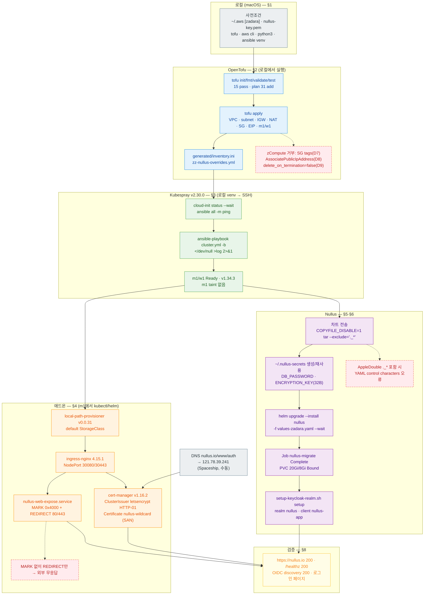

# Zadara Cloud PoC — 설치/배포 절차

> 현재 클러스터 구조는 [README.md](README.md), 실행 기록/실패-원인-수정은
> [INSTALL_LOG_2026-09-13.md](INSTALL_LOG_2026-09-13.md), 인프라 코드 세부는
> [opentofu/README.md](opentofu/README.md) / [opentofu/VALIDATION.md](opentofu/VALIDATION.md) 참고.

작업 위치: **m1(bastion, 121.78.39.241)**, `ssh -i nullus-key.pem ubuntu@121.78.39.241`.
w1은 m1 ProxyCommand로만 접근한다.

## 설치 흐름 한눈에



빨간 점선 상자는 실제로 부딪힌 실패 지점이다. 원인과 수정은
[INSTALL_LOG_2026-09-13.md](INSTALL_LOG_2026-09-13.md), 인프라 아키텍처 다이어그램은
[README.md §3](README.md#3-네트워크-흐름).

---

## 1. 사전조건

- OpenTofu로 m1/w1 인프라가 생성되어 있을 것 ([opentofu/README.md](opentofu/README.md) 사용법 참고).
- ghcr 패키지가 public일 것 (private로 되돌렸다면 아래 §7 참고).
- `values-zadara.yaml`은 그대로 두고 시크릿만 `--set`으로 주입한다 — 파일 자체를 고치지 않는다.

## 2. OpenTofu apply

```bash
cd deploy/csp/zadara/opentofu
cp terraform.tfvars.example terraform.tfvars   # 조회로 확정한 값 채움
tofu init
tofu fmt -check -recursive
tofu validate
tofu test
python3 -m unittest discover -s scripts -p 'test_*.py'
tofu plan -out=tfplan
tofu apply tfplan
```

실측 결함 2건이 `.tf`에 이미 반영되어 있다 — 재현되면 아래를 확인한다.

- **D7**: `aws_security_group`에 `tags` 지정 시 `400 Invalid format for tags`. 이
  플랫폼은 태그를 저장하지 않는다 → SG `tags` 제거.
- **D8**: `aws_instance`에 `associate_public_ip_address`(false 포함) 지정 시
  `400 unsupported params AssociatePublicIpAddress` → 속성 제거, 공인 IP는
  `aws_eip`로만 붙인다.
- **D9**: `root_block_device.delete_on_termination=false`로 두면 zCompute가 생성 시
  이를 무시해 `true`로 만들고, 이어지는 `ModifyInstanceAttribute`가 끝나지 않아 apply가
  멈춘다 → `delete_on_termination=true` + `lifecycle.ignore_changes=[root_block_device[0].tags]`.

apply 후 인벤토리를 인계한다.

```bash
tofu output -raw kubespray_inventory
ansible -i generated/inventory.ini all -m ping
```

## 3. Kubespray

```bash
# Kubespray clone 디렉토리에서. TF_ROOT는 OpenTofu 디렉토리의 절대 경로.
cp -a inventory/sample inventory/platform
cp "$TF_ROOT/generated/inventory.ini" inventory/platform/inventory.ini
cp "$TF_ROOT/generated/zz-nullus-overrides.yml" inventory/platform/group_vars/k8s_cluster/
ansible-inventory -i inventory/platform/inventory.ini --graph
ansible -i inventory/platform/inventory.ini all -b -m command -a 'cloud-init status --wait'
ansible -i inventory/platform/inventory.ini all -m ping </dev/null >log 2>&1
ansible-playbook -i inventory/platform/inventory.ini cluster.yml -b </dev/null >log 2>&1
```

`</dev/null >log 2>&1`는 필수다 — 파이프/비대화형 실행에서 Ansible이
"requires blocking IO on stdin/stdout/stderr"로 실패한다.

RECAP 확인: m1 ok=667 failed=0 ignored=4, w1 ok=417 failed=0. ignored 4건(최초 설치의
`etcd --version`, `calicoctl get felixconfig/ippool/bgpconfig` 조회)은 정상이다.

## 4. 애드온

### 4.1 local-path-provisioner

```bash
kubectl apply -f \
  https://raw.githubusercontent.com/rancher/local-path-provisioner/v0.0.31/deploy/local-path-storage.yaml
kubectl patch storageclass local-path \
  -p '{"metadata":{"annotations":{"storageclass.kubernetes.io/is-default-class":"true"}}}'
```

`WaitForFirstConsumer` 모드라 PVC는 파드가 스케줄된 노드의 로컬 디스크에 바인딩된다.
**노드를 재생성하면 데이터가 사라진다** — 백업 미구성.

### 4.2 ingress-nginx (NodePort)

Zadara에는 LoadBalancer 연동이 없다.

```bash
helm repo add ingress-nginx https://kubernetes.github.io/ingress-nginx
helm repo update
helm upgrade --install ingress-nginx ingress-nginx/ingress-nginx \
  --namespace ingress-nginx --create-namespace \
  --set controller.service.type=NodePort \
  --set controller.service.nodePorts.http=30080 \
  --set controller.service.nodePorts.https=30443 \
  --set controller.replicaCount=1 \
  --wait --timeout 300s
```

### 4.3 80/443 → NodePort 포워딩 (m1)

공인 IP는 m1에만 있고 ingress-nginx 컨트롤러는 w1에서 뜬다. m1의 systemd 유닛
`nullus-web-expose.service`(`/usr/local/sbin/nullus-web-expose.sh`)가 iptables nat 체인
`NULLUS-WEB`으로 80→30080, 443→30443을 REDIRECT한다.

**REDIRECT 앞에 반드시 `MARK --set-xmark 0x4000/0x4000`을 먼저 걸어야 한다.** 없으면
vxlan.calico가 원본 src IP 그대로 w1 파드에 전달하고, w1이 NAT 없이 직접 응답해
비대칭 라우팅으로 무응답이 된다 (근거: INSTALL_LOG §실패 8). `expose-web.sh`가 이미
문서화한 규칙과 동일하다.

진단 시 `curl 127.0.0.1:30080`은 ipvs 모드에서 실패할 수 있다 — 노드 IP
(`curl 10.20.0.10:30080`)로 시험한다.

### 4.4 cert-manager + Certificate

```bash
helm repo add jetstack https://charts.jetstack.io
helm repo update
helm upgrade --install cert-manager jetstack/cert-manager \
  --namespace cert-manager --create-namespace \
  --version v1.16.2 --set installCRDs=true --wait
```

`ClusterIssuer letsencrypt`는 HTTP-01 전용(DNS-01 자격증명 없음)으로 적용하고,
`Certificate nullus-wildcard`를 nullus.io/www.nullus.io/auth.nullus.io SAN으로 발급해
secret `nullus-wildcard-tls`에 담는다. **와일드카드가 아니므로** 호스트를 추가하면
SAN을 갱신해야 한다.

## 5. Nullus Helm 배포

전송은 macOS `tar`의 AppleDouble(`._*`) 메타파일이 섞이지 않게 한다 — 섞이면
`.Files.Glob`이 그 파일을 텍스트로 렌더링해 `YAML parse error: control characters are
not allowed`가 난다 (근거: INSTALL_LOG §실패 7).

```bash
# 로컬 → m1 전송
COPYFILE_DISABLE=1 tar --exclude='._*' -czf nullus.tar.gz deploy/helm/nullus deploy/csp/zadara scripts
scp -i nullus-key.pem nullus.tar.gz ubuntu@121.78.39.241:~/
# m1에서 압축을 풀기 전, 혹시 남아있을 메타파일 정리
find ~/nullus -name '._*' -delete
```

시크릿은 최초 배포 시 생성하고 `~/.nullus-secrets`(0600)에 보관한다. 재배포 시에는
새로 만들지 말고 이 파일에서 값을 재사용한다.

```bash
# 최초 생성
DB_PASSWORD=$(openssl rand -hex 16)
ENCRYPTION_KEY=$(openssl rand -hex 16)   # 정확히 32바이트(hex 32자)
umask 077
cat > ~/.nullus-secrets <<EOF
DB_PASSWORD=$DB_PASSWORD
ENCRYPTION_KEY=$ENCRYPTION_KEY
EOF

# 재배포 시
source ~/.nullus-secrets

cd ~/nullus
helm dependency update deploy/helm/nullus

helm upgrade --install nullus deploy/helm/nullus \
  --namespace nullus --create-namespace \
  -f deploy/csp/zadara/values-zadara.yaml \
  --set secrets.dbPassword="$DB_PASSWORD" \
  --set postgresql.auth.password="$DB_PASSWORD" \
  --set secrets.encryptionKey="$ENCRYPTION_KEY" \
  --wait --timeout 600s
```

`postgresql.auth.password`도 반드시 `secrets.dbPassword`와 함께 지정한다 —
`secrets.dbPassword`만 바꾸면 번들 DB 비밀번호는 바뀌지 않는다.

이미지 경로·태그는 차트 기본값(`values.yaml` + `Chart.appVersion`)을 그대로 쓴다.
다른 버전을 배포하려면 `--set api.image.tag=<버전> --set web.image.tag=<버전>`.

**릴리즈 이름은 반드시 `nullus`여야 한다** — web nginx가 이름 기반 서비스명으로
`nullus-api` 등을 프록시하므로, 이름이 바뀌면 API 프록시가 깨진다.

**차트 태그 주의**: 프리릴리즈 태그 그대로는 결함이 있을 수 있다(CHANGELOG의
`Unreleased`/`Fixed` 참조). 패치 릴리즈가 없다면 `main`의 차트를 쓰거나 수정 커밋을
체크아웃한다.

### 5.1 마이그레이션

차트의 `post-install,pre-upgrade` Job이 자동 실행된다(수동 실행 불필요). 완료만 확인한다.

```bash
kubectl -n nullus get job nullus-migrate
kubectl -n nullus logs job/nullus-migrate
```

## 6. Keycloak realm 설정

```bash
cd ~/nullus
./scripts/setup-keycloak-realm.sh setup
```

`scripts/setup-keycloak.sh`가 같은 디렉토리에 있어야 한다 — 없으면
"업스트림 스크립트를 찾지 못했습니다" 오류가 난다(§5 전송 시 `scripts/` 포함 확인).

realm `nullus`, client `nullus-app`(public, redirectUris `https://nullus.io/*`,
`http://localhost:5173/*`), 기본 계정 admin@nullus.io/devops@nullus.io/dev@nullus.io
비밀번호 `nullus123!`(`KEYCLOAK_TEST_USER_PASSWORD` 환경변수로 지정 가능 — 운영 전환 시
반드시 변경).

## 7. ghcr 패키지 접근 (참고)

```bash
gh api /orgs/cloud-nullus/packages/container/nullus%2Fnullus-api --jq .visibility   # public
kubectl run ghcr-pull-probe --restart=Never --rm -i \
  --image=ghcr.io/cloud-nullus/nullus/nullus-api:<태그> -- echo IMAGE_PULL_OK
```

패키지를 다시 private으로 돌렸다면 pull secret이 필요하다.

```bash
kubectl create namespace nullus 2>/dev/null || true
kubectl -n nullus create secret docker-registry ghcr-pull-secret \
  --docker-server=ghcr.io --docker-username="$GHCR_USER" --docker-password="$GHCR_PAT"
```

`GHCR_PAT`는 `read:packages` 스코프면 충분하다. `values-zadara.yaml`의
`imagePullSecrets`를 `[{name: ghcr-pull-secret}]`로 바꾼다. 가시성 전환은
`https://github.com/orgs/cloud-nullus/packages` 아래 패키지별 Settings에서만 된다.

## 8. 검증

```bash
kubectl -n nullus get pods -o wide      # 전부 Running
kubectl -n nullus get pvc               # Bound
kubectl -n nullus get ingress

curl -s -o /dev/null -w '%{http_code}\n' https://nullus.io/
curl -s -o /dev/null -w '%{http_code}\n' https://nullus.io/healthz
curl -s -o /dev/null -w '%{http_code}\n' https://nullus.io/config.js
curl -s -o /dev/null -w '%{http_code}\n' https://auth.nullus.io/realms/nullus/.well-known/openid-configuration
```

DNS(`nullus.io`/`www.nullus.io`/`auth.nullus.io`)가 121.78.39.241을 가리키는지
`dig @1.1.1.1 <host>`로 먼저 확인한다 — 배포 직후 구 IP를 가리킬 수 있다.

브라우저 로그인(OIDC authorize→콜백) 클릭 흐름은 이번 배포에서 미검증이다
(Claude in Chrome 미연결) — authorize 엔드포인트가 로그인 페이지 HTML을 반환하는 것까지만
확인했다.

## 9. 로컬에서 접근하기 (터널 스크립트)

DNS/보안 그룹 없이 로컬에서 확인하고 싶을 때, SSH(22/tcp) 위로 터널을 뚫는다.

| 스크립트 | 하는 일 | 기본 로컬 포트 |
|---|---|---|
| `tunnel.sh` | 웹 UI 를 브라우저로 연다 | 30080 |
| `kubeconfig.sh` | `kubectl`·`helm` 을 붙인다 | 16443 |
| `expose-apiserver.sh` | apiserver 를 외부에 노출 — **기본적으로 쓰지 않는다** | — |

> 이 스크립트들은 기존 platform/develop 2클러스터·bastion `121.78.39.184` 환경 기준으로
> 작성됐다. 신규 단일 클러스터 환경에서는 m1 IP(`121.78.39.241`)와 단일 kubeconfig
> 기준으로 값을 확인하고 쓴다. `CLUSTER=develop` 같은 다중 클러스터 옵션은 해당 없다.

```bash
./deploy/csp/zadara/tunnel.sh          # direct 모드 — hosts/sudo 불필요, http://127.0.0.1:30080
./deploy/csp/zadara/tunnel.sh stop

./deploy/csp/zadara/kubeconfig.sh                  # 터널 + ~/.kube/nullus-zadara.conf 생성
export KUBECONFIG=$HOME/.kube/nullus-zadara.conf
kubectl get pods -A
./deploy/csp/zadara/kubeconfig.sh stop
```

`~/.kube/config`에 병합하지 않고 별도 파일로 쓴다. `insecure-skip-tls-verify`는 쓰지
않는다 — API 서버 인증서 SAN에 `127.0.0.1`과 `localhost`가 있어 터널 주소로 붙어도
검증이 통과한다.

`expose-apiserver.sh`는 apiserver를 비표준 포트(36443)로 열고 노드 iptables에서 소스
IP를 한 번 더 검사한다. 문서 설계에 없던 노출면이므로 터널로 감당이 안 될 때만 쓰고,
끝나면 `close`로 되돌린다.

```bash
./deploy/csp/zadara/expose-apiserver.sh open
./deploy/csp/zadara/expose-apiserver.sh close
```

## 10. 재배포 절차 요약

1. `~/nullus`에 최신 소스 재전송 (§5의 `COPYFILE_DISABLE=1 tar --exclude='._*'` 그대로).
2. `source ~/.nullus-secrets`로 기존 시크릿 재사용(신규 생성 금지).
3. `helm dependency update deploy/helm/nullus` 후 §5의 `helm upgrade --install` 재실행.
4. `pre-upgrade` 마이그레이션 Job 자동 실행 확인(§5.1).
5. §8 검증 커맨드로 확인.

## 부록 — 폐기된 절차 (참고용, 사용하지 않음)

과거 platform/develop 2클러스터 환경에서 쓰던 kubeconfig 컨텍스트 분리 절차는
현재 단일 클러스터 구조에 필요 없다.

```bash
# (참고용, 실행 금지 — 클러스터 1개뿐이라 컨텍스트 분리가 불필요함)
# cp ~/.kube/config ~/.kube/config.bak.$(date +%Y%m%d-%H%M%S)
# for c in platform develop; do
#   sed "s/cluster\.local/$c/g" ~/kubespray/inventory/$c/artifacts/admin.conf > /tmp/$c.conf
#   kubectl --kubeconfig /tmp/$c.conf config rename-context "kubernetes-admin-$c@$c" "$c"
# done
```
