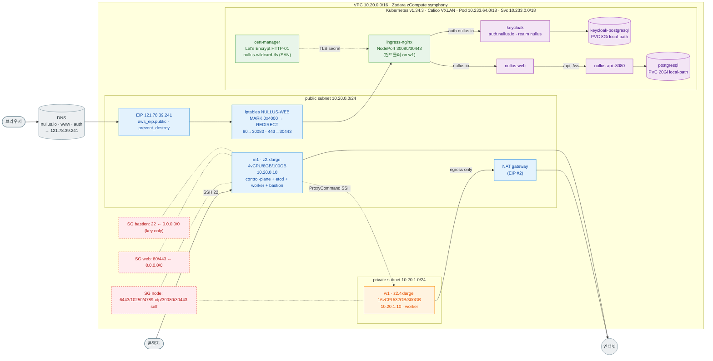

# Zadara Cloud PoC — 현재 아키텍처

> 신규 인프라 apply·설치 순서는 [INSTALL.md](INSTALL.md), 실행 기록은
> [INSTALL_LOG_2026-09-13.md](INSTALL_LOG_2026-09-13.md), 인프라 코드는
> [opentofu/README.md](opentofu/README.md) / [opentofu/VALIDATION.md](opentofu/VALIDATION.md),
> 계획 배경은 [배포 재계획](../../../docs/50_운영/zadara_cloud_deployment_plan.md) 참고.

## 1. 목적/범위

온라인 PoC, **m1(control-plane+worker+bastion) + w1(worker) 단일 클러스터**.
airgap·MetalLB·Zadara 볼륨 CSI는 범위 밖 — local-path와 NodePort로 대체한다.

## 2. VM 구성

| VM | type | vCPU/RAM/disk | 사설 IP | 공인 IP | subnet | 역할 |
|---|---|---|---|---|---|---|
| m1 | z2.xlarge | 4/8GB/100GB | 10.20.0.10 | 121.78.39.241 | public | control-plane+etcd+worker(taint 없음)+bastion |
| w1 | z2.4xlarge | 16/32GB/300GB | 10.20.1.10 | 없음 | private | worker |

w1은 NAT gateway로만 인터넷에 나가고, SSH는 m1을 ProxyCommand로 경유해야 붙는다.

## 3. 네트워크 흐름




```
운영자 --SSH(22)--> m1(EIP 121.78.39.241, bastion)
                      └─ ProxyCommand --SSH--> w1(private)

브라우저 --DNS(nullus.io/www/auth)--> m1 EIP:80/443
  --iptables nat NULLUS-WEB(MARK 0x4000 → REDIRECT 80→30080,443→30443)-->
  NodePort 30080/30443 (클러스터 전 노드에 열림, 실제 컨트롤러는 w1)
  --ingress-nginx(w1)--> nullus-web 서비스
       └─ web nginx가 /api/, /ws/ 를 --> nullus-api:8080 로 프록시
       └─ auth.nullus.io 경로 --> keycloak 서비스

w1 --NAT gateway--> 인터넷 (egress 전용, 인바운드 없음)
```

MARK 단계가 없으면 vxlan.calico가 원본 src IP를 그대로 넘겨 w1이 비대칭 라우팅으로
직접 응답하며 무응답이 된다 (원인/수정: INSTALL_LOG §실패 8).

## 4. VPC / CIDR

| 구분 | CIDR |
|---|---|
| VPC | 10.20.0.0/16 |
| public subnet (m1) | 10.20.0.0/24 |
| private subnet (w1) | 10.20.1.0/24 |
| Pod CIDR (Calico) | 10.233.64.0/18 |
| Service CIDR | 10.233.0.0/18 |

NAT gateway 1개, EIP 2개(NAT용, m1용). m1 EIP 는 OpenTofu 루트의 `aws_eip.public` 로 `prevent_destroy` 보호되며 VM 교체 시에도 121.78.39.241 이 유지된다(opentofu/README.md D10).

## 5. 보안 그룹

| SG | 인바운드 | 대상 |
|---|---|---|
| bastion | 22/tcp ← 0.0.0.0/0 (운영자 다수·유동 IP, 2026-09-13 개방. 키 인증 전용) | m1 |
| web | 80/tcp, 443/tcp ← 0.0.0.0/0 | m1(공인 IP 보유 노드) |
| node | 클러스터 내부 전용(노드 간) | m1, w1 |

## 6. Kubernetes 구성

- Kubespray v2.30.0(`f4ccdb5`), Kubernetes v1.34.3, containerd 2.2.1, Calico VXLAN,
  Ubuntu 24.04.3, kube-proxy **ipvs** 모드.
- m1은 `kube_control_plane`+`etcd`+`kube_node` 세 그룹에 모두 속해 taint 없음
  (`schedule_on_control_plane=true`) — 노드가 2대뿐이라 m1도 워크로드를 받는다.
- kubeconfig: m1의 `/etc/kubernetes/admin.conf` → `~ubuntu/.kube/config` 하나뿐.
  **클러스터가 1개이므로 `--context` 지정이나 admin.conf 병합이 필요 없다** — 과거
  platform/develop 2클러스터 시절의 컨텍스트 분리 절차는 폐기됨(§10).

## 7. 애드온

| 애드온 | 버전/설정 | 비고 |
|---|---|---|
| local-path-provisioner | v0.0.31, default StorageClass | `WaitForFirstConsumer`, 노드 재생성 시 데이터 소실 |
| ingress-nginx | chart 4.15.1, NodePort 30080/30443 | 컨트롤러는 w1에 배치 |
| cert-manager | v1.16.2, ClusterIssuer `letsencrypt`(HTTP-01 전용, DNS-01 자격증명 없음) | |
| Certificate | `nullus-wildcard` → secret `nullus-wildcard-tls` | SAN: nullus.io, www.nullus.io, auth.nullus.io. **와일드카드 아님** — 호스트 추가마다 SAN 갱신 필요. Let's Encrypt YR1, 만료 2026-12-11 |

## 8. Nullus 배포 상태

- Helm release `nullus`, namespace `nullus`, chart `nullus-0.5.0` rev 1.
- values: `deploy/csp/zadara/values-zadara.yaml` 무수정 + `--set` 3개(시크릿).
- 시크릿은 **m1의 `~/.nullus-secrets`(0600)에만 존재**, 다른 곳에 백업 없음.
- 마이그레이션 Job `nullus-migrate`: Complete(1/1, 8s), 차트의
  `post-install,pre-upgrade` 훅으로 자동 실행.
- PVC: `data-nullus-postgresql-0` 20Gi, `data-nullus-keycloak-postgresql-0` 8Gi, 둘 다 Bound.
- 릴리즈 이름은 반드시 `nullus`여야 한다 — web nginx가 `nullus-api`/`nullus-web` 등
  이름 기반 서비스명으로 프록시하기 때문에 이름을 바꾸면 API 프록시가 깨진다.

## 9. Keycloak

- realm `nullus`, client `nullus-app`(public), redirectUris
  `https://nullus.io/*`, `http://localhost:5173/*`.
- 계정: admin@nullus.io / devops@nullus.io / dev@nullus.io, 기본 비밀번호
  `nullus123!` — **변경 권고**.
- OSS 연동 클라이언트: grafana/argocd/harbor, 각 `*-dev-secret`.

## 10. DNS

`nullus.io`, `www.nullus.io`, `auth.nullus.io` → `121.78.39.241` (Spaceship에서 관리,
배포 직후 구 IP `121.78.39.184`를 가리키고 있었으므로 `dig @1.1.1.1 <host>`로 재확인).

## 11. 접속 방법 요약

- 웹: `https://nullus.io/`
- SSH: `ssh -i nullus-key.pem ubuntu@121.78.39.241`
- kubectl/helm: m1에서 직접 실행 (`~ubuntu/.kube/config`). 로컬에서 붙이려면
  [INSTALL.md](INSTALL.md)의 터널 스크립트(`kubeconfig.sh`, `tunnel.sh`) 참고.

## 12. 운영 시 알아야 할 것 / 한계

| 항목 | 내용 |
|---|---|
| 시크릿 위치 | m1 `~/.nullus-secrets` 단일 지점, 백업 없음 |
| 스토리지 | local-path — 노드 재생성 시 데이터 소실, 백업 미구성 |
| TLS 인증서 | 와일드카드 아님(SAN 방식), 만료 2026-12-11, 호스트 추가마다 갱신 필요 |
| CD 시크릿 | `.github/workflows/cd.yml`의 `deploy-zadara` job이 참조하는 ZADARA_HOST/호스트키가 구 IP(121.78.39.184) 기준일 수 있음 — 갱신 확인 필요 |
| Keycloak 기본 비밀번호 | `nullus123!` 미변경 상태 |
| quota 상한 | 미확인. `describe-account-attributes`의 `max-instances=20`만 확인(인스턴스 개수 한도, vCPU/RAM 한도 아님) |
| ingress-nginx | EOL 관련 이슈는 [배포 재계획](../../../docs/50_운영/zadara_cloud_deployment_plan.md) 참고 |
| 워커 1대 | `replicaCount: 1` 고정. 2 이상이면 파드가 Pending |
| SSO 스택 | `deploy/k8s/oauth2-proxy/*`, `airgap/helm/stack-values/*`의 고정 시크릿·`ssl-insecure-skip-verify`를 이 환경에 그대로 적용하면 안 됨 |
| 브라우저 로그인 검증 | Claude in Chrome 미연결로 클릭 흐름 미확인, authorize HTML 응답으로만 대체 확인 |

## 13. 폐기된 구 환경 (참고)

2026-09-13, node-10/11/20/21로 구성된 platform/develop 2클러스터와 그 위의 PVC 11개·Helm
release 12개를 백업 없이 폐기하고 위 m1+w1 단일 클러스터로 전환했다. 상세 경위는
[INSTALL_LOG_2026-09-13.md](INSTALL_LOG_2026-09-13.md) 참고.
