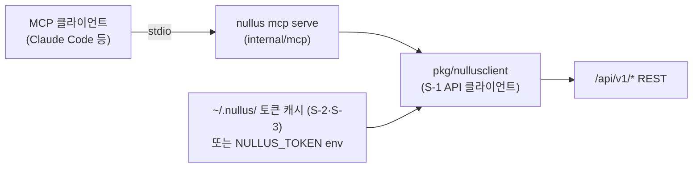

# Nullus MCP 서버 설계

- **상태**: 확정 (CLI+MCP 구현 백로그 0-4 산출물)
- **작성일**: 2026-08-23
- **관련 문서**: [CLI+MCP 구현 백로그](../plans/2026-08-22-cli-mcp-구현-백로그.md) · [Automation 계약](./Nullus_CLI_Automation_계약.md) · [Stack YAML 스키마](./Nullus_Stack_YAML_스키마.md) · [ADR-0001](../adr/0001-cli-구현을-위한-논의.md)

> AI 어시스턴트(Claude Code 등 MCP 클라이언트)가 Nullus를 조회·조작할 수 있게 하는 MCP 서버의 v1 설계를 확정한다.
> 원칙은 CLI와 동일하다 — **`/api/v1/*` REST의 얇은 클라이언트**이며 서버 쪽 신규 API를 만들지 않는다.
> 중간점검 피드백의 "AI 어시스턴트" 아이디어(P3)는 이 tool 표면 위에서 성립한다.

---

## 1. 결정 요약

| 항목 | 결정 | 근거 |
|------|------|------|
| SDK | **공식 `github.com/modelcontextprotocol/go-sdk`** | 공식 SDK(Google 협업 유지보수). generic `mcp.AddTool`이 Go 타입에서 입력/출력 JSON 스키마를 자동 생성 — tool 스키마와 핸들러 시그니처가 컴파일 타임에 묶인다. 커뮤니티 SDK(mark3labs/mcp-go 등)는 기능은 넓지만 공식 대비 스펙 추종 보장이 없다 |
| Transport | **stdio만 v1** | 로컬 개발자·CI 시나리오가 전부다. HTTP/SSE·원격 서버 모드는 인증 설계(OAuth)가 별도 문제라 범위 밖 (백로그 "범위 밖" 유지) |
| 패키징 | **단일 바이너리 서브커맨드 `nullus mcp serve`** | §4 |
| tool 표면 | 읽기 6종 + 변경 3종 (§2) | 백로그 B-2·B-3 확정 |
| 변경 tool 정책 | **기본 비활성**, `--allow-write` 옵트인 (§3) | 사고 반경 최소화 |
| 시크릿 | **tool 인자로 시크릿을 받지 않는다** (§5) | 모델 컨텍스트에 시크릿이 남는 것을 원천 차단 |
| resources / prompts | v1 범위 밖 — tools만 | 수요 확인 후 v2 |

## 2. Tool 표면 v1

이름은 `snake_case`, 동사가 아닌 `대상_행위` 순. 모든 tool 출력은 JSON(text content)이며, 실패는 MCP `isError` + HTTP 상태·`trace_id` 포함 메시지로 반환한다.

### 읽기 tool (기본 활성, B-2)

| tool | 래핑 API | 입력 | 비고 |
|------|----------|------|------|
| `stack_list` | `GET /api/v1/stacks` | (없음) | 조직 스코프는 토큰 권한을 따름 |
| `stack_status` | `GET /api/v1/stacks/:id/status` | `stack_id` | state·progress·실패 스텝/사유 포함 |
| `cluster_list` | `GET /api/v1/admin/clusters` | (없음) | kubeconfig 필드는 응답에서 **제거** 후 반환 |
| `template_list` | `GET /api/v1/stacks/templates` | (없음) | Golden Path 카탈로그 |
| `compat_check` | `POST /api/v1/stacks/:id/validate` | `stack_id`, `tools?`(map) | POST지만 시맨틱은 조회(검증) — 읽기로 분류 |
| `stack_logs_tail` | 설치 로그 REST 조회 | `stack_id`, `lines?`(기본 100) | 설치 로그는 DB 영속(PR #207) — REST로 최근 N줄. WS 스트리밍은 범위 밖 |

### 변경 tool (기본 비활성, B-3)

| tool | 래핑 API | 입력 | 비고 |
|------|----------|------|------|
| `stack_deploy` | `POST /stacks` + `POST /stacks/:id/deploy` | [stack.yaml v1alpha1](./Nullus_Stack_YAML_스키마.md) 구조와 동일한 객체, `acknowledge_warnings?` | 입력→payload 변환은 스키마 문서 §3 대응표 재사용 (트랙 A 코드 의존 없음). 호환성 게이트는 서버 판정 그대로 |
| `stack_rollback` | `POST /stacks/:id/rollback` | `stack_id`, `version_id`, `reason?` | 설정(config) 버전 롤백. Helm 롤백은 설치 엔진 자동 동작이라 tool 없음 |
| `pipeline_deploy` | F6 파이프라인 배포 API | `pipeline_id` | F5·F6 API 현행 기준 — 변경 추적 비용은 ADR-0001로 감수 |

- retry/continue는 v1 tool에 넣지 않는다 — `stack_status`로 실패를 확인한 사용자가 웹/CLI로 판단하는 흐름을 유지 (실패 재시도는 사람 확인이 필요한 작업). 수요가 확인되면 v1.1에서 `stack_retry` 추가 검토

## 3. 변경 tool 허용 정책

- 서버 기동 플래그 `nullus mcp serve --allow-write` 또는 env `NULLUS_MCP_ALLOW_WRITE=true`일 때만 변경 tool 3종을 **등록**한다
- 미허용 시 변경 tool은 `list_tools`에 아예 나타나지 않는다 — "호출하면 거부"가 아니라 표면에서 제거 (모델이 시도조차 못 하게)
- 클라이언트 설정 예시·권한 정책 문서는 B-4에서 작성

## 4. 패키징 — 단일 바이너리 서브커맨드 (결정)

`nullus mcp serve` 서브커맨드로 확정한다. 별도 바이너리(`cmd/nullus-mcp`)는 만들지 않는다.

- **근거**: 릴리스 아티팩트 1개(R-1 단일 정적 바이너리), airgap 동봉 1개(R-2), 설정·토큰 캐시(`~/.nullus/`) 공유가 자연스러움. 클라이언트 설정도 `command: nullus, args: [mcp, serve]`로 단순
- **트랙 독립성 유지**: MCP 서버 본체는 `internal/mcp/`에 `Run(ctx, Options) error` 진입점으로 구현하고, cobra 등록은 얇은 어댑터만 둔다. 트랙 B가 트랙 A에 갖는 의존은 **A-1(cobra 골격, S 크기)뿐** — 백로그 B-1 의존에 A-1을 추가한다
- 개발 중 A-1이 없어도 `go run ./internal/mcp/cmd` 식 임시 진입으로 MCP Inspector 검증 가능

## 5. 인증·시크릿 경로



- 토큰 획득은 공유 기반 그대로: `nullus login`으로 캐시된 토큰 → 없으면 `NULLUS_TOKEN` env → 없으면 시작 시 stderr 안내 후 종료. 무인 환경은 bootstrap 토큰(`nullus auth bootstrap issue`) 재사용
- **tool 인자로 시크릿을 받지 않는다**: `stack_deploy`의 SCM PAT는 tool 입력에 없다 — 서버 프로세스의 `NULLUS_SCM_TOKEN` env에서만 읽어 배포 본문에 주입한다. 모델 컨텍스트·대화 로그에 시크릿이 남지 않는다 (stack.yaml 스키마 §1.3과 동일 원칙)
- 읽기 tool 응답에서도 시크릿성 필드(kubeconfig 등)는 제거 후 반환. `token-source reveal`류는 tool 표면에서 영구 제외
- RBAC은 서버가 판정한다 — 토큰 권한 밖 호출은 403이 그대로 `isError`로 전달

## 6. 구현 골격 (공식 SDK 기준)

```go
// internal/mcp/server.go
server := mcp.NewServer(&mcp.Implementation{Name: "nullus", Version: version}, nil)

type stackStatusIn struct {
    StackID string `json:"stack_id" jsonschema:"조회할 스택 ID"`
}
mcp.AddTool(server, &mcp.Tool{
    Name: "stack_status", Description: "스택 배포 상태·진행률·실패 사유 조회",
}, func(ctx context.Context, req *mcp.CallToolRequest, in stackStatusIn) (*mcp.CallToolResult, any, error) {
    // pkg/nullusclient 호출 → JSON 반환
})

if opts.AllowWrite { registerWriteTools(server) }
return server.Run(ctx, &mcp.StdioTransport{})
```

- 입력 스키마는 Go 타입 + `jsonschema` 태그에서 자동 생성 — 스키마 문서를 따로 유지하지 않는다
- **stdout은 프로토콜 전용** — 서버 로그·경고(버전 스큐 포함)는 전부 stderr (automation 계약 §2와 동일 규율)
- 버전 스큐(S-4): 시작 시 1회 검사, stderr 경고. 실패시키지 않음

## 7. 클라이언트 설정 예시 (B-4 가이드에서 확장)

```json
{
  "mcpServers": {
    "nullus": {
      "command": "nullus",
      "args": ["mcp", "serve"],
      "env": { "NULLUS_SERVER": "https://nullus.example.com" }
    }
  }
}
```

변경 tool까지 쓰려면 `args: ["mcp", "serve", "--allow-write"]` — 팀 정책상 CI·공용 설정 파일에는 넣지 않기를 권고.

## 8. 테스트 전략 (CLAUDE.md TDD 준수)

| 대상 | 방법 |
|------|------|
| tool 핸들러 | `httptest` 목 API 서버 + SDK in-memory transport로 단위 테스트 (DB·실서버 불필요) |
| 스키마 | tool 입력 타입의 jsonschema 생성 결과 스냅샷 테스트 |
| 옵트인 정책 | `--allow-write` 유무에 따른 `list_tools` 표면 차이 테스트 |
| 수동 검증 | MCP Inspector로 initialize/list_tools/call_tool (B-1 완료 기준) |
| e2e | 로컬 스택 배포 환경에서 `stack_deploy` 옵트인 배포 1회 (B-3 완료 기준) |
