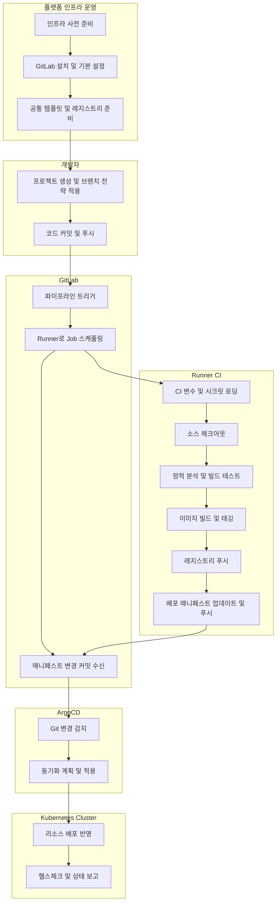
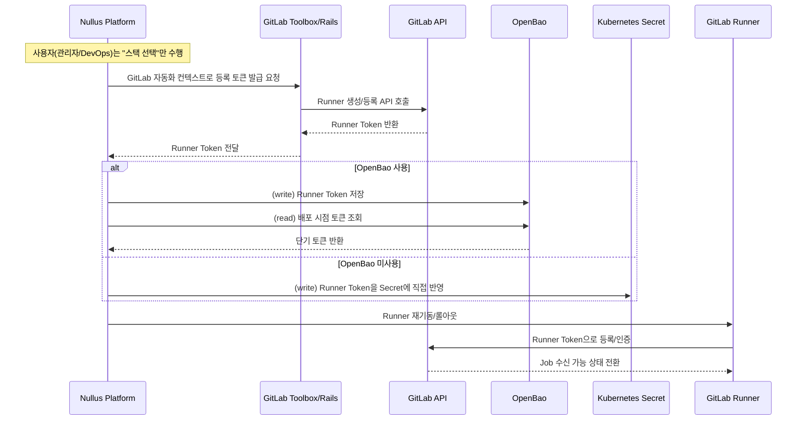
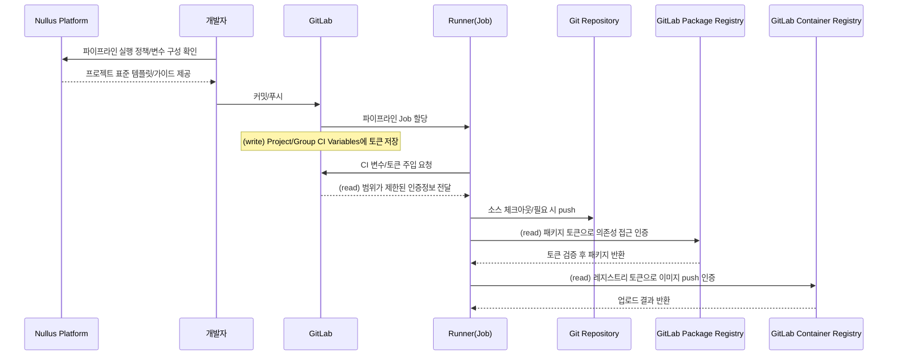
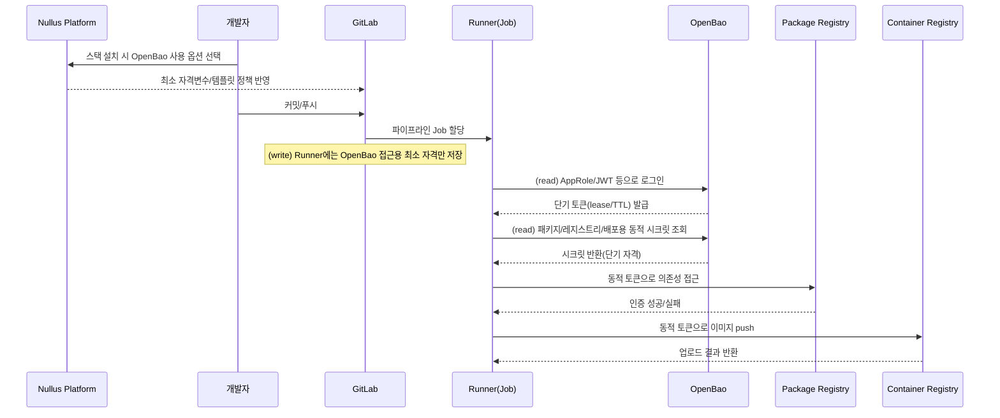
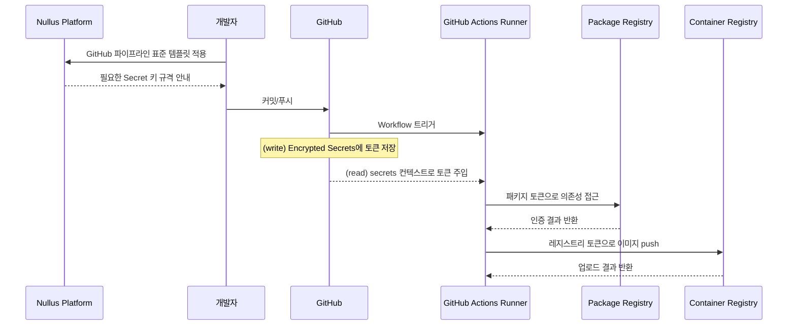
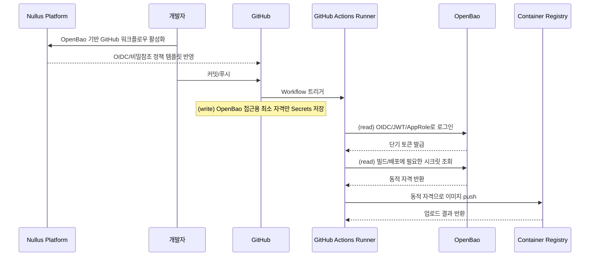
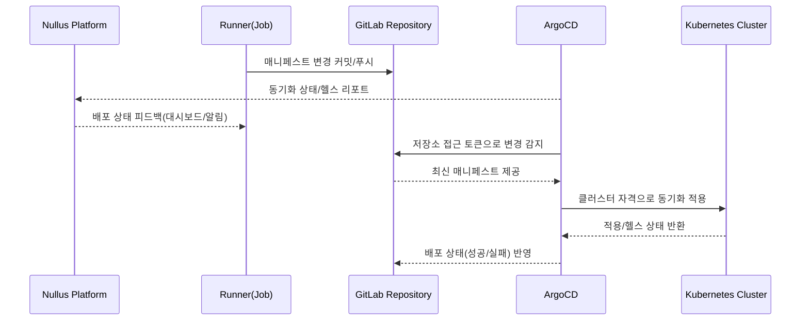
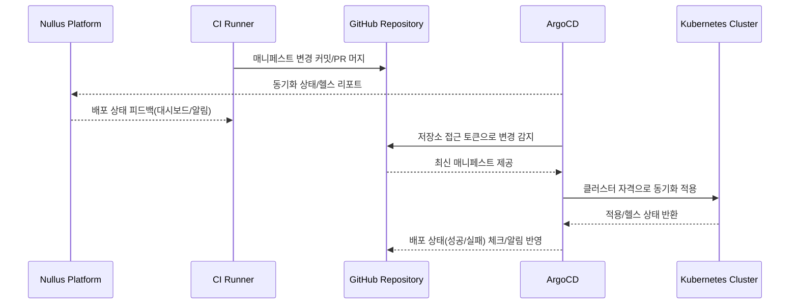
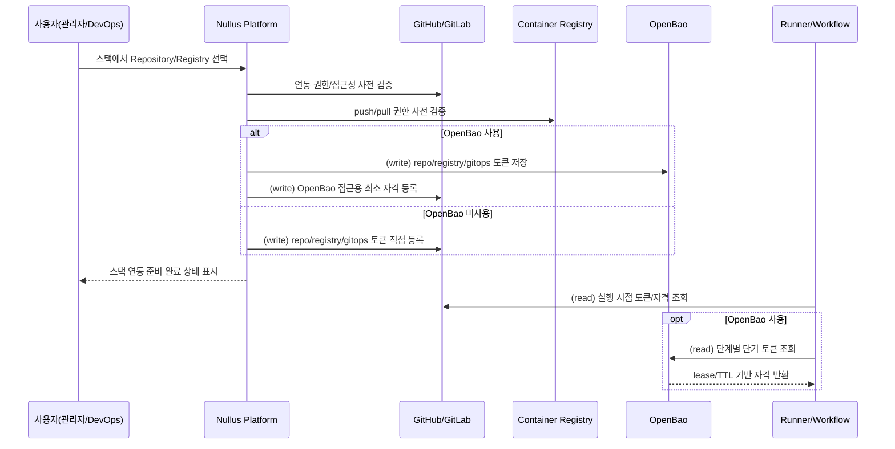

# CI/CD 파이프라인 정리

이 문서는 `Gitlab 파이프라인 구성(26)` 디렉토리 기준으로, 세부 구현값을 제외한 **전체 CI/CD 프로세스 흐름**과 **인증/토큰 연계 흐름**을 정리합니다.

## 1) 전체 CI/CD 파이프라인 프로세스

## 2) 단계별 해야 할 일

### 1. 인프라/플랫폼 사전 준비
- DevSecOps 네임스페이스, 스토리지, 공통 Ingress, TLS 인증서 기반을 준비한다.
- 폐쇄망/사설망 환경이면 필수 이미지 및 인증서 신뢰 체인을 선반영한다.

### 2. GitLab 설치 및 기본 설정
- GitLab을 Helm 기반으로 설치하고 도메인/Ingress/Registry를 연결한다.
- 관리자 계정 보안 설정, 회원가입 정책, 운영 기본 정책을 반영한다.

### 3. 공통 프로젝트/템플릿 구성
- 공통 그룹 및 파이프라인 템플릿 저장소를 생성한다.
- 기본 CI 템플릿(브랜치 규칙, 스테이지 구조, 공통 Job)을 표준화한다.

### 4. 애플리케이션 프로젝트 생성
- 서비스 그룹/프로젝트를 생성하고 기본 브랜치 전략을 적용한다.
- 애플리케이션 저장소 구조와 배포(kustomize 등) 구조를 정렬한다.

### 5. Runner 등록 및 실행 환경 연결
- Instance Runner를 등록하고 Kubernetes Runner와 토큰을 연동한다.
- Runner가 GitLab/Registry/클러스터에 신뢰 가능한 네트워크·인증 환경을 갖추게 한다.

### 6. 저장소 코드 푸시 및 브랜치 전략 반영
- 로컬 저장소 원격을 연결하고 기준 브랜치에 초기 코드를 푸시한다.
- 파이프라인 트리거 대상 브랜치 정책을 팀 규칙과 맞춘다.

### 7. CI 변수/시크릿 설정
- 빌드/패키지/레지스트리/배포에 필요한 토큰과 식별자 변수를 등록한다.
- 변수 보호 정책(Protected/Masked/환경별 범위)을 운영 정책에 맞게 설정한다.

### 8. CI 실행(검증~산출물)
- 소스 체크아웃 후 정적 분석, 빌드, 테스트를 순차 실행한다.
- 컨테이너 이미지를 생성하고 버전 태깅 규칙을 적용한다.

### 9. 산출물 배포 준비
- 이미지와 매니페스트의 참조 버전을 동기화한다.
- 변경된 배포 매니페스트를 저장소에 반영해 GitOps 이벤트를 만든다.

### 10. CD 실행(ArgoCD)
- ArgoCD가 저장소 변경을 감지하고 대상 클러스터에 동기화한다.
- 배포 결과를 상태/헬스 기준으로 확인하고 실패 시 롤백/재동기화를 수행한다.

### 11. 운영 검증 및 피드백
- 배포 후 애플리케이션 상태, 로그, 리소스 사용량을 모니터링한다.
- 품질/보안/배포 지표를 다음 파이프라인 개선 항목으로 환류한다.

## 3) 토큰 연계 및 인증 연동 시퀀스

아래 시퀀스는 기존 프로세스(개발자 push -> CI 실행 -> 이미지/매니페스트 반영 -> ArgoCD 동기화)는 유지하되,
**SCM(GitHub/GitLab)** 과 **시크릿 소스(OpenBao 사용/미사용)** 조합별로 토큰의 `발급(write)`/`조회(read)` 시점을 세분화한 것입니다.

### 3-1) 조합별 토큰 흐름 요약

| 구분 | CI 실행 주체 | 토큰 저장(write) 위치 | 토큰 조회(read) 시점 |
|---|---|---|---|
| GitHub + OpenBao 미사용 | GitHub Actions Runner | GitHub Encrypted Secrets | Workflow 시작 직후 `secrets.*` 주입 시 |
| GitHub + OpenBao 사용 | GitHub Actions Runner | OpenBao(KV/Transit) + GitHub에는 OpenBao 접근용 최소 자격만 저장 | `auth` 단계에서 OpenBao 로그인 후, build/deploy 직전 동적 토큰 조회 시 |
| GitLab + OpenBao 미사용 | GitLab Runner | GitLab CI/CD Variables(+ Protected/Masked) | Job 시작 시 변수 주입 단계 |
| GitLab + OpenBao 사용 | GitLab Runner | OpenBao + GitLab에는 OpenBao 접근용 최소 자격만 저장 | `before_script`/초기 stage에서 OpenBao 로그인 후 필요한 시점별 조회 |

---

### A. Nullus 기반 자동 토큰 프로비저닝(스택 선택 시)

### B-1. GitLab + OpenBao 미사용: CI Job 인증(소스/패키지/레지스트리)

### B-2. GitLab + OpenBao 사용: CI Job 인증(OpenBao 경유)

여기서 동적 토큰은 **OpenBao가 CI 실행 시점에 단기 TTL(lease)로 발급하는 임시 자격증명**을 의미한다.
즉, 장기 고정 토큰을 저장해 두지 않고 Job 단계에서 필요 시 발급/조회하고, 종료 후 revoke 또는 TTL 만료로 폐기한다.

### B-3. GitHub + OpenBao 미사용: CI Job 인증

### B-4. GitHub + OpenBao 사용: CI Job 인증(OpenBao 경유)

### C-1. GitOps 배포 인증(ArgoCD <-> GitLab <-> Cluster)

### C-2. GitOps 배포 인증(ArgoCD <-> GitHub <-> Cluster)

### D. 토큰 read/write 타이밍 체크리스트(Nullus 자동화 기준)

- `write(저장)`
  - 원칙: 사람이 수동 입력하지 않고, Nullus가 스택 선택/연동 단계에서 자동 저장
  - OpenBao 미사용: Nullus가 SCM Secrets/CI Variables 또는 K8s Secret에 직접 반영
  - OpenBao 사용: Nullus가 업무 토큰을 OpenBao에 저장, SCM에는 OpenBao 접근용 최소 자격만 저장
- `read(조회)`
  - 미사용(OpenBao): Job/Workflow 시작 시점 변수 주입에서 read
  - 사용(OpenBao): `auth` 단계에서 OpenBao 로그인 후, build/push/deploy 직전에 필요한 토큰만 read
- `재발급/폐기`
  - Nullus 스케줄러/회전 정책으로 자동 재발급
  - 단기 토큰(lease/TTL) 우선 사용, Job 종료 시 revoke 또는 TTL 만료 전략 적용

## 4) 운영 관점 체크포인트

## 5) 스택 선택 시점 토큰 프로비저닝 규칙

토큰 lifecycle의 시작점은 `CI 실행 시점`이 아니라, **Nullus에서 스택에 Repository/Registry를 선택하는 시점**이다.
사용자는 연동 대상을 고르고 검증만 수행하며, 실제 토큰 생성/저장/회전 정책 반영은 Nullus가 자동 처리한다.

### 5-1) 기본 원칙

- Repository 또는 Registry를 스택 설정에서 선택하면 Nullus가 필요한 토큰 종류를 자동 산출한다.
- OpenBao 사용 시, 업무용 실토큰은 OpenBao에 저장하고 CI에는 OpenBao 조회용 최소 자격만 전달한다.
- OpenBao 미사용 시, Nullus가 SCM Secrets/CI Variables/Kubernetes Secret에 직접 저장한다.
- 파이프라인 실행 시점은 `read` 중심이며, 가능하면 단기 토큰(lease/TTL)로 동작한다.

### 5-2) 자원 선택별 토큰 생성/저장 매트릭스

| 선택 리소스 | 필요한 토큰(예시) | 생성/확보 시점 | 저장(write) 위치(OpenBao on) | 저장(write) 위치(OpenBao off) | 실행 시 read 주체 |
|---|---|---|---|---|---|
| Source Repository (GitHub) | `repo_read_token`, `repo_push_token`(매니페스트 자동커밋 시) | 스택에서 Repository 선택/연결 테스트 직후 | OpenBao KV(실토큰), GitHub Secret에는 OpenBao 접근 최소 자격 | GitHub Encrypted Secrets | Actions Runner |
| Source Repository (GitLab) | `gitlab_repo_token`, `manifest_push_token` | 스택에서 Repository 선택/연결 테스트 직후 | OpenBao KV(실토큰), GitLab Variables에는 OpenBao 접근 최소 자격 | GitLab CI/CD Variables | GitLab Runner |
| Container Registry (GHCR) | `registry_push_token` | 스택에서 Registry 선택/권한 검증 직후 | OpenBao KV(실토큰), CI에는 조회 자격만 | GitHub/GitLab Secrets/Variables | Runner |
| Container Registry (GitLab Registry) | `gitlab_registry_token` | 스택에서 Registry 선택/권한 검증 직후 | OpenBao KV(실토큰), CI에는 조회 자격만 | GitLab CI/CD Variables | GitLab Runner |
| Container Registry (Harbor 등 외부) | `harbor_robot_token` 또는 동등 자격 | 스택에서 Registry 선택/권한 검증 직후 | OpenBao KV(실토큰), CI에는 조회 자격만 | SCM Secrets/CI Variables/K8s Secret | Runner |
| GitOps Repo(ArgoCD 감시) | `gitops_repo_read_token`, `gitops_repo_write_token`(자동 반영 시) | GitOps 저장소 연결 시점 | OpenBao KV + ArgoCD Repo Secret은 참조 정보만 | ArgoCD Repo Secret(+필요 시 SCM Secret) | ArgoCD/Runner |

### 5-3) Nullus 자동화 시퀀스(Repository/Registry 선택 시)

- 토큰은 용도별로 분리하고 최소 권한 원칙으로 발급한다.
- Runner/ArgoCD/Registry 간 TLS 신뢰 체인을 일관되게 유지한다.
- CI 변수의 보호 범위를 브랜치 정책과 반드시 일치시킨다.
- Git push 권한(Job Token/PAT)은 자동 커밋이 필요한 저장소로만 제한한다.
- 장애 시에는 인증 실패 구간(토큰 만료/권한 부족/CA 불일치)을 우선 확인한다.
