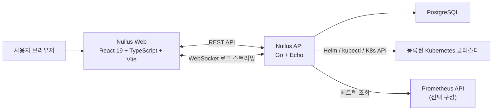
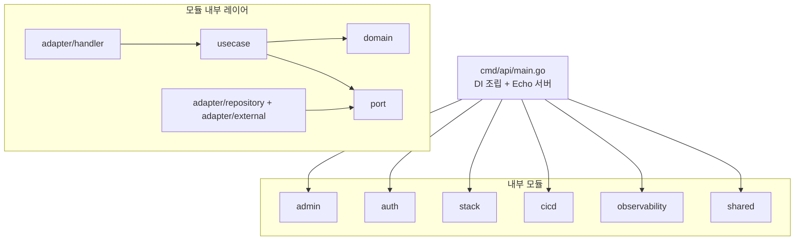
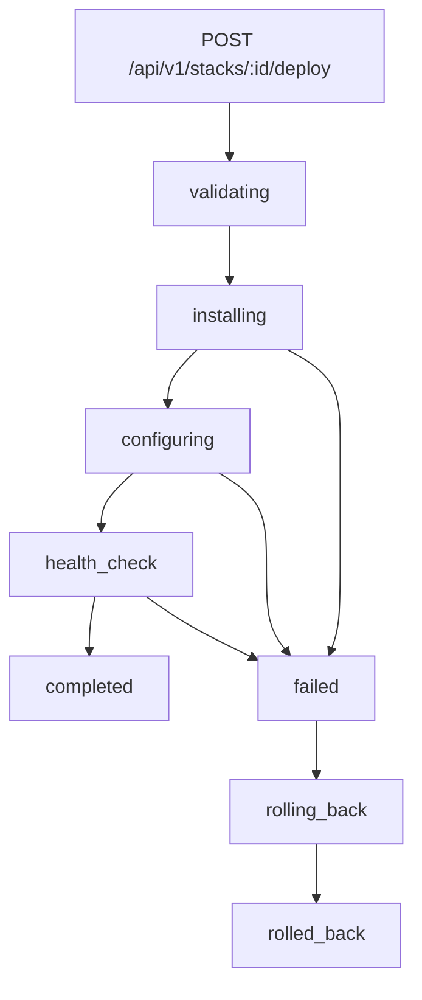
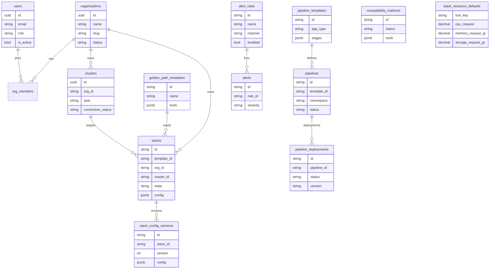
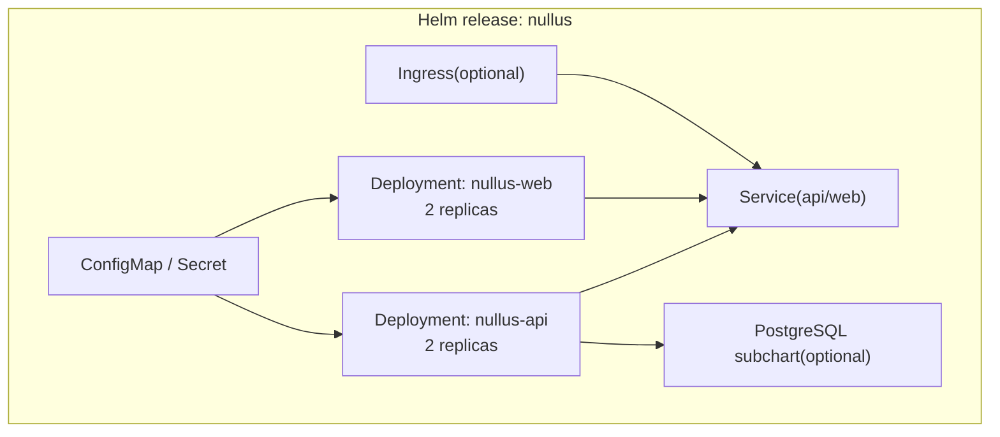
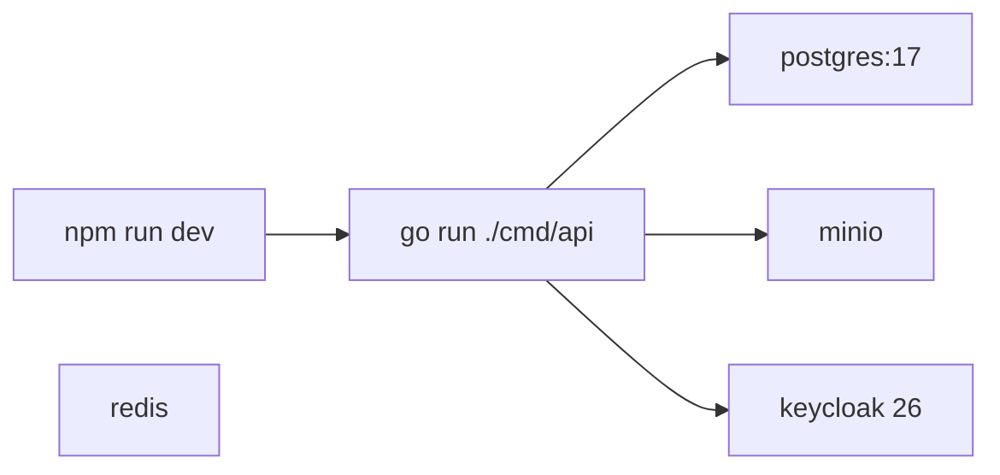
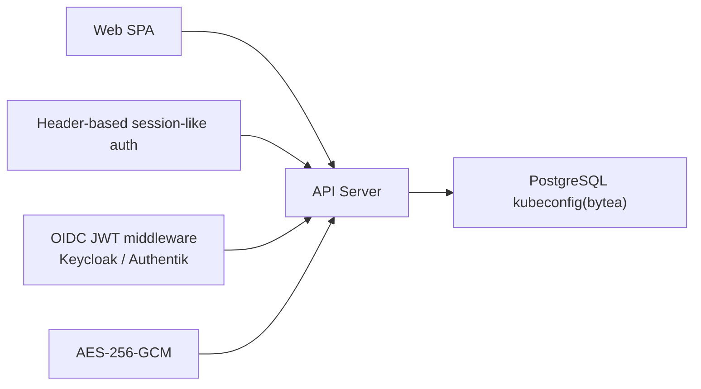

# Nullus 상세 기능 명세 및 시스템 아키텍처 v0.2

**작성일**: 2026-03-30
**문서 버전**: 0.2
**기준 문서**: v0.1 설계 문서 + `draft` 실제 구현
**문서 성격**: 현재 구현 기준 문서 (As-Is Baseline)
**대상 독자**: 엔지니어, 아키텍트, DevOps Engineer

---

## 문서 업데이트 원칙

- v0.1은 설계 기준 문서로 유지한다.
- v0.2는 `draft` 코드베이스의 현재 구현을 기준으로 서술한다.
- 설계에 있었지만 아직 구현되지 않은 항목은 본문에서 현재 기능처럼 설명하지 않는다.
- 설계 대비 미구현 목록은 `Nullus_설계_대비_미구현_항목.md`를 별도 참조한다.
- As-Is 다이어그램 원본은 `Nullus_As-Is_아키텍처_다이어그램.md`를 참조한다.

---

## Part 1: 시스템 아키텍처

### 1. 아키텍처 개요

현재 `draft`의 Nullus는 다음 성격을 가진다.

- 프런트엔드는 React/Vite 기반 SPA이며 Stack, CI/CD, Observability, Admin 화면을 제공한다.
- 백엔드는 단일 Go 바이너리로 배포되지만 내부는 `admin`, `auth`, `stack`, `cicd`, `observability`, `shared` 모듈로 분리된 Modular Monolith 구조다.
- Stack 설치는 Helm 오케스트레이터 중심으로 동작하며, PostgreSQL에 설정과 이력을 저장하고 WebSocket으로 배포 로그를 스트리밍한다.
- 템플릿, 호환성, Known Issues, 리소스 기본값은 파일 카탈로그보다 DB 중심으로 관리된다.
- 설계 문서의 다중 네임스페이스 논리 모델과 달리 현재 실행 기본값은 Stack 단위 네임스페이스 중심이다.



#### 현재 런타임 경계

1. 사용자 브라우저
2. Nullus 컨트롤 플레인 (`web` + `api` + `postgresql`)
3. 등록된 대상 Kubernetes 클러스터

#### v0.1 대비 핵심 변경점

- `Auth/Config/Installer/Monitor Handler` 중심 구조에서 모듈별 `domain/usecase/port/adapter` 구조로 정리되었다.
- 파일 기반 `matrix.yaml`, `known-issues.yaml` 중심 설계에서 DB 기반 카탈로그 구조로 이동했다.
- 대상 클러스터 내부 `Nullus Operator` 전제 대신 API 서버가 Helm/kubectl을 직접 구동하는 구조가 현재 기준이다.

---

### 2. 시스템 구성 원칙

#### 2.1 현재 아키텍처 원칙

- **모듈러 모놀리스**: 서비스 분리보다 단일 배포 단위 내 모듈 분리를 우선한다.
- **클린 아키텍처 지향**: 각 모듈은 `domain`, `usecase`, `port`, `adapter` 레이어를 가진다.
- **DB 중심 카탈로그**: 템플릿, 호환성, 리소스 기본값, Known Issues는 PostgreSQL 기준으로 관리한다.
- **비동기 배포 + 실시간 관찰**: Stack/Pipeline 배포는 서버에서 비동기로 실행하고 클라이언트는 WebSocket으로 진행 상태를 구독한다.
- **실행 가능한 문서화**: API 경로, 테이블명, 상태값은 실제 코드와 마이그레이션 기준으로 맞춘다.

#### 2.2 현재 제약

- 프런트 OIDC는 의존성만 들어와 있고 런타임 연결은 placeholder 상태다.
- 세션 인증은 현재 `X-User-*` 헤더 기반 단순화 구현이다.
- Stack 배포 로그는 인메모리 스트리머 기반이며 DB 영속화되지 않는다.
- Alert Rule과 Notification Config는 모두 CRUD 가능하지만 운영 알림 파이프라인 연결은 아직 제한적이다.

---

### 3. 비기능 요구사항과 현재 운영 기준

v0.1의 NFR 목표는 유지하되, v0.2에서는 현재 구현이 제공하는 운영 근거를 함께 적는다.

| 항목 | 목표/기준 | 현재 구현 근거 |
|---|---|---|
| REST API 응답 | 일반 조회 API는 수백 ms 내 응답 목표 | Echo + pgx 기반, `/health` 제공, production rate limit 적용 |
| Stack 로그 전달 | Near real-time | gorilla/websocket + 인메모리 fan-out 스트리머 |
| 대시보드 조회 | 요청 시 외부 메트릭 반영 | Prometheus API 프록시 방식, DB 장기 저장 없음 |
| 배포 복구 | 실패 시 최소 safe rollback | Stack install 실패 시 rollback 단계 지원 |
| 보안 민감정보 보호 | DB 평문 저장 지양 | kubeconfig AES-256-GCM 암호화 저장 |

#### 현재 문서 해석 기준

- 이 절은 측정 결과 리포트가 아니라 운영 설계 기준이다.
- 수치형 목표는 유지하되, 실제 관측 체계가 아직 완성되지 않은 항목은 구현 근거만 적는다.

---

### 4. 기술 스택

| 계층 | 현재 기술 | 비고 |
|---|---|---|
| Frontend | React 19.2, TypeScript 5.9, Vite 8 | SPA |
| 라우팅 | React Router 7 | 역할 기반 라우팅 |
| 클라이언트 상태 | Zustand 5 | 인증/초안 상태 |
| 서버 상태 | TanStack Query 5 | API 캐시/동기화 |
| 폼/검증 | React Hook Form + Zod | 입력 검증 |
| 편집/시각화 | Monaco, `monaco-yaml`, Recharts, Chart.js | YAML View, 차트 |
| Backend | Go 1.26, Echo v4 | 단일 API 바이너리 |
| 설정 | Viper | 런타임 설정 |
| DB 접근 | pgx v5 | PostgreSQL 연결 |
| 실시간 통신 | gorilla/websocket | Stack/Pipeline 로그 |
| K8s 연동 | Helm Go SDK, client-go, kubectl fallback | 설치/정리 |
| Database | PostgreSQL | dev compose는 PostgreSQL 17 |
| 인증 | Session-like middleware + OIDC JWT middleware | Keycloak/Authentik provider abstraction |
| API 문서 | `api/openapi.yaml` 정적 산출물 | 현재 swag 자동 생성 연결 미확인 |
| 테스트 | `testify`, Vitest, Testing Library, Playwright | FE/BE 혼합 |

---

### 5. 컴포넌트 상세

#### 5.1 Web UI

프런트엔드는 단일 SPA이며 주요 라우트는 아래와 같다.

- `/login`
- `/stack/templates`
- `/stack/install`
- `/stack/list`
- `/stack/deploy/:id`
- `/stack/history/:stackId?`
- `/cicd/templates`
- `/cicd/list`
- `/cicd/developer-deploy`
- `/observability/monitoring`
- `/observability/alert-rules`
- `/observability/alert-history`
- `/admin/organization`
- `/admin/users`
- `/admin/clusters`
- `/admin/known-issues`

#### 5.2 API Server

현재 API는 `/api/v1` 아래 4개 그룹과 2개의 WebSocket 엔드포인트로 정리된다.

```text
Nullus API Server
├── GET  /health
├── /api/v1/admin
│   ├── GET    /organization
│   ├── PATCH  /organization
│   ├── POST   /orgs
│   ├── GET    /users/search
│   ├── GET    /organizations/:orgId/members
│   ├── POST   /organizations/:orgId/members
│   ├── PATCH  /organizations/:orgId/members/:memberId
│   ├── DELETE /organizations/:orgId/members/:memberId
│   ├── POST   /organizations/:orgId/members/:memberId/deactivate
│   ├── GET    /organizations/:orgId/invites
│   ├── POST   /organizations/:orgId/invites
│   ├── DELETE /organizations/:orgId/invites/:token
│   ├── POST   /clusters
│   ├── GET    /clusters
│   ├── GET    /clusters/:id
│   ├── GET    /clusters/:id/namespaces
│   ├── PATCH  /clusters/:id
│   ├── DELETE /clusters/:id
│   ├── POST   /clusters/:id/verify
│   ├── GET    /known-issues
│   ├── GET    /audit-logs
│   ├── GET    /notifications/configs
│   ├── POST   /notifications/configs
│   ├── DELETE /notifications/configs/:id
│   └── GET    /notifications/history
├── /api/v1/stacks
│   ├── POST   /
│   ├── GET    /
│   ├── GET    /:stackId
│   ├── DELETE /:stackId
│   ├── PATCH  /:stackId/tools
│   ├── POST   /:stackId/config
│   ├── POST   /draft
│   ├── GET    /templates
│   ├── GET    /templates/:id
│   ├── POST   /templates
│   ├── PUT    /templates/:id
│   ├── DELETE /templates/:id
│   ├── GET    /compatibility
│   ├── POST   /:stackId/validate
│   ├── POST   /estimate
│   ├── GET    /resource-defaults
│   ├── POST   /resource-defaults
│   ├── GET    /:stackId/history
│   ├── GET    /:id/history/diff
│   ├── GET    /:stackId/diff
│   ├── POST   /:stackId/rollback
│   ├── GET    /:stackId/monitoring
│   ├── POST   /:id/deploy
│   ├── GET    /:id/status
│   ├── GET    /:id/deploy/logs
│   └── GET    /:id/export?format=json|yaml
├── /api/v1/cicd
│   ├── GET    /templates
│   ├── GET    /templates/:id
│   ├── POST   /templates
│   ├── PUT    /templates/:id
│   ├── DELETE /templates/:id
│   ├── GET    /pipelines
│   ├── POST   /pipelines
│   ├── POST   /pipelines/:id/deploy
│   ├── GET    /deployments
│   ├── GET    /deployments/:id
│   ├── GET    /app-templates
│   └── POST   /deploy-app
├── /api/v1/observability
│   ├── GET    /dashboard
│   ├── GET    /alert-rules
│   ├── GET    /alert-rules/:id
│   ├── POST   /alert-rules
│   ├── PATCH  /alert-rules/:id
│   ├── DELETE /alert-rules/:id
│   └── GET    /alert-history
├── GET /ws/deployments/:id/logs
└── GET /ws/cicd/deployments/:id/logs
```

#### 5.3 인증 모드별 라우팅 특성

- development 모드: 인증 미들웨어를 끄고 모든 그룹을 바로 연다.
- production 모드:
  - `admin`: `admin` 전용
  - `stacks`: `admin`, `devops`
  - `cicd`: `admin`, `devops`, `developer`
  - `observability`: 인증된 사용자 전체

`/api/v1/auth/*`는 현재 별도 REST 그룹으로 존재하지 않는다.

#### 5.4 백엔드 모듈 구조



---

### 6. Install Engine

#### 6.1 현재 상태 머신

현재 Stack 배포 상태는 아래 값을 사용한다.

- `pending`
- `validating`
- `installing`
- `configuring`
- `health_check`
- `completed`
- `cancelled`
- `failed`
- `rolling_back`
- `rolled_back`



#### 6.2 현재 설치 단계

현재 구현은 설계 문서의 DAG 엔진보다 고정된 phase/step order에 가깝다.

| Phase | 주요 항목 | 비고 |
|---|---|---|
| A | cert-manager, metrics-server, postgresql, minio, object-storage-secret | 기반 인프라 |
| B | gitlab, argocd, gitlab-runner | 핵심 서비스 |
| C | prometheus, grafana, loki, opensearch, otel-collector, envoy gateway, integration check | 운영 보조 영역 |

#### 6.3 현재 동작 방식

- 배포 시작은 HTTP 요청으로 받고 내부 goroutine에서 비동기로 진행한다.
- 진행 이벤트는 WebSocket과 HTTP 로그 스트림으로 전달된다.
- Compatibility는 `compatibility_matrices`를 조회한다.
- Known Issues는 `known_issues` 테이블을 조회한다.
- 배포 실패 시 rollback 단계가 실행된다.
- 로그는 인메모리 스트리머에 유지되며 DB에 저장되지 않는다.

#### 6.4 현재 Stack 설치 UX 보강 요소

프런트 Stack 설치 화면은 설계 초기안보다 다음 요소가 강화되어 있다.

- YAML View
- Preview Deploy Script
- Dry Run 스타일 체크리스트
- `access_domain` 및 TLS 입력
- `Gateway API` 기반 Gateway/HTTPRoute 미리보기
- `storage.plan_mode` 기반 스토리지 생성/연결 입력
- `resource-defaults` 기반 OSS 리소스 기본값 조정

---

### 7. 데이터 모델

#### 7.1 핵심 ERD



#### 7.2 현재 저장 구조 요약

| 영역 | 테이블 | 비고 |
|---|---|---|
| 조직/사용자 | `organizations`, `users`, `org_members` | 조직 및 멤버 관리 |
| 클러스터 | `clusters` | 등록 대상 클러스터 |
| Stack | `stacks`, `stack_config_versions` | 본문 설정 + 버전 이력 |
| Stack 카탈로그 | `golden_path_templates`, `compatibility_matrices`, `stack_resource_defaults`, `known_issues` | DB 중심 카탈로그 |
| CI/CD | `pipeline_templates`, `pipelines`, `pipeline_deployments` | 파이프라인 정의/실행 |
| Observability | `alert_rules`, `alerts` | 규칙/이력 |
| 운영 로그 | `audit_logs` | 감사 로그 |
| 알림 | `notification_configs`, `notification_history` | 알림 채널 및 발송 이력 |

#### 7.3 JSONB 중심 필드

- `stacks.config`
- `stack_config_versions.config`
- `golden_path_templates.tools`
- `compatibility_matrices.tools`
- `notification_configs.config`

#### 7.4 StackConfig 현재 구조

```json
{
  "access_domain": "platform.example.internal",
  "access_domain_tls": {
    "enabled": true,
    "secret_name": "wildcard-platform-tls",
    "secret_namespace": "nullus"
  },
  "yaml_overrides": {},
  "artifacts": {},
  "pipeline": {},
  "monitoring": {},
  "logging": {},
  "resources": {
    "developers": 20,
    "concurrent_runners": 5,
    "weekly_commits": 100,
    "build_frequency": "hourly"
  },
  "storage": {
    "plan_mode": "integrated-create",
    "database": {},
    "object_storage": {}
  }
}
```

---

### 8. 배포 아키텍처

#### 8.1 Nullus 컨트롤 플레인 배포

현재 Helm chart는 `nullus-api`, `nullus-web`, 선택적 `postgresql` subchart를 중심으로 배포된다.



#### 8.2 로컬 개발 배포



#### 8.3 대상 클러스터 배포 기준

- Stack 생성 시 기본 namespace는 `nullus`
- 오케스트레이터 기본 namespace도 `nullus`
- 프런트는 신규 namespace 생성과 기존 namespace 선택을 모두 지원
- 일부 미리보기 예시에는 `nullus-stack` 표현이 남아 있으므로 문서/예시 해석 시 주의가 필요하다

즉 현재 As-Is는 "서비스별 다중 namespace 설치"보다 "Stack 단위 namespace 중심 설치"에 가깝다.

---

### 9. 보안 아키텍처



#### 9.1 현재 인증 구조

- backend
  - session 모드: `X-User-ID`, `X-User-Email`, `X-User-Name`, `X-User-Role`, `X-User-OrgID` 헤더를 읽는 단순화 구현
  - OIDC 모드: JWT middleware + provider abstraction
  - 지원 provider: Keycloak 기본, Authentik 선택
- frontend
  - mock 로그인 폼이 현재 기본 동선
  - OIDC wrapper는 placeholder 상태
  - 로그인 화면에는 OIDC redirect 호출 TODO가 남아 있다

#### 9.2 권한 모델

| 그룹 | 현재 접근 범위 |
|---|---|
| `admin` | 모든 그룹 접근 |
| `devops` | `stacks`, `cicd`, `observability` 중심 |
| `developer` | `cicd`, `observability` 중심 |

#### 9.3 민감정보 보호

- kubeconfig는 AES-256-GCM으로 암호화해 DB에 저장한다.
- 복호화는 실제 K8s 호출 시점에 메모리에서 수행한다.
- production 모드에서는 rate limiter가 활성화된다.

---

### 10. 운영 및 마이그레이션 전략

#### 10.1 DB 마이그레이션

- `golang-migrate` 기반 SQL 마이그레이션
- 초기 상태 enum 보정, 리소스 기본값, 템플릿 버전 정렬 등 후속 마이그레이션이 누적되어 있다
- Stack 상태 enum은 후속 마이그레이션으로 `healthcheck` → `health_check`, `cancelled` 추가가 반영되었다

#### 10.2 API 버전 정책

- 현재 공용 API prefix는 `/api/v1`
- 실시간 로그 채널은 `/ws/*`
- 설계 문서에 있던 `/auth`, `/monitoring`, `/compatibility` 독립 그룹은 현재 구현에서 각각 `admin`, `observability`, `stacks` 그룹 내부로 재배치되었다

#### 10.3 운영 진단 포인트

- `/health` 제공
- 배포 로그: HTTP 스트림 + WebSocket
- 감사 로그: `audit_logs`
- 알림 설정 및 이력: `notification_configs`, `notification_history`

---

## Part 2: 상세 기능 명세

### 기능 0: Organization 및 Admin 영역

**목적**: 조직 메타데이터, 멤버, 클러스터, Known Issues, 알림 설정, 감사 로그를 관리한다.

#### 현재 구현 범위

- 단일 organization 조회/수정
- organization 생성 호환 엔드포인트
- 조직 멤버 CRUD 및 비활성화
- 사용자 이메일 검색
- 클러스터 등록/수정/삭제/검증/namespace 조회
- Known Issues 조회
- Notification Config CRUD 및 발송 이력 조회
- Audit Log 조회

#### 현재 API

| Method | Path | 설명 |
|---|---|---|
| GET | `/api/v1/admin/organization` | 조직 조회 |
| PATCH | `/api/v1/admin/organization` | 조직 수정 |
| POST | `/api/v1/admin/orgs` | 조직 생성 호환 엔드포인트 |
| GET | `/api/v1/admin/users/search` | 이메일 기반 사용자 검색 |
| GET | `/api/v1/admin/organizations/:orgId/members` | 멤버 목록 |
| POST | `/api/v1/admin/organizations/:orgId/members` | 멤버 생성/초대 |
| PATCH | `/api/v1/admin/organizations/:orgId/members/:memberId` | 멤버 수정 |
| DELETE | `/api/v1/admin/organizations/:orgId/members/:memberId` | 멤버 제거 |
| POST | `/api/v1/admin/organizations/:orgId/members/:memberId/deactivate` | 멤버 비활성화 |
| POST | `/api/v1/admin/clusters/:id/verify` | 클러스터 연결 검증 |
| GET | `/api/v1/admin/known-issues` | Known Issues 조회 |
| GET | `/api/v1/admin/audit-logs` | 감사 로그 조회 |
| GET | `/api/v1/admin/notifications/configs` | 알림 설정 목록 |
| POST | `/api/v1/admin/notifications/configs` | 알림 설정 생성 |
| GET | `/api/v1/admin/notifications/history` | 알림 이력 조회 |

#### 현재 데이터 모델

- `organizations`
- `users`
- `org_members`
- `clusters`
- `audit_logs`
- `notification_configs`
- `notification_history`
- `known_issues`

#### 향후 확장

- 상위 `/api/v1/users` 전역 RBAC 관리 API
- 실제 초대 토큰 발급/만료/수락 플로우
- 조직 상태 전환과 접근 제어 강화

---

### 기능 1: Kubernetes Cluster 등록 및 관리

**목적**: Stack 및 Pipeline이 사용할 대상 Kubernetes 클러스터를 등록하고 검증한다.

#### 현재 구현 범위

- cluster 등록
- 목록/상세 조회
- 수정/삭제
- kubeconfig 기반 연결 검증
- namespace 목록 조회

#### 현재 API

| Method | Path | 설명 |
|---|---|---|
| POST | `/api/v1/admin/clusters` | 클러스터 등록 |
| GET | `/api/v1/admin/clusters` | 클러스터 목록 |
| GET | `/api/v1/admin/clusters/:id` | 클러스터 상세 |
| PATCH | `/api/v1/admin/clusters/:id` | 클러스터 수정 |
| DELETE | `/api/v1/admin/clusters/:id` | 클러스터 삭제 |
| POST | `/api/v1/admin/clusters/:id/verify` | 연결 검증 |
| GET | `/api/v1/admin/clusters/:id/namespaces` | namespace 목록 |

#### 현재 구현 포인트

- cluster type은 `pipeline`, `target`
- connection status는 `connected`, `pending`, `unreachable`, `auth_failed`
- kubeconfig는 암호화 저장 후 검증 시 복호화한다

#### 향후 확장

- cluster 분류별 정책 템플릿
- 검증 결과 캐시/주기 동기화 고도화

---

### 기능 2: Stack 설계 및 노코드 구성 UI

**목적**: 사용자가 DevSecOps Stack을 코드 없이 설계하고 검토할 수 있게 한다.

#### 현재 구현 범위

- Stack 생성 및 목록/상세 조회
- 드래프트 저장
- 도구 추가
- 설정 저장
- YAML View
- Preview Deploy Script
- Dry Run 스타일 검토 체크리스트
- Access Domain 및 TLS 설정
- Storage plan mode 설정
- 리소스 예상량 표시

#### 현재 API

| Method | Path | 설명 |
|---|---|---|
| POST | `/api/v1/stacks` | Stack 생성 |
| GET | `/api/v1/stacks` | Stack 목록 |
| GET | `/api/v1/stacks/:stackId` | Stack 상세 |
| DELETE | `/api/v1/stacks/:stackId` | Stack 삭제 |
| PATCH | `/api/v1/stacks/:stackId/tools` | 도구 추가 |
| POST | `/api/v1/stacks/:stackId/config` | 설정 저장 |
| POST | `/api/v1/stacks/draft` | 드래프트 저장 |

#### 현재 설정 모델 핵심 필드

- `access_domain`
- `access_domain_tls.enabled`
- `access_domain_tls.secret_name`
- `access_domain_tls.secret_namespace`
- `yaml_overrides`
- `resources.developers`
- `resources.concurrent_runners`
- `resources.weekly_commits`
- `resources.build_frequency`
- `storage.plan_mode`
- `storage.database`
- `storage.object_storage`

#### 향후 확장

- 서버 측 정식 dry-run endpoint
- YAML 편집 정책과 배포 승인 플로우의 분리

---

### 기능 3: Golden Path 템플릿 및 호환성 관리

**목적**: 검증된 Stack 조합과 버전 호환성 정보를 제공한다.

#### 현재 구현 범위

- Golden Path 템플릿 CRUD
- Compatibility matrix 조회
- Stack 기준 조합 검증
- DB 기반 버전 메타데이터 관리

#### 현재 API

| Method | Path | 설명 |
|---|---|---|
| GET | `/api/v1/stacks/templates` | 템플릿 목록 |
| GET | `/api/v1/stacks/templates/:id` | 템플릿 상세 |
| POST | `/api/v1/stacks/templates` | 템플릿 생성 |
| PUT | `/api/v1/stacks/templates/:id` | 템플릿 수정 |
| DELETE | `/api/v1/stacks/templates/:id` | 템플릿 삭제 |
| GET | `/api/v1/stacks/compatibility` | 호환성 매트릭스 조회 |
| POST | `/api/v1/stacks/:stackId/validate` | Stack 조합 검증 |

#### 현재 데이터 모델

- `golden_path_templates`
- `compatibility_matrices`

#### 현재 구현 포인트

- 템플릿의 `tools`는 `category`, `name`, `helm_version`, `app_version`를 가진다
- 호환성 정보는 `compatibility_matrices.tools JSONB`에 저장된다
- 설계 초기안과 달리 YAML 카탈로그 파일이 아니라 DB를 기준으로 운영한다

#### 향후 확장

- 검증 결과의 추천 버전 자동 반영
- Known Issues와 호환성 경고의 통합 UI

---

### 기능 4: DevSecOps Stack 설치, 배포, 이력 관리

**목적**: 선택한 Stack 구성을 대상 클러스터에 설치하고 진행 상태와 이력을 관리한다.

#### 현재 구현 범위

- Stack 배포 시작
- 상태 조회
- 로그 스트리밍
- 버전 이력 조회
- 버전 diff 조회
- 설정 rollback
- Stack monitoring 조회
- 설정 export
- 삭제 시 best-effort 정리

#### 현재 API

| Method | Path | 설명 |
|---|---|---|
| POST | `/api/v1/stacks/:id/deploy` | 배포 시작 |
| GET | `/api/v1/stacks/:id/status` | 현재 상태 조회 |
| GET | `/api/v1/stacks/:id/deploy/logs` | HTTP 로그 스트림 |
| GET | `/ws/deployments/:id/logs` | WebSocket 로그 스트림 |
| GET | `/api/v1/stacks/:stackId/history` | 버전 이력 조회 |
| GET | `/api/v1/stacks/:id/history/diff` | 버전 간 diff |
| GET | `/api/v1/stacks/:stackId/diff` | 현재 대비 diff |
| POST | `/api/v1/stacks/:stackId/rollback` | 버전 rollback |
| GET | `/api/v1/stacks/:stackId/monitoring` | Stack 모니터링 정보 |
| GET | `/api/v1/stacks/:id/export?format=json|yaml` | 설정 내보내기 |

#### 현재 이력 모델

- 현재 설정: `stacks`
- 버전 이력: `stack_config_versions`
- 배포 로그: 인메모리 스트리머

#### 현재 제약

- `deployments`, `deployment_logs` 테이블은 없다
- 재시도 전용 endpoint는 없다
- `partial_success`, `retrying`, `timeout` 상태는 없다

#### 향후 확장

- 배포 실행 이력 분리 저장
- 실패 단계 재시도 API
- 로그 영속화

---

### 기능 5: CI/CD 템플릿 카탈로그

**목적**: 애플리케이션 배포용 파이프라인 템플릿을 관리한다.

#### 현재 구현 범위

- CI/CD 템플릿 CRUD
- 앱 템플릿 목록 제공

#### 현재 API

| Method | Path | 설명 |
|---|---|---|
| GET | `/api/v1/cicd/templates` | 템플릿 목록 |
| GET | `/api/v1/cicd/templates/:id` | 템플릿 상세 |
| POST | `/api/v1/cicd/templates` | 템플릿 생성 |
| PUT | `/api/v1/cicd/templates/:id` | 템플릿 수정 |
| DELETE | `/api/v1/cicd/templates/:id` | 템플릿 삭제 |
| GET | `/api/v1/cicd/app-templates` | 앱 템플릿 목록 |

#### 현재 데이터 모델

- `pipeline_templates`

#### 향후 확장

- 템플릿 검증 정책 강화
- 언어/프레임워크별 더 세밀한 기본값 제공

---

### 기능 6: CI/CD Pipeline 배포 및 이력 관리

**목적**: 앱 배포용 파이프라인을 생성하고 실행 이력을 추적한다.

#### 현재 구현 범위

- pipeline 생성/목록 조회
- pipeline deploy 실행
- deployment 목록/상세 조회
- app deploy endpoint 제공
- pipeline 로그 WebSocket 스트림

#### 현재 API

| Method | Path | 설명 |
|---|---|---|
| GET | `/api/v1/cicd/pipelines` | 파이프라인 목록 |
| POST | `/api/v1/cicd/pipelines` | 파이프라인 생성 |
| POST | `/api/v1/cicd/pipelines/:id/deploy` | 파이프라인 배포 |
| GET | `/api/v1/cicd/deployments` | 배포 목록 |
| GET | `/api/v1/cicd/deployments/:id` | 배포 상세 |
| POST | `/api/v1/cicd/deploy-app` | 앱 배포 도우미 endpoint |
| GET | `/ws/cicd/deployments/:id/logs` | 파이프라인 로그 |

#### 현재 데이터 모델

- `pipelines`
- `pipeline_deployments`

#### 현재 구현 포인트

- app type은 `web`, `backend`, `batch`
- deployment status는 `pending`, `running`, `success`, `failed`, `rolled_back`
- 기본 namespace는 `default`

#### 향후 확장

- pipeline rollback/diff
- 생성된 K8s 오브젝트 상세 비교

---

### 기능 7: Observability 및 Alert Rule 관리

**목적**: 대시보드, Alert Rule, Alert History를 관리한다.

#### 현재 구현 범위

- Observability dashboard 조회
- Alert Rule CRUD
- Alert History 조회

#### 현재 API

| Method | Path | 설명 |
|---|---|---|
| GET | `/api/v1/observability/dashboard` | 대시보드 조회 |
| GET | `/api/v1/observability/alert-rules` | Alert Rule 목록 |
| GET | `/api/v1/observability/alert-rules/:id` | Alert Rule 상세 |
| POST | `/api/v1/observability/alert-rules` | Alert Rule 생성 |
| PATCH | `/api/v1/observability/alert-rules/:id` | Alert Rule 수정 |
| DELETE | `/api/v1/observability/alert-rules/:id` | Alert Rule 삭제 |
| GET | `/api/v1/observability/alert-history` | Alert History 조회 |

#### 현재 데이터 모델

- `alert_rules`
- `alerts`

#### 현재 구현 포인트

- 메트릭은 Prometheus API 조회 기반이다
- 대시보드는 저장형 BI보다 요청 시 계산/조합에 가깝다
- 알림 채널 설정 테이블은 admin 영역에 분리되어 있다

#### 현재 제약

- `metrics/summary` 독립 endpoint는 없다
- Alert Rule에서 실제 Notification Config로 이어지는 자동 발송 경로는 제한적이다

#### 향후 확장

- Slack/Email notifier 운영 wiring
- 파이프라인/Stack 요약 메트릭 endpoint

---

### 기능 8: 리소스 예상량 계산 및 리소스 기본값 관리

**목적**: 설치 전에 필요한 리소스를 계산하고 OSS별 기본 요청량을 관리한다.

#### 현재 구현 범위

- Stack resource estimation
- OSS resource default 조회/수정

#### 현재 API

| Method | Path | 설명 |
|---|---|---|
| POST | `/api/v1/stacks/estimate` | 리소스 예상량 계산 |
| GET | `/api/v1/stacks/resource-defaults` | 기본값 목록 |
| POST | `/api/v1/stacks/resource-defaults` | 기본값 저장 |

#### 현재 데이터 모델

- `stack_resource_defaults`

#### 현재 구현 포인트

- 기본값은 CPU, Memory, Storage request/limit을 모두 가진다
- Stack 설치 화면은 이 기본값을 이용해 총량을 계산한다

#### 향후 확장

- 비용 추정 모델 정교화
- 템플릿별 baseline 추천 자동화

---

### 기능 9: 인증 및 역할 기반 접근 제어

**목적**: 사용자의 로그인 상태와 역할에 따라 UI/API 접근을 제어한다.

#### 현재 구현 범위

- mock 로그인
- header-based session-like auth
- OIDC JWT backend middleware
- 역할 기반 API 그룹 접근 제어
- 프런트 route guard

#### 현재 구현 포인트

- 테스트 계정
  - `admin@nullus.dev / admin123`
  - `devops@nullus.dev / devops123`
  - `developer@nullus.dev / developer123`
- OIDC provider abstraction은 Keycloak/Authentik을 지원한다
- 프런트 `OIDCWrapper`는 현재 no-op wrapper다

#### 현재 제약

- `/api/v1/auth/login`, `/logout`, `/me` REST 세트 미구현
- 실제 쿠키 세션 저장소 미연결
- 프런트 OIDC redirect/logout callback 미연결

#### 향후 확장

- 완전한 세션 쿠키 모드
- OIDC end-to-end 로그인/로그아웃/토큰 갱신
- 사용자 전역 관리 API

---

## Part 3: 현재 기준 ADR 요약

| ID | 결정 | 현재 선택 | 비고 |
|---|---|---|---|
| ADR-001 | 웹 앱 구조 | React SPA + feature route | 단일 Web UI |
| ADR-002 | 백엔드 구조 | Modular Monolith + Clean Architecture | 모듈별 레이어 분리 |
| ADR-003 | 설치 방식 | Helm 오케스트레이터 + kubectl fallback | Operator 미도입 |
| ADR-004 | Stack 설정 저장 | PostgreSQL JSONB + 버전 스냅샷 | `stacks`, `stack_config_versions` |
| ADR-005 | 카탈로그 저장소 | DB 중심 | 템플릿/호환성/Known Issues |
| ADR-006 | 실시간 배포 관찰 | WebSocket + HTTP stream | 로그는 인메모리 유지 |
| ADR-007 | 인증 | 단순 세션 헤더 + OIDC JWT 병행 | 프런트 OIDC는 과도기 |
| ADR-008 | 네트워크 진입 | Stack 영역은 Gateway API 중심 | Ingress보다 Gateway/HTTPRoute 비중 증가 |
| ADR-009 | 문서 기준 | v0.2부터 As-Is 기준 문서화 | v0.1은 설계 기준으로 유지 |

---

## Part 4: 참조 문서

- `Nullus 상세 기능 명세 및 시스템 아키텍처.md` (v0.1 설계 기준)
- `Nullus_설계_대비_미구현_항목.md`
- `Nullus_As-Is_아키텍처_다이어그램.md`
- `docs/20_개발가이드/Nullus_백엔드_모듈_개발_가이드.md`
- `docs/20_개발가이드/Nullus_프론트엔드_아키텍처_가이드.md`

---

## 결론

v0.2의 Nullus 문서는 더 이상 "예정 아키텍처"를 기술하지 않는다.
현재 구현의 기준선은 다음과 같다.

- React SPA + Go API + PostgreSQL 컨트롤 플레인
- Modular Monolith + DB 중심 카탈로그
- Helm 오케스트레이터 기반 Stack 설치
- WebSocket 기반 배포 로그 스트리밍
- 과도기적 인증 구조와 단계적 RBAC

향후 설계 확장 논의는 반드시 이 기준선 위에서 진행한다.
