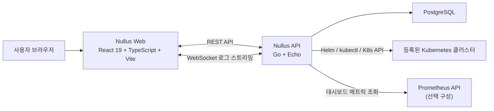
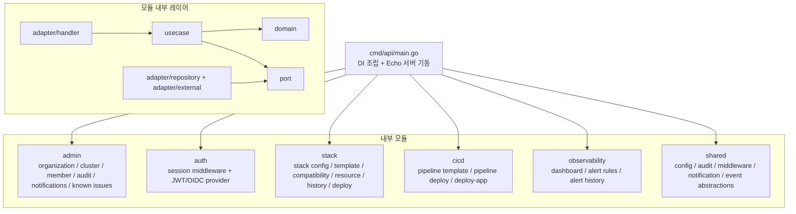
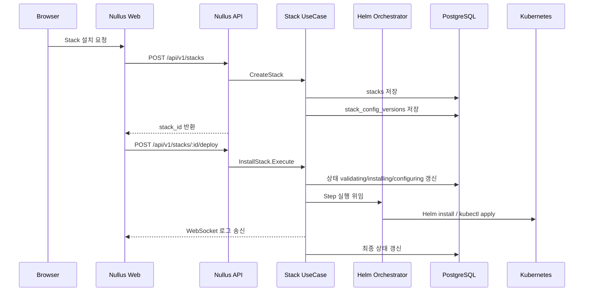
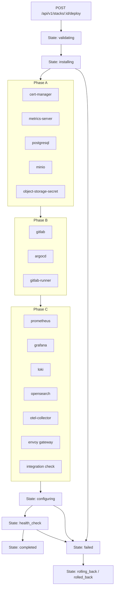
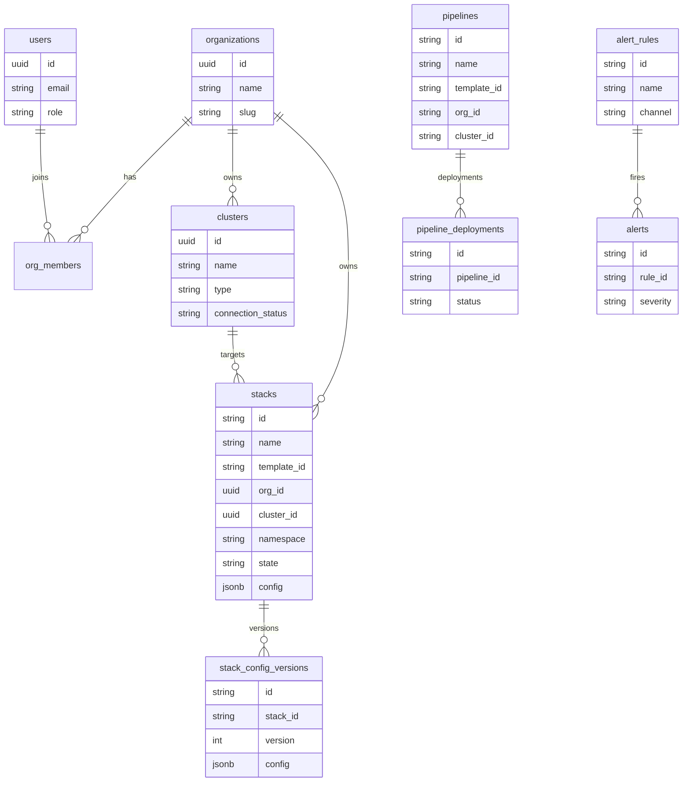
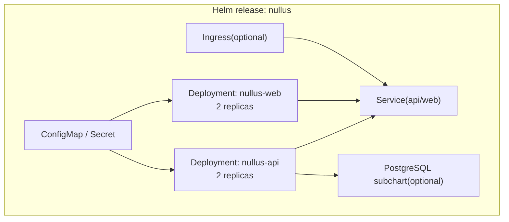
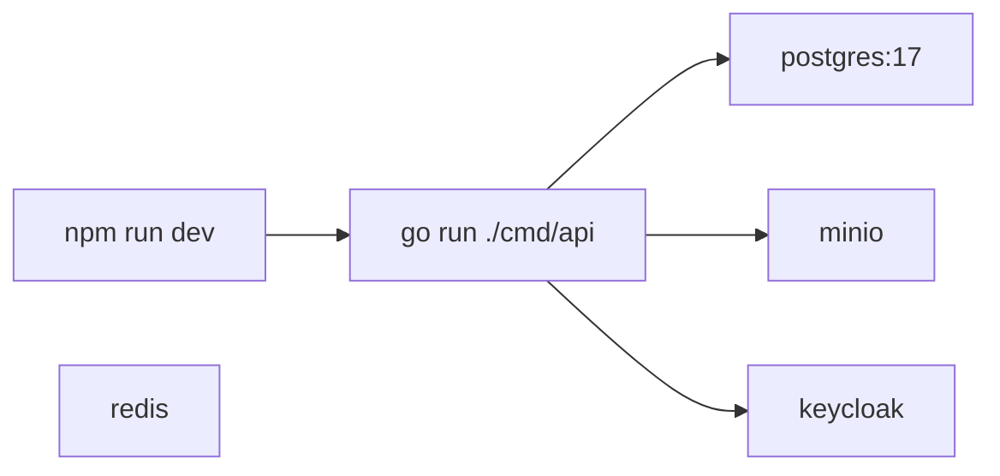
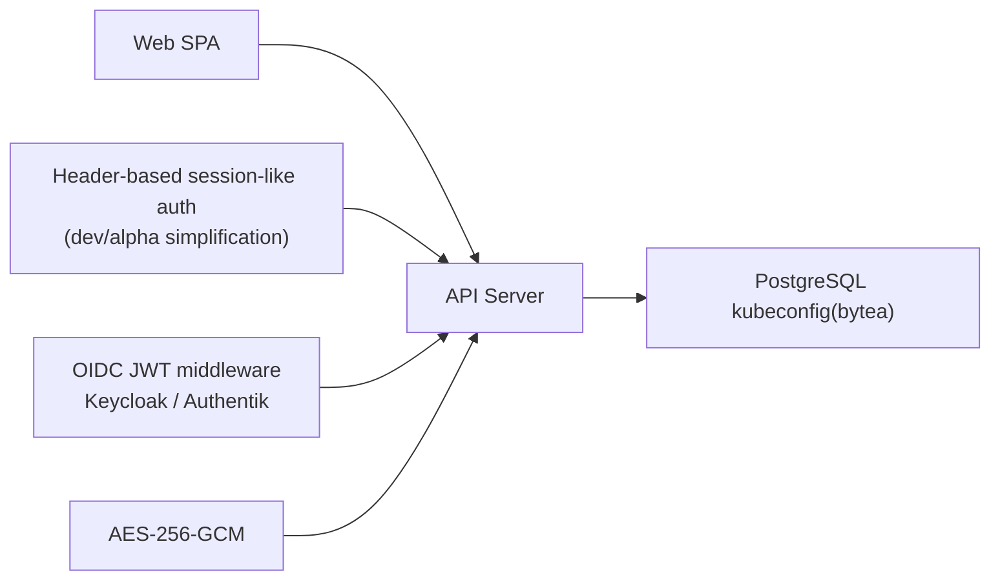

# Nullus 현재 As-Is 아키텍처 다이어그램

**작성일**: 2026-03-30
**버전**: 1.0
**기준 범위**: `draft` 실제 코드/마이그레이션/배포 템플릿 기준
**대상 독자**: 엔지니어, 아키텍트, 신규 기여자

---

## 1. 개요

현재 `draft`의 Nullus는 다음 특성을 가진다.

- 프런트엔드는 React/Vite SPA이며 역할 기반 라우팅과 Stack/CI-CD/Observability/Admin 기능을 가진다.
- 백엔드는 단일 Go 바이너리이지만 내부는 `admin`, `auth`, `stack`, `cicd`, `observability`, `shared` 모듈로 분리된 **Modular Monolith + Clean Architecture** 구조다.
- Stack 설치는 Helm 오케스트레이터 중심이며, PostgreSQL에 설정/이력/카탈로그를 저장하고 WebSocket으로 진행 로그를 스트리밍한다.
- Compatibility, Known Issues, Notification Config는 파일 카탈로그보다 DB 중심으로 운용된다.

---

## 2. 시스템 런타임 다이어그램

### 보충 설명

- Web은 `/login`, `/stack/*`, `/cicd/*`, `/observability/*`, `/admin/*` 경로를 가진다.
- API는 `/api/v1/admin`, `/api/v1/stacks`, `/api/v1/cicd`, `/api/v1/observability` 그룹으로 동작한다.
- Stack 배포 시작은 HTTP로 받고, 진행 로그는 `/ws/deployments/:id/logs`로 스트리밍한다.

---

## 3. 백엔드 모듈 구조

### 실제 모듈 경로

- `internal/admin/`
- `internal/auth/`
- `internal/stack/`
- `internal/cicd/`
- `internal/observability/`
- `internal/shared/`

---

## 4. 요청 흐름 다이어그램

### 특징

- 배포는 비동기 goroutine으로 시작된다.
- Stack 배포 로그는 `PostgresStreamer`가 구독자에게 fan-out 하며 DB(`deployment_logs`)에도 저장된다.
- Stack 설정 이력은 `stack_config_versions`, 배포 로그는 `deployment_logs`에 각각 분리 저장된다.

---

## 5. Stack 설치 엔진 As-Is

### 현재 구현 특성

- 설치 단계는 `installPhases`와 Helm 오케스트레이터의 고정 step order를 따른다.
- Compatibility는 DB의 `compatibility_matrices`를 조회한다.
- Known Issues도 YAML 파일이 아니라 DB `known_issues` 테이블을 사용한다.
- Gateway는 설계 문서의 후반 동기화 내용대로 `Gateway API`를 사용하는 쪽으로 UI와 오케스트레이터가 보강되어 있다.

---

## 6. 데이터 저장 구조

### 실제 저장 계층 포인트

- Stack 본문 설정은 `stacks.config JSONB`
- Stack 버전 이력은 `stack_config_versions`
- Compatibility는 `compatibility_matrices.tools JSONB`
- Notification Config와 History는 admin 영역 DB 테이블로 분리
- kubeconfig 는 암호화된 상태로 DB에 저장되고 사용 시 복호화된다

---

## 7. 배포 구조 As-Is

### 7.1 Nullus 컨트롤 플레인 자체 배포

### 7.2 로컬 개발 배포

### 7.3 대상 클러스터 설치 결과

현재 구현은 설계 문서의 완전한 `nullus-{service}` 다중 네임스페이스보다, 실제 실행 시점에는 단일 Stack 네임스페이스 중심 설치가 더 강하다.

- 백엔드 `CreateStack` 기본 namespace: `nullus`
- 오케스트레이터 기본 namespace: `nullus`
- 프런트 일부 Preview/Gateway 생성 예시: `nullus-stack`

즉 현재 As-Is는 "문서상 논리 모델"과 "실행 기본값" 사이에 namespace 표현 차이가 남아 있다.

---

## 8. 보안 및 인증 As-Is

### 현재 상태

- production 모드에서는 `DualAuthMiddleware`가 session 또는 OIDC JWT middleware 를 선택한다.
- 하지만 session 모드는 아직 실제 쿠키 세션 저장소가 아니라 `X-User-*` 헤더 기반 단순화 구현이다.
- kubeconfig는 AES-256-GCM으로 암복호화된다.

---

## 9. 핵심 As-Is 요약

- 현재 Nullus는 설계 초안보다 "더 코드 중심적이고 모듈화된 백엔드"를 갖고 있다.
- 반대로 운영 아키텍처는 설계 초안보다 "더 단순화된 배포 모델"을 택하고 있다.
- Stack 영역은 가장 구현 진척도가 높고, Auth와 이벤트 연동은 아직 과도기적이다.
- 문서상 논리 모델과 실제 구현의 차이를 해석할 때는 Stack 동기화 문서와 실제 namespace 기본값 차이를 함께 봐야 한다.
