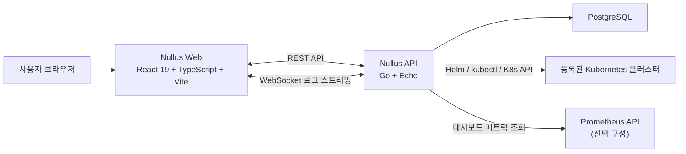
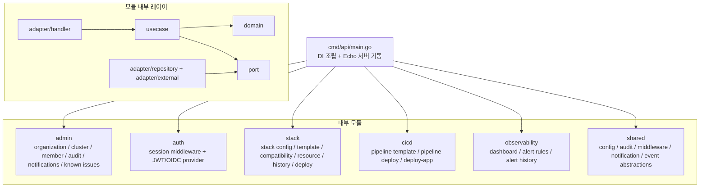
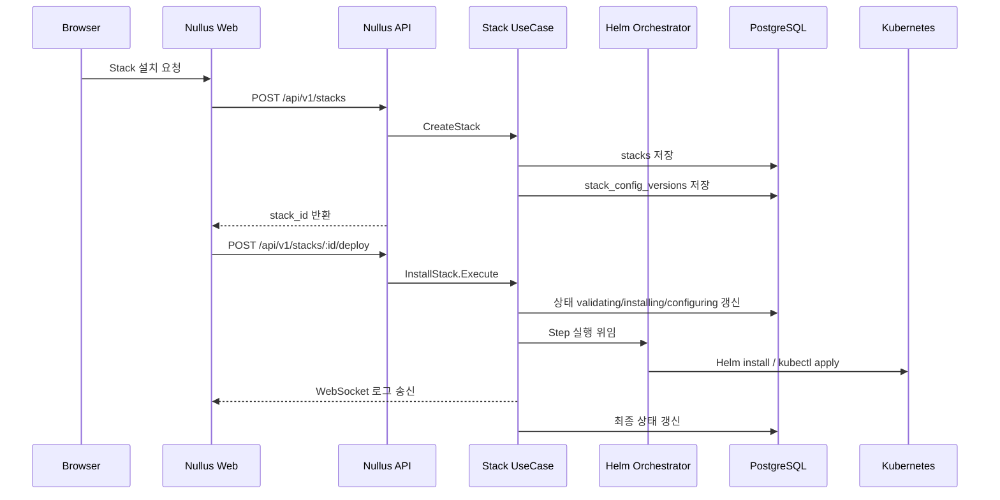
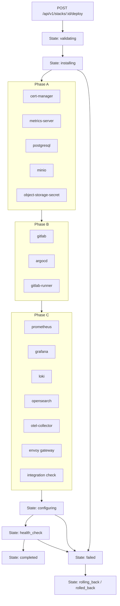
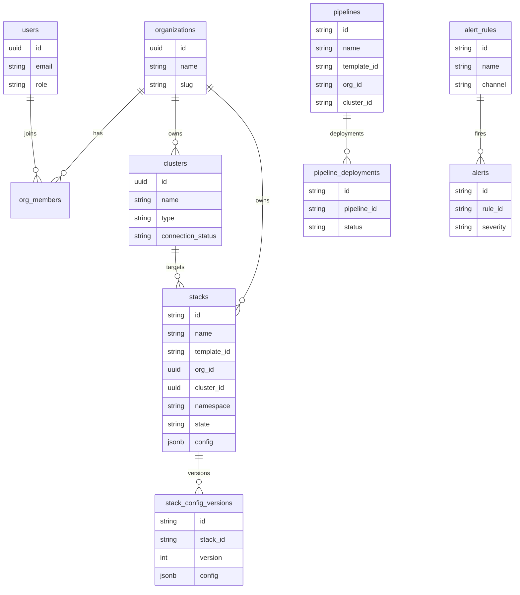
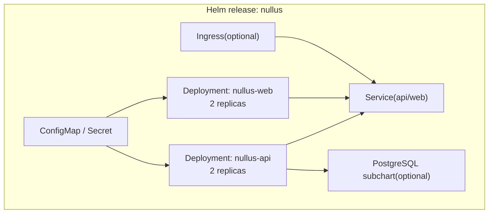
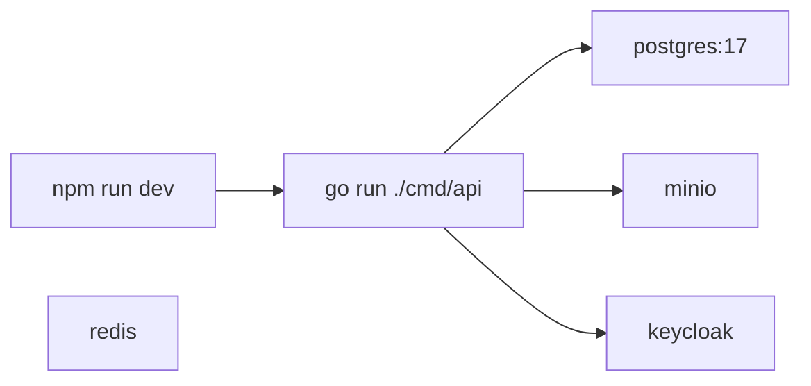
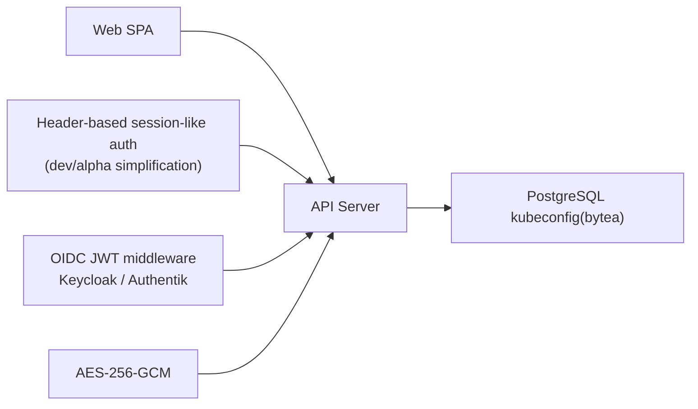

# Nullus 현재 As-Is 아키텍처 다이어그램

**작성일**: 2026-03-30
**최종 갱신**: 2026-08-31 (코드 기준 재대조)
**버전**: 1.1
**기준 범위**: `draft` 실제 코드/마이그레이션/배포 템플릿 기준
**대상 독자**: 엔지니어, 아키텍트, 신규 기여자

---

## 1. 개요

현재 `draft`의 Nullus는 다음 특성을 가진다.

- 프런트엔드는 React/Vite SPA이며 역할 기반 라우팅과 Stack/CI-CD/Observability/Admin 기능을 가진다.
- 백엔드는 단일 Go 바이너리이지만 내부는 `admin`, `auth`, `stack`, `cicd`, `observability`, `shared`, `cli` 모듈로 분리된 **Modular Monolith + Clean Architecture** 구조다. 배포 바이너리는 `cmd/api` 하나이고, `cmd/nullus`(통합 CLI)가 같은 저장소에서 따로 빌드된다.
- Stack 설치는 Helm 오케스트레이터 중심이며, PostgreSQL에 설정/이력/카탈로그를 저장하고 WebSocket으로 진행 로그를 스트리밍한다.
- Compatibility, Known Issues, Notification Config는 파일 카탈로그보다 DB 중심으로 운용된다.

---

## 2. 시스템 런타임 다이어그램

```mermaid
flowchart LR
  Browser["사용자 브라우저"]
  Web["Nullus Web<br/>React 19 + TypeScript + Vite"]
  API["Nullus API<br/>Go + Echo"]
  PG["PostgreSQL"]
  K8S["등록된 Kubernetes 클러스터"]
  PROM["Prometheus API<br/>(선택 구성)"]

  Browser --> Web
  Web <-->|REST API| API
  Web <-->|WebSocket 로그 스트리밍| API
  API --> PG
  API -->|Helm / kubectl / K8s API| K8S
  API -->|대시보드 메트릭 조회| PROM
```

### 보충 설명

- Web은 `/login`, `/stack/*`, `/cicd/*`, `/observability/*`, `/admin/*` 경로를 가진다.
- API는 `/api/v1/admin`, `/api/v1/stacks`, `/api/v1/cicd`, `/api/v1/observability` 그룹으로 동작한다.
- Stack 배포 시작은 HTTP로 받고, 진행 로그는 `/ws/deployments/:id/logs`로 스트리밍한다.

---

## 3. 백엔드 모듈 구조

```mermaid
flowchart TB
  Main["cmd/api/main.go<br/>DI 조립 + Echo 서버 기동"]

  subgraph Modules["내부 모듈"]
    direction LR
    Admin["admin<br/>organization / cluster / member / audit / notifications / known issues"]
    Auth["auth<br/>session middleware + JWT/OIDC provider"]
    Stack["stack<br/>stack config / template / compatibility / resource / history / deploy"]
    CICD["cicd<br/>pipeline template / pipeline deploy / deploy-app"]
    Obs["observability<br/>dashboard / alert rules / alert history"]
    Shared["shared<br/>config / audit / middleware / notification / event abstractions"]
  end

  subgraph Layers["모듈 내부 레이어"]
    direction LR
    Handler["adapter/handler"]
    Usecase["usecase"]
    Domain["domain"]
    Port["port"]
    Infra["adapter/repository + adapter/external"]
  end

  Main --> Admin
  Main --> Auth
  Main --> Stack
  Main --> CICD
  Main --> Obs
  Main --> Shared

  Handler --> Usecase
  Usecase --> Domain
  Usecase --> Port
  Infra --> Port
```

### 실제 모듈 경로

- `internal/admin/`
- `internal/auth/`
- `internal/stack/`
- `internal/cicd/`
- `internal/observability/`
- `internal/shared/`
- `internal/cli/` — 바운디드 컨텍스트가 아니라 CLI 표면(명령 트리·출력 형식)
- `pkg/nullusclient/` — `internal/` 밖. CLI·MCP 가 함께 쓰는 공유층이라 외부 import 가 가능해야 한다
- `pkg/crypto/` — AES-256-GCM

---

## 4. 요청 흐름 다이어그램

```mermaid
sequenceDiagram
  participant User as Browser
  participant Web as Nullus Web
  participant API as Nullus API
  participant StackUC as Stack UseCase
  participant Helm as Helm Orchestrator
  participant DB as PostgreSQL
  participant K8S as Kubernetes

  User->>Web: Stack 설치 요청
  Web->>API: POST /api/v1/stacks
  API->>StackUC: CreateStack
  StackUC->>DB: stacks 저장
  StackUC->>DB: stack_config_versions 저장
  API-->>Web: stack_id 반환

  Web->>API: POST /api/v1/stacks/:id/deploy
  API->>StackUC: InstallStack.Execute
  StackUC->>DB: 상태 validating/installing/configuring 갱신
  StackUC->>Helm: Step 실행 위임
  Helm->>K8S: Helm install / kubectl apply
  StackUC-->>Web: WebSocket 로그 송신
  StackUC->>DB: 최종 상태 갱신
```

### 특징

- 배포는 비동기 goroutine으로 시작된다.
- Stack 배포 로그는 인메모리 스트리머에서 구독자에게 fan-out 되고, **같은 로그가
  `stack_deploy_logs` 에도 쌓인다**(`PersistentStreamer`, 마이그레이션 `000074`).
  메모리 계층은 실시간 구독을, DB 는 재기동을 견디는 몫을 맡는다.
- Stack 설정 이력은 `stack_config_versions` 에 저장된다.
- 서버가 재시작돼도 끊긴 설치가 `installing` 에 갇히지 않는다 — 기동 시 고아 배포를 회수한다.

---

## 5. Stack 설치 엔진 As-Is

```mermaid
flowchart TB
  Start["POST /api/v1/stacks/:id/deploy"]
  Validate["State: validating"]
  Install["State: installing"]
  Config["State: configuring"]
  Health["State: health_check"]
  Done["State: completed"]
  Fail["State: failed"]
  Roll["State: rolling_back / rolled_back"]

  subgraph PhaseA["Phase A"]
    A1["cert-manager"]
    A2["metrics-server"]
    A3["postgresql"]
    A4["minio"]
    A5["object-storage-secret"]
  end

  subgraph PhaseB["Phase B"]
    B1["gitlab"]
    B2["argocd"]
    B3["gitlab-runner"]
  end

  subgraph PhaseC["Phase C"]
    C1["prometheus"]
    C2["grafana"]
    C3["loki"]
    C4["opensearch"]
    C5["otel-collector"]
    C6["envoy gateway"]
    C7["integration check"]
  end

  Start --> Validate --> Install
  Install --> PhaseA --> PhaseB --> PhaseC --> Config --> Health --> Done
  Install --> Fail
  Config --> Fail
  Health --> Fail
  Fail --> Roll
```

### 현재 구현 특성

- 설치 단계는 `domain.InstallStepOrder`(31개)의 고정 순서를 따른다. 진행률도 여기서
  파생되므로 화면과 서버가 같은 값을 본다.
- Compatibility는 DB의 `compatibility_matrices`를 조회한다.
- Known Issues도 YAML 파일이 아니라 DB `known_issues` 테이블을 사용한다.
- Gateway는 설계 문서의 후반 동기화 내용대로 `Gateway API`를 사용하는 쪽으로 UI와 오케스트레이터가 보강되어 있다.

---

## 6. 데이터 저장 구조

```mermaid
erDiagram
  organizations ||--o{ org_members : has
  users ||--o{ org_members : joins
  organizations ||--o{ clusters : owns
  organizations ||--o{ stacks : owns
  clusters ||--o{ stacks : targets
  stacks ||--o{ stack_config_versions : versions
  pipelines ||--o{ pipeline_deployments : deployments
  alert_rules ||--o{ alerts : fires

  organizations {
    uuid id
    string name
    string slug
  }
  users {
    uuid id
    string email
    string role
  }
  clusters {
    uuid id
    string name
    string type
    string connection_status
  }
  stacks {
    string id
    string name
    string template_id
    uuid org_id
    uuid cluster_id
    string namespace
    string state
    jsonb config
  }
  stack_config_versions {
    string id
    string stack_id
    int version
    jsonb config
  }
  pipelines {
    string id
    string name
    string template_id
    string org_id
    string cluster_id
  }
  pipeline_deployments {
    string id
    string pipeline_id
    string status
  }
  alert_rules {
    string id
    string name
    string channel
  }
  alerts {
    string id
    string rule_id
    string severity
  }
```

### 실제 저장 계층 포인트

- Stack 본문 설정은 `stacks.config JSONB`
- Stack 버전 이력은 `stack_config_versions`
- **Stack 설치 로그는 `stack_deploy_logs`** — 정렬 기준은 타임스탬프가 아니라 `seq`
  (같은 밀리초에 여러 줄이 들어온다)
- Compatibility는 `compatibility_matrices.tools JSONB`
- **배포 단계는 `pipeline_deployments.steps JSONB`** — 테이블로 쪼개지 않았다
- Notification Config와 History는 admin 영역 DB 테이블로 분리.
  다만 History 에 **쓰는 코드는 없다**(읽기 전용, 화면의 행은 데모 시드다)
- kubeconfig 는 암호화된 상태로 DB에 저장되고 사용 시 복호화된다

---

## 7. 배포 구조 As-Is

### 7.1 Nullus 컨트롤 플레인 자체 배포

```mermaid
flowchart TB
  subgraph HelmRelease["Helm release: nullus"]
    API["Deployment: nullus-api<br/>2 replicas"]
    WEB["Deployment: nullus-web<br/>2 replicas"]
    CFG["ConfigMap / Secret"]
    SVC["Service(api/web)"]
    ING["Ingress(optional)"]
    PG["PostgreSQL subchart(optional)"]
  end

  CFG --> API
  CFG --> WEB
  API --> SVC
  WEB --> SVC
  ING --> SVC
  API --> PG
```

### 7.2 로컬 개발 배포

```mermaid
flowchart LR
  API["go run ./cmd/api"]
  WEB["npm run dev"]
  PG["postgres:17"]
  MINIO["minio"]
  REDIS["redis"]
  KC["keycloak"]

  WEB --> API
  API --> PG
  API --> MINIO
  API --> KC
```

### 7.3 대상 클러스터 설치 결과

현재 구현은 설계 문서의 `nullus-{service}` 다중 네임스페이스가 아니라 **"Stack 하나 =
네임스페이스 하나"** 다.

- 기본 namespace 는 스택 이름에서 파생한 `nullus-<slug>`
  (`domain.DefaultStackNamespaceFor`, RFC1123 라벨로 정규화 후 63자 절단)
- 게이트웨이(Gateway API + Envoy 데이터플레인)와 브리지 Ingress 도 같은 네임스페이스에 있다
- 삭제는 자기 네임스페이스 안에서만 동작한다

> **2026-08-20 이전에는 기본값이 `nullus` 하나였고, 그것은 플랫폼 자신이 사는
> 네임스페이스와 같았다.** 설치는 릴리스 이름 충돌로 Helm 이 거부했고, 삭제는 스택 정리가
> 플랫폼 리소스를 지웠다 — 그날 운영 도메인이 통째로 내려갔다. 스택마다 자기
> 네임스페이스를 갖게 하면 두 경로 모두 애초에 만나지 않는다.
>
> 한 클러스터에 스택은 하나만 선다. OpenBao 의 ClusterRoleBinding 이 클러스터 범위라
> 두 번째 설치는 소유권 충돌로 막힌다(의도된 차단).

---

## 8. 보안 및 인증 As-Is

```mermaid
flowchart LR
  FE["Web SPA"]
  API["API Server"]
  Session["Header-based session-like auth<br/>(dev/alpha simplification)"]
  OIDC["OIDC JWT middleware<br/>Keycloak / Authentik"]
  DB["PostgreSQL kubeconfig(bytea)"]
  Crypto["AES-256-GCM"]

  FE --> API
  Session --> API
  OIDC --> API
  API --> DB
  Crypto --> API
```

### 현재 상태

- production 모드에서는 `DualAuthMiddleware`가 OIDC JWT 와 **로컬 발급 토큰을 함께** 받는다.
- **ID/PW 로그인이 OIDC 와 나란히 선다** — `POST /api/v1/auth/login`, 자격은
  `users.password_hash`(bcrypt), 토큰은 HS256 로컬 발급. 쿠키를 쓰지 않는다.
  IdP 장애가 곧 전면 잠금이 되지 않게 하려고 둔 두 번째 경로다.
- `auth.mode=session` 의 `X-User-*` 헤더 방식은 여전히 단순화 구현이며 **로컬 개발 전용**이다.
- 스택이 설치한 OSS(Argo CD·Harbor·GitLab·Gitea·Jenkins·Grafana·MinIO)도 같은 Keycloak 을
  본다. 도구마다 비밀번호 로그인 우회로를 남긴다.
- kubeconfig는 AES-256-GCM으로 암복호화된다.

---

## 9. 핵심 As-Is 요약

- 현재 Nullus는 설계 초안보다 "더 코드 중심적이고 모듈화된 백엔드"를 갖고 있다.
- 반대로 운영 아키텍처는 설계 초안보다 "더 단순화된 배포 모델"을 택하고 있다.
- Stack 영역은 가장 구현 진척도가 높다. Auth 는 2026-08-19 에 OIDC·ID/PW 두 경로가
  자리 잡으며 과도기를 벗어났고, **모듈 간 이벤트 연동은 여전히 포트 직접 호출**이다.
- 알림(Observability)은 조각은 다 있으나 이어져 있지 않다 — 규칙 평가 루프도 notifier
  호출부도 없어 **알림이 실제로 발송되지 않는다**(`Nullus_설계_대비_미구현_항목.md` 3.5 B).
- namespace 는 더 이상 "문서상 논리 모델 vs 실행 기본값" 의 차이가 아니다. 스택마다
  자기 네임스페이스를 갖는 쪽으로 정리됐다(7.3).
