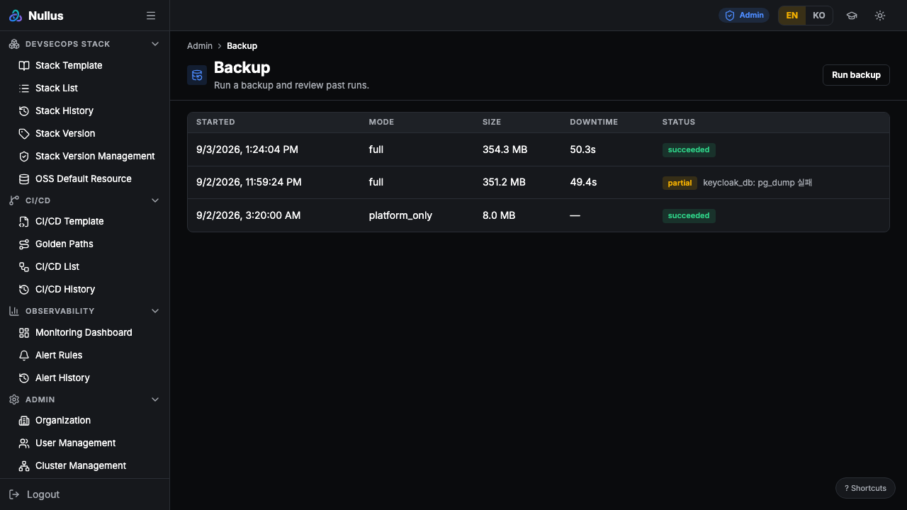
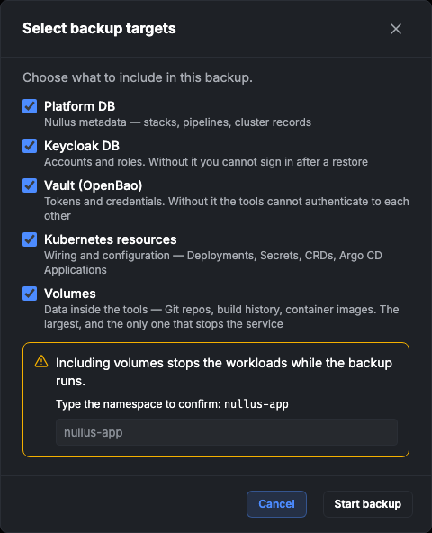
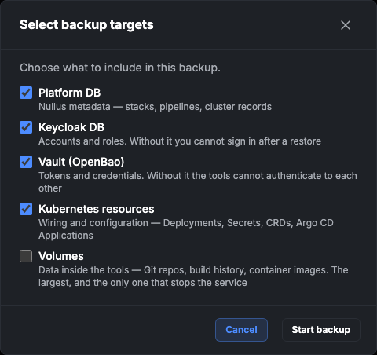

# Nullus 백업/복구 사용 가이드

> 화면에서 백업을 실행하고 복구하는 절차다.
> 설계: [`docs/11_기능설계/Nullus_백업복구_설계.md`](../11_기능설계/Nullus_백업복구_설계.md) · 구조: [`docs/20_아키텍처/Nullus_백업복구_아키텍처.html`](../20_아키텍처/Nullus_백업복구_아키텍처.html)

작성일: 2026-09-03

**이 문서는 운영자를 위한 것이다.** 개발자가 자기 기계에서 기능이 도는지 확인하는 절차는 [로컬 테스트 가이드](./Nullus_백업복구_로컬_테스트_가이드.md)가 다룬다.

---

## 1. 백업 실행

**관리 → 백업**(`/admin/backup`)에서 지난 실행을 보고 새 백업을 시작한다.



표가 말하는 것은 넷이다.

| 열 | 뜻 |
|---|---|
| **모드** | `full` · `platform_only` · `stack_only` |
| **크기** | 산출물 총합 |
| **정지 시간** | 서비스가 실제로 멈춰 있던 시간. 볼륨을 뜨지 않았으면 `—` |
| **상태** | 아래 표 |

| 상태 | 뜻 | 할 일 |
|---|---|---|
| `succeeded` | 전부 성공 | 없음 |
| `partial` | **일부만 성공.** 옆에 빠진 항목이 뜬다 | 쓸 수는 있지만 완전하지 않다. 원인을 없애고 다시 받는다 |
| `failed` | 산출물 없음 | 원인 해결 후 재실행 |

> `partial` 을 초록으로 칠하지 않는 이유가 있다. 성공처럼 보이면 빠진 산출물을 아무도 보지 않고, 그 사실은 **복구할 때에야** 드러난다.

---

## 2. 대상 고르기

**백업 실행**을 누르면 무엇을 담을지 고른다.



다섯 항목은 저장 위치와 뜨는 방법이 다르고, **빠졌을 때 드러나는 시점도 다르다.**

| 항목 | 무엇 | 빠지면 |
|---|---|---|
| **플랫폼 DB** | Nullus 메타데이터 — 스택 · 파이프라인 · 클러스터 | 복구 후 플랫폼이 자기 스택을 모른다 |
| **Keycloak DB** | 계정과 권한 | 복구 후 로그인할 수 없다 |
| **금고 (OpenBao)** | 토큰 · 자격증명 | 도구들이 서로 인증하지 못한다 |
| **K8s 리소스** | 배선 — Deployment · Secret · CRD · Argo CD Application | 복구가 "성공" 인데 스택이 뜨지 않는다 |
| **볼륨** | OSS 내부 데이터 — Git 저장소 · 빌드 이력 · 이미지 | 도구가 빈 디스크를 보고 재초기화한다 |

**기본은 다섯 개 전부 선택**이다. 완전한 백업이 안전한 선택이므로 아무것도 하지 않아도 그것이 된다.

### 정지 창

**볼륨을 포함하면 그동안 워크로드가 멈춘다.** 그래서 경고가 뜨고 네임스페이스를 입력해야 시작할 수 있다 — 다운타임이 생긴다는 사실을 모르고 누르면 안 되기 때문이다.

볼륨을 빼면 경고가 사라지고 바로 시작된다:



> 확인을 **모드가 아니라 실제 선택**으로 판단한다. `full` 을 골랐어도 볼륨이 빠졌으면 멈추지 않으므로 확인이 필요 없다. 멈추지도 않는데 확인을 강요하면 그 문구는 의미 없는 절차가 되고, 정작 진짜 멈추는 백업에서도 습관적으로 넘기게 된다.

### 정지 시간은 얼마나 되나

데이터량이 지배한다. 로컬 kind 에서 잰 값은 아래와 같다 — **규모의 근거가 아니라 자릿수의 감각**으로만 쓴다.

| 스택 | 볼륨 | 산출물 | 정지 창 |
|---|---|---|---|
| Gitea + Jenkins + Harbor | 9개 | 371 MB | 50.3초 |
| GitLab + Argo CD | 5개 | 255 MB | 38.4초 |

---

## 3. 백업 확인

실행이 끝나면 목록에서 상태를 본다. 그 이상이 필요하면 **무결성 검증**이 있다 — 복원하지 않고 "이 백업이 열리기는 하는가" 만 확인한다.

```bash
BID=<백업 ID>
curl -sX POST "$NULLUS/api/v1/admin/backups/$BID/verify" \
  -H "X-Org-Id: $ORG" | jq
```

복구 리허설을 상시로 돌릴 수 없는 상황에서 **최소한의 방어선**이다.

---

## 4. 복구

복구는 화면에 없다. **파괴적이기 때문이다** — 대상 네임스페이스의 워크로드를 내리고 볼륨을 덮어쓴다. API 로만 실행하며 백업 ID 재입력을 요구한다.

```bash
curl -sX POST "$NULLUS/api/v1/admin/restores" \
  -H 'Content-Type: application/json' -H "X-Org-Id: $ORG" \
  -d "{\"backup_run_id\":\"$BID\",\"namespace\":\"nullus-app\",\"mode\":\"full\",\"confirm\":\"$BID\"}" | jq
```

### 복구가 하는 일과 순서

순서가 이 기능의 값어치다. 바꾸면 조용히 깨진다.

1. **전제 확인** — 암호화 키 · 봉인 키 · 목적지 자격증명. 하나라도 없으면 **아무것도 하지 않고 멈춘다**
2. **무결성 검증** — 산출물이 열리는지, 조각이 잘리지 않았는지
3. **스키마 · 차트 버전 대조** — 대상에 다른 버전이 깔려 있으면 알린다(막지는 않는다)
4. **PVC 생성 → 볼륨 복원 → 리소스 적용**
5. **DB → 금고**
6. **워크로드 기동** — 반드시 마지막. 먼저 띄우면 도구들이 빈 디스크를 보고 재초기화한다
7. **참조 정합성 검사** — 경고하되 중단하지 않는다

### 복구 후 확인할 것

**`status: succeeded` 는 "단계가 실행됐다" 는 뜻이지 "스택이 동작한다" 가 아니다.** 실제로 복구가 성공을 반환하고도 도구들이 멈춰 있던 적이 있다. 데이터를 직접 본다.

```bash
# 워크로드가 떴는가
kubectl -n <네임스페이스> get pods

# 배포 주체가 돌아왔는가 — 없으면 앱이 배포되지 않는다
kubectl -n <네임스페이스> get applications.argoproj.io

# 앱이 백업 시점 이미지로 떴는가 (:bootstrap 이면 아직 조정 전이다)
kubectl -n <네임스페이스> get deploy <앱> \
  -o jsonpath='{.spec.template.spec.containers[0].image}'
```

도구의 데이터까지 대조하려면 Git 커밋 · CI 이력 · 이미지 태그를 백업 전후로 비교한다 — 절차는 [로컬 테스트 가이드 §4.9](./Nullus_백업복구_로컬_테스트_가이드.md) 에 있다.

---

## 5. 자동 백업

`backup.schedule.enabled` 로 켠다. 보존은 **일 7 · 주 4 · 월 3** 이되, 어떤 경우에도 **가장 최근 성공본은 지우지 않는다** — 보존 정책이 백업을 0 개로 만들 수 있으면 정책이 아니라 사고다.

---

## 6. 알아 둘 것

- **목적지는 클러스터 밖 S3 호환 오브젝트 스토리지다.** 자격증명은 스택 금고가 아니라 컨트롤 플레인 설정에서만 온다 — 금고에서 조달하면 스택이 죽을 때 백업본이 멀쩡해도 가져올 수 없다.
- **매니페스트만 암호화하지 않는다.** 키를 잃어도 "무엇이 들어 있고 어떤 키가 필요한가" 는 읽을 수 있어야 하기 때문이다. 그 대가로 비밀값을 한 조각도 담지 않는다.
- **복구는 Service 의 ClusterIP 를 보존하지 않는다.** 클러스터 안에서는 DNS 로 해석하므로 무해하지만, IP 를 박아 둔 외부 배선이 있으면 다시 설정해야 한다.
- **차트 버전이 다르면 알린다.** 다른 버전으로 재설치하면 기동 시 스키마가 올라가 백업 시점으로 돌아가지 않는다 — 되돌릴 수 없으므로 미리 확인한다.

---

## 참고

- 설계(왜 그렇게 정했는가): [`Nullus_백업복구_설계.md`](../11_기능설계/Nullus_백업복구_설계.md)
- 구조(무엇이 어떻게 짜여 있는가): [`Nullus_백업복구_아키텍처.html`](../20_아키텍처/Nullus_백업복구_아키텍처.html)
- 로컬 검증 절차: [`Nullus_백업복구_로컬_테스트_가이드.md`](./Nullus_백업복구_로컬_테스트_가이드.md)
- 화면 캡처 재생성: `cd web && npm run e2e:shots`
