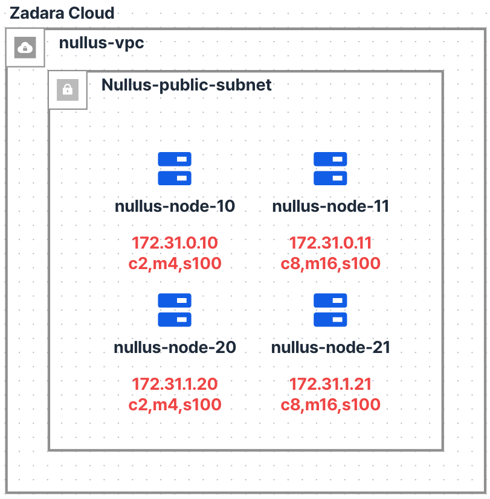

# Zadara Cloud PoC — Kubespray 기반 Kubernetes 클러스터 구축 가이드

Nullus Platform PoC를 위해 Zadara Cloud 위에 Kubespray로 Kubernetes 클러스터 2식(platform / develop)을 구축하는 절차를 정리한다.

- **Kubespray**: v2.30.0 (Kubernetes **v1.34.3** 기본 / containerd 2.2 / Calico)
- **대상 OS**: Ubuntu 22.04 LTS (SSH 사용자 `ubuntu` 가정 — 이미지에 따라 조정)
- **작업 위치**: 모든 설치 작업은 **nullus-node-10 (bastion)** 에서 수행한다

---

## 1. 인프라 구성



### 1.1 노드 구성

| 노드           | IP          | 사양                 | 클러스터           | 역할                                                  |
| -------------- | ----------- | -------------------- | ------------------ | ----------------------------------------------------- |
| nullus-node-10 | 172.31.0.10 | 2vCPU / 4GB / 100GB  | **platform** | Control Plane + etcd,**Bastion (Ansible 실행)** |
| nullus-node-11 | 172.31.0.11 | 8vCPU / 16GB / 100GB | **platform** | Worker                                                |
| nullus-node-20 | 172.31.1.20 | 2vCPU / 4GB / 100GB  | **develop**  | Control Plane + etcd                                  |
| nullus-node-21 | 172.31.1.21 | 8vCPU / 16GB / 100GB | **develop**  | Worker                                                |

### 1.2 네트워크 / 접근 경로

- VPC: `nullus-vpc` / Subnet: `Nullus-public-subnet`
- 외부에서는 **node-10만 SSH 접근 가능** (`~/Desktop/nullus-key.pem`)
- node-11, 20, 21은 node-10을 경유해 내부 IP로만 접근한다
- develop 클러스터도 node-10에서 Ansible로 원격 배포한다

```
로컬 PC ──(nullus-key.pem, SSH)──▶ node-10 (bastion)
                                      │ 내부 SSH (172.31.x.x)
                                      ├──▶ node-11  (platform worker)
                                      ├──▶ node-20  (develop master)
                                      └──▶ node-21  (develop worker)
```

### 1.3 보안 그룹 요구사항

| 구분               | 포트           | 용도              |
| ------------------ | -------------- | ----------------- |
| 외부 → node-10    | 22/tcp         | Bastion SSH       |
| 노드 간 (VPC 내부) | 전체 허용 권장 | k8s 컴포넌트 통신 |

노드 간 전체 허용이 어려우면 최소한 다음을 연다: `6443`(API Server), `2379-2380`(etcd), `10250`(kubelet), `179`(Calico BGP), `4789/udp`(VXLAN), `30000-32767`(NodePort).

---

## 2. 사전 준비

### 2.1 로컬 → node-10 접속

```bash
chmod 400 ~/Desktop/nullus-key.pem
ssh -i ~/Desktop/nullus-key.pem ubuntu@<node-10-public-ip>
```

### 2.2 SSH 키를 node-10으로 복사

node-10이 나머지 노드에 SSH 접속할 수 있도록 키를 bastion에 올린다.

```bash
# 로컬에서 실행
scp -i ~/Desktop/nullus-key.pem ~/Desktop/nullus-key.pem \
    ubuntu@<node-10-public-ip>:~/.ssh/nullus-key.pem
```

### 2.3 내부 노드 SSH 연결 확인 (node-10에서)

```bash
chmod 400 ~/.ssh/nullus-key.pem

for ip in 172.31.0.10 172.31.0.11 172.31.1.20 172.31.1.21; do
  ssh -i ~/.ssh/nullus-key.pem -o StrictHostKeyChecking=accept-new \
      ubuntu@$ip hostname
done
```

4개 노드의 호스트명이 모두 출력되면 준비 완료. node-10 자신(172.31.0.10)도 포함해서 확인한다 — Ansible이 자기 자신에게도 SSH로 접속하기 때문이다.

---

## 3. Kubespray 설치 (node-10에서)

```bash
sudo apt update
sudo apt install -y git python3 python3-venv python3-pip

git clone -b v2.30.0 https://github.com/kubernetes-sigs/kubespray.git
cd kubespray

# Python 가상환경에 Ansible 설치
python3 -m venv ~/kubespray-venv
source ~/kubespray-venv/bin/activate
pip install -U pip
pip install -r requirements.txt
```

> **이미 다른 버전을 clone해 둔 경우** — 재clone 없이 기존 `~/kubespray`에서 버전만 전환한다. (`inventory/platform`, `inventory/develop`은 git 미추적 디렉토리라 checkout해도 유지되지만, 샘플 group_vars가 버전마다 다르므로 4~5장의 인벤토리 생성을 다시 수행한다)
>
> ```bash
> cd ~/kubespray
> git fetch --tags
> git checkout v2.30.0
> pip install -r requirements.txt   # 버전별 ansible 핀이 다르므로 재설치
> rm -rf inventory/platform inventory/develop   # 이전 버전 샘플 기반이므로 재생성
> ```

> 이후 모든 `ansible-playbook` 명령은 가상환경이 활성화된 상태(`source ~/kubespray-venv/bin/activate`)에서, `~/kubespray` 디렉토리 기준으로 실행한다.

---

## 4. 인벤토리 구성

클러스터별로 인벤토리를 분리한다.

```bash
cp -rfp inventory/sample inventory/platform
cp -rfp inventory/sample inventory/develop
```

### 4.1 platform 클러스터 — `inventory/platform/inventory.ini`

아래 블록을 그대로 복사해 실행하면 파일이 생성된다.

```bash
cat > inventory/platform/inventory.ini <<'EOF'
[all]
nullus-node-10 ansible_host=172.31.0.10 ip=172.31.0.10
nullus-node-11 ansible_host=172.31.0.11 ip=172.31.0.11

[all:vars]
ansible_user=ubuntu
ansible_ssh_private_key_file=~/.ssh/nullus-key.pem

[kube_control_plane]
nullus-node-10

[etcd]
nullus-node-10

[kube_node]
nullus-node-11

[k8s_cluster:children]
kube_control_plane
kube_node
EOF
```

### 4.2 develop 클러스터 — `inventory/develop/inventory.ini`

```bash
cat > inventory/develop/inventory.ini <<'EOF'
[all]
nullus-node-20 ansible_host=172.31.1.20 ip=172.31.1.20
nullus-node-21 ansible_host=172.31.1.21 ip=172.31.1.21

[all:vars]
ansible_user=ubuntu
ansible_ssh_private_key_file=~/.ssh/nullus-key.pem

[kube_control_plane]
nullus-node-20

[etcd]
nullus-node-20

[kube_node]
nullus-node-21

[k8s_cluster:children]
kube_control_plane
kube_node
EOF
```

> PoC 구성이므로 etcd는 각 클러스터의 마스터 노드에 단일 배치한다(정족수 없음). 프로덕션 전환 시 etcd 3노드 이상으로 확장한다.

### 4.3 Ansible 연결 확인

```bash
ansible -i inventory/platform/inventory.ini all -m ping
ansible -i inventory/develop/inventory.ini all -m ping
```

---

## 5. 클러스터 설정

기존 `group_vars` 파일을 직접 수정하는 대신, **override 파일을 추가**한다. `group_vars/k8s_cluster/` 디렉토리의 YAML 파일들은 알파벳순으로 로드되고 뒤 파일이 앞 파일을 덮어쓰므로, `zz-` 접두사 파일 하나로 필요한 값만 안전하게 재정의할 수 있다.

아래 블록을 그대로 복사해 실행하면 두 클러스터에 동일하게 적용된다.

```bash
for cluster in platform develop; do
cat > inventory/$cluster/group_vars/k8s_cluster/zz-nullus-overrides.yml <<'EOF'
---
# Nullus PoC override — 알파벳순 마지막 파일이라 기본 group_vars를 덮어쓴다

# CNI — 기본값 유지 (Calico)
kube_network_plugin: calico

# 설치 완료 후 admin kubeconfig를 Ansible 실행 노드(node-10)의
# inventory/<cluster>/artifacts/admin.conf 로 내려받는다
kubeconfig_localhost: true

# Nullus Platform은 Helm 기반 스택 설치를 사용
helm_enabled: true

# HPA·리소스 모니터링용
metrics_server_enabled: true
EOF
done
```

- Pod/Service 대역(`kube_pods_subnet`, `kube_service_addresses`)은 두 클러스터가 서로 분리된 오버레이이므로 기본값을 그대로 둔다
- Kubernetes 버전은 Kubespray v2.30.0의 기본값(**v1.34.3**)을 사용한다. 다른 버전이 필요하면 위 override 파일에 `kube_version`을 추가한다 (릴리스가 지원하는 범위 내에서만 가능)

---

## 6. 클러스터 설치

### 6.1 설치 전 점검

> Kubespray는 Ansible `--check`(드라이런) 모드를 지원하지 않는다 — 태스크 대부분이 `command`/`shell` 기반이라 check 모드에서 정상 동작하지 않는다. 대신 아래 항목으로 실행 전 검증하고, 나머지는 `cluster.yml` 초반의 preinstall 검증(메모리·CPU·OS·네트워크 어설션)이 설치 시작 몇 분 내에 걸러준다.

```bash
# 1) 그룹 매핑 확인 — 마스터/워커/etcd 배치가 의도와 같은지 (가장 중요)
ansible-inventory -i inventory/platform/inventory.ini --graph
ansible-inventory -i inventory/develop/inventory.ini --graph

# 2) 전 노드 연결·권한 확인
ansible -i inventory/platform/inventory.ini all -m ping
ansible -i inventory/develop/inventory.ini all -b -m command -a "whoami"   # root 출력 확인 (sudo 동작)

# 3) override 파일이 실제로 읽히는지 확인 — 5장에서 설정한 값(true)이 나와야 함
#    (debug 모듈은 SSH 접속 없이 로컬에서 변수만 평가한다)
ansible -i inventory/platform/inventory.ini all -m debug -a "var=kubeconfig_localhost,helm_enabled"
```

기대 출력 (platform `--graph` 예시):

```
@all:
  |--@k8s_cluster:
  |  |--@kube_control_plane:
  |  |  |--nullus-node-10
  |  |--@kube_node:
  |  |  |--nullus-node-11
  |--@etcd:
  |  |--nullus-node-10
```

### 6.2 platform 클러스터

```bash
ansible-playbook -i inventory/platform/inventory.ini cluster.yml -b
```

### 6.3 develop 클러스터

```bash
ansible-playbook -i inventory/develop/inventory.ini cluster.yml -b
```

- 노드당 약 15~25분 소요된다
- 실패 시 원인 해결 후 **같은 명령을 재실행**하면 된다 (멱등성 보장)
- 상세 로그가 필요하면 `-v` 옵션을 추가한다

---

## 7. kubectl 설정 (node-10에서 두 클러스터 관리)

`kubeconfig_localhost: true` 설정으로 각 클러스터의 kubeconfig가 node-10에 생성되어 있다.

```bash
mkdir -p ~/.kube
cp ~/kubespray/inventory/platform/artifacts/admin.conf ~/.kube/platform.conf
cp ~/kubespray/inventory/develop/artifacts/admin.conf  ~/.kube/develop.conf
chmod 600 ~/.kube/*.conf
```

두 클러스터 모두 컨텍스트명이 `kubernetes-admin@cluster.local`로 동일하므로 병합 전에 이름을 바꾼다.
**컨텍스트만 바꾸면 안 된다** — cluster 항목 이름도 양쪽 다 `cluster.local`이라, 그대로 병합하면
cluster가 하나로 합쳐져 `--context=develop`이 **platform 클러스터로 연결된다**. 의도하지 않은
클러스터에 배포하게 되므로 식별자까지 치환한다.

```bash
for c in platform develop; do
  sed "s/cluster\.local/$c/g" ~/kubespray/inventory/$c/artifacts/admin.conf > /tmp/$c.conf
  kubectl --kubeconfig /tmp/$c.conf config rename-context "kubernetes-admin-$c@$c" "$c"
done

# 병합
KUBECONFIG=/tmp/platform.conf:/tmp/develop.conf \
    kubectl config view --flatten > /tmp/merged.conf
install -m 600 /tmp/merged.conf ~/.kube/config
rm -f /tmp/platform.conf /tmp/develop.conf /tmp/merged.conf
```

검증 — cluster 항목이 2개이고 서버 주소가 서로 달라야 한다.

```bash
kubectl config view -o jsonpath='{range .clusters[*]}{.name}{"\t"}{.cluster.server}{"\n"}{end}'
# develop   https://172.31.1.20:6443
# platform  https://172.31.0.10:6443
```

컨텍스트 전환:

```bash
kubectl config use-context platform
kubectl config use-context develop
```

> kubectl 바이너리가 없다면 platform 마스터인 node-10에는 Kubespray가 이미 설치해 두었다 (`/usr/local/bin/kubectl`).

> **로컬 PC에서 kubectl을 쓰려면** apiserver를 외부에 노출하지 말고 SSH 터널을 쓴다 — §1.3대로
> 외부에 열린 포트는 node-10의 `22/tcp`뿐이다. `deploy/csp/zadara/kubeconfig.sh`가 터널 생성과
> kubeconfig 작성을 함께 처리한다 (`deploy/csp/zadara/README.md` §6).

### 7.1 편의 유틸리티 — k alias / kube-ps1 / k9s

두 클러스터를 오가며 작업하므로, 현재 컨텍스트를 프롬프트에 항상 표시해 주는 kube-ps1과 클러스터 상태를 한눈에 보는 k9s를 node-10에 설치한다. 아래 블록을 그대로 복사해 실행한다.

```bash
# bash 자동완성 의존성
sudo apt install -y bash-completion git

# k9s — 클러스터 TUI (최신 릴리스 바이너리)
curl -sL https://github.com/derailed/k9s/releases/latest/download/k9s_Linux_amd64.tar.gz \
  | sudo tar xz -C /usr/local/bin k9s

# kube-ps1 — 프롬프트에 현재 컨텍스트/네임스페이스 표시
git clone --depth 1 https://github.com/jonmosco/kube-ps1.git ~/.kube-ps1

# ~/.bashrc에 설정 추가
cat >> ~/.bashrc <<'EOF'

# --- kubectl utilities ---
# k alias + 자동완성
source <(kubectl completion bash)
alias k=kubectl
complete -o default -F __start_kubectl k

# kube-ps1
source ~/.kube-ps1/kube-ps1.sh
PS1='$(kube_ps1) '$PS1
EOF

source ~/.bashrc
```

적용 후 사용법:

```bash
# 프롬프트가 (⎈|platform:default) 형태로 바뀐다 — 컨텍스트 전환 시 즉시 반영
k config use-context develop     # k = kubectl, 자동완성 동작
k get nodes

kubeoff                          # 프롬프트 표시 끄기 (kubeon으로 다시 켜기)

k9s                              # TUI 실행 — 현재 컨텍스트 기준
k9s --context platform           # 특정 컨텍스트로 실행
```

k9s 안에서는 `:ctx`로 컨텍스트 전환, `:pods`·`:nodes` 등으로 리소스 이동, `?`로 단축키 도움말, `:q`로 종료한다.

---

## 8. 설치 확인

클러스터별로 다음을 확인한다.

```bash
kubectl config use-context platform   # 또는 develop

# 노드 상태 — 모두 Ready
kubectl get nodes -o wide

# 시스템 파드 — 모두 Running
kubectl get pods -A

# 컴포넌트 헬스
kubectl get --raw='/readyz?verbose'
```

기대 결과 (platform 예시):

```
NAME             STATUS   ROLES           AGE   VERSION
nullus-node-10   Ready    control-plane   10m   v1.34.3
nullus-node-11   Ready    <none>          9m    v1.34.3
```

간단한 배포 테스트:

```bash
kubectl create deployment nginx-test --image=nginx --replicas=2
kubectl get pods -o wide          # node-11(worker)에 스케줄링 확인
kubectl delete deployment nginx-test
```

---

## 9. 클러스터 운영

모든 명령은 node-10의 `~/kubespray`에서 실행한다. 대상 클러스터에 맞는 인벤토리를 지정한다.

### 9.1 워커 노드 추가

```bash
# 1) inventory.ini의 [all], [kube_node]에 새 노드 추가
# 2) facts 갱신 후 scale 실행
ansible-playbook -i inventory/develop/inventory.ini facts.yml -b
ansible-playbook -i inventory/develop/inventory.ini scale.yml -b \
    --limit=<새-노드명>
```

### 9.2 노드 제거

```bash
ansible-playbook -i inventory/develop/inventory.ini remove-node.yml -b \
    -e node=<노드명>
```

### 9.3 클러스터 업그레이드

```bash
ansible-playbook -i inventory/platform/inventory.ini upgrade-cluster.yml -b \
    -e kube_version=<대상버전>
```

### 9.4 클러스터 초기화 (전체 삭제)

```bash
# ⚠️ 해당 클러스터의 모든 k8s 구성요소와 데이터가 삭제된다
# -e reset_confirmation=yes 로 확인 프롬프트를 생략한다
ansible-playbook -i inventory/develop/inventory.ini reset.yml -b \
    -e reset_confirmation=yes
```

---

## 10. 트러블슈팅

| 증상                                                                                                 | 원인 / 조치                                                                                                                                                                                                                                              |
| ---------------------------------------------------------------------------------------------------- | -------------------------------------------------------------------------------------------------------------------------------------------------------------------------------------------------------------------------------------------------------- |
| `UNREACHABLE!` (SSH 실패)                                                                          | `~/.ssh/nullus-key.pem` 권한(400)·경로 확인, 대상 노드 보안 그룹에서 node-10 → 22/tcp 허용 확인                                                                                                                                                      |
| etcd / API Server 기동 실패                                                                          | 노드 간`2379-2380`, `6443` 포트 차단 여부 확인                                                                                                                                                                                                       |
| 파드 간 통신 불가 (노드 간)                                                                          | Calico VXLAN`4789/udp` 또는 BGP `179/tcp` 차단 여부 확인. 클라우드 오버레이 환경에서 MTU 문제 시 `calico_mtu: 1400` 설정 후 재실행                                                                                                                 |
| 설치 중간 실패                                                                                       | 로그 확인 후 동일`cluster.yml` 재실행 (멱등). 반복 실패 시 `reset.yml` 후 재설치                                                                                                                                                                     |
| 재실행 시`Wait for new control plane nodes to be Ready` 반복 실패 (`cni plugin not initialized`) | 첫 실행이 CNI 설치 전에 중단된 뒤 재실행하면 발생하는 교착 — 재실행 시 이 대기 태스크가 CNI 설치보다 먼저 실행되는데, CNI 없이는 노드가 Ready가 될 수 없다.`reset.yml` 후 처음부터 재설치하면 신규 설치 경로에서는 이 게이트가 스킵되어 정상 진행된다 |
| 마스터 노드 메모리 부족                                                                              | node-10/20은 4GB로 PoC 최소 사양. 워크로드는 워커에만 배치하고, 마스터에 파드를 올리지 않는다                                                                                                                                                            |
| `python3 not found`                                                                                | 대상 노드에`sudo apt install -y python3` 후 재실행                                                                                                                                                                                                     |

---

## 11. 다음 단계

- [ ] platform 클러스터에 Keycloak, PostgreSQL 등 Nullus 플랫폼 컴포넌트 배포
- [ ] develop 클러스터를 Nullus에 워크로드 클러스터로 등록 (PoC 시나리오)
- [ ] Ingress Controller / StorageClass 구성 (Zadara 볼륨 연동 검토)
- [ ] 프로덕션 전환 시: 마스터 3중화(etcd 정족수), bastion 분리, 보안 그룹 최소화
