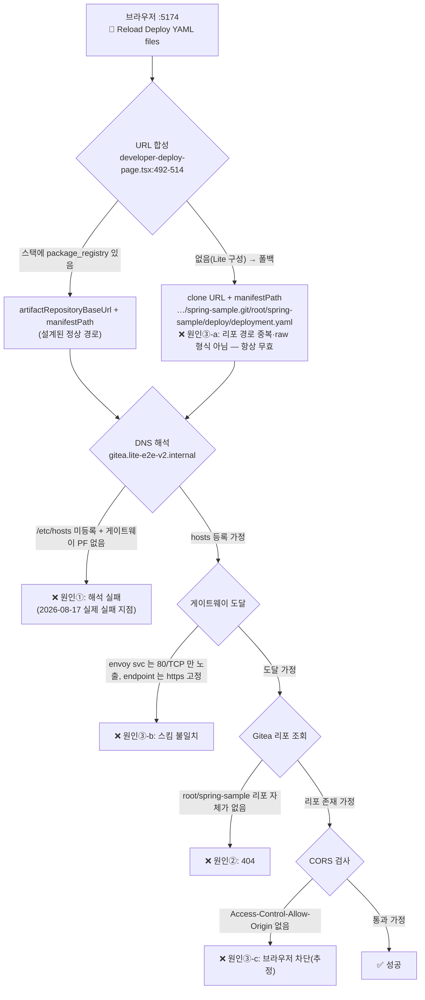

# Deploy YAML 리로드 실패 원인 분석 (Developer Deploy · Reload Deploy YAML files)

> 2026-08-17 둘러보기 E2E(S7, `lite-e2e-v2` = stk_8b349a88bb28) 중 Deploy Configuration 화면에서
> "해당 directory에서 deployment.yaml, service.yaml, ingress.yaml을 불러오지 못했습니다" 오류의 근본 원인 조사 기록.
> 결론: **원인이 4겹으로 중첩되어 있어, 어느 한 겹을 고쳐도 다음 겹에서 다시 실패하는 구조**다.
> 관련: 기록지 [발견 F7·F8·F9](Nullus_둘러보기_기능확인_시나리오.md) · nullus-plan#52 · 수행 가이드 §2(환경 기동)

## 증상

- 화면: CI/CD → Developer Deploy → Deploy Configuration → Deploy YAML Repository 옆 🔄(Reload Deploy YAML files) 클릭
- 입력값: `https://gitea.lite-e2e-v2.internal/root/spring-sample.git` (스택 연동 자동 채움)
- 결과: 원인 불문 고정 메시지 "경로와 파일명을 확인하세요" (→ 메시지 품질 문제는 **F8**로 별도 기록)
- **파이프라인 생성에는 논블로킹**: Review Manifest 는 클라이언트 생성 매니페스트(`generateManifestYamls()`)를 사용하고,
  생성 버튼 활성 조건(`canReview`)에 YAML 로드 여부가 포함되지 않는다. 이 리로드 버튼만 실패한다.

## 요청 경로와 실패 지점

이 기능은 API 경유가 아니라 **브라우저가 Gitea 로 직접 `fetch()`** 한다 (`developer-deploy-page.tsx:509`).

## 원인별 상세 (전부 2026-08-17 실측)

### 원인① — 브라우저가 `gitea.lite-e2e-v2.internal` 에 도달 불가 (이번 세션의 직접 원인)

- `/etc/hosts` 에 `.internal` 항목 없음, 게이트웨이 포트포워드(80/443) 미실행 — 떠 있는 PF는 gitea `:3100`·jenkins `:8480` 직결 2개뿐(수행 가이드 §2의 API 용)
- 실측: `curl https://gitea.lite-e2e-v2.internal/` → exit 6 (could not resolve host)
- F7(API 호스트의 `git clone` 실패)과 **동일한 전제 미충족** — S6 Info 탭의 hosts 복사 + 게이트웨이 포트포워드(`sudo ./scripts/port-forward-gateway.sh`) 절차가 브라우저 접근에도 필요하다

### 원인② — Gitea 에 `root/spring-sample` 리포가 존재하지 않음

- 실측: `GET :3100/api/v1/repos/search` → `{"ok":true,"data":[]}` (리포 0개), 사용자도 `gitea_admin` 1명뿐(`root` 없음)
- `root/spring-sample.git` 은 프론트 기본 placeholder(`DEFAULT_REPOSITORY_PATH`, `developer-deploy-page.tsx:69`)일 뿐, 제품·스크립트 어디에도 시드 로직 없음(`grep spring-sample` — web 소스·문서에서만 검출)
- 기록지 "미완 구간 ②(샘플 리포 시드)" 그대로

### 원인③ — 제품 결함: 환경을 다 갖춰도 실패 (신규 발견 F9)

| # | 결함 | 근거 |
|---|------|------|
| ③-a | **폴백 URL 합성 오류** — 스택에 `package_registry` 통합이 없으면 base 가 `artifactRepositoryBaseUrl` 대신 **clone URL 로 폴백**(`developer-deploy-page.tsx:496-498`). manifestPath 기본값 `root/spring-sample/deploy` 는 레지스트리 base 전용 설계(리포 경로 포함)라서 최종 URL 이 `…/spring-sample.git/root/spring-sample/deploy/deployment.yaml` — 리포 경로 중복 + `.git` 접미사 + Gitea raw 형식(`/{owner}/{repo}/raw/branch/{branch}/…`) 불일치로 **항상 404**. Lite 구성(레지스트리 없음)이 정확히 이 폴백에 해당 | 코드 판독 + `:3100` 대상 URL 형식 실측 404 |
| ③-b | **스킴 불일치** — integration endpoint 가 `https://.<accessDomain>` 하드코딩(`stack_handler.go:275`)인데 envoy 게이트웨이 서비스는 **80/TCP(http)만 노출**. 게이트웨이 포트포워드를 해도 https 접근 불가(TLS 리스너 부재) | `kubectl get svc` 실측 |
| ③-c | **CORS 부재(추정)** — `:5174` 오리진 → gitea 오리진 교차 fetch 인데 gitea 응답에 `Access-Control-Allow-Origin` 없음. ①·②·③-a 해소 후에도 브라우저가 차단할 가능성 높음 | `curl -H "Origin:…" -I` 실측(헤더 부재) — 도달 가능 환경에서 재확인 필요 |

## 해결 방향

| 구분 | 조치 | 비고 |
|------|------|------|
| 환경(테스트 재개용) | hosts 엔트리 + 게이트웨이 포트포워드(S6 복사 버튼 절차) + Gitea 샘플 리포 시드(`root/spring-sample` + `deploy/` 3종 yaml) | F7 마지막 마일 ①② 와 동일 — 단 ③-a 가 남아 리로드는 여전히 실패 |
| 제품(수정 후보) | (1) 폴백 시 Gitea raw URL(`{owner}/{repo}/raw/branch/{branch}/{dir}`) 합성으로 교정, 또는 브라우저 직접 fetch 를 **API 프록시 경유**로 전환(CORS·스킴 문제 동시 해소) (2) endpoint 스킴을 게이트웨이 리스너와 일치시킴 (3) 실패 원인별 메시지 분리(F8) | F9 이슈 등록 시 nullus-plan#52 와 연계 |

## 테스트 진행 판단

- **S7 은 이 오류와 무관하게 진행 가능** — 리로드는 선택 기능이고 생성 매니페스트로 Review·Execute 가 동작함(실측: `pip_48e52f5af935` 생성 성공)
- 리로드 기능 자체의 검증은 제품 수정(③-a) 전까지 **어떤 로컬 구성으로도 불가** → 회귀 스위트에서 제외하고 F9 해소 후 편입
