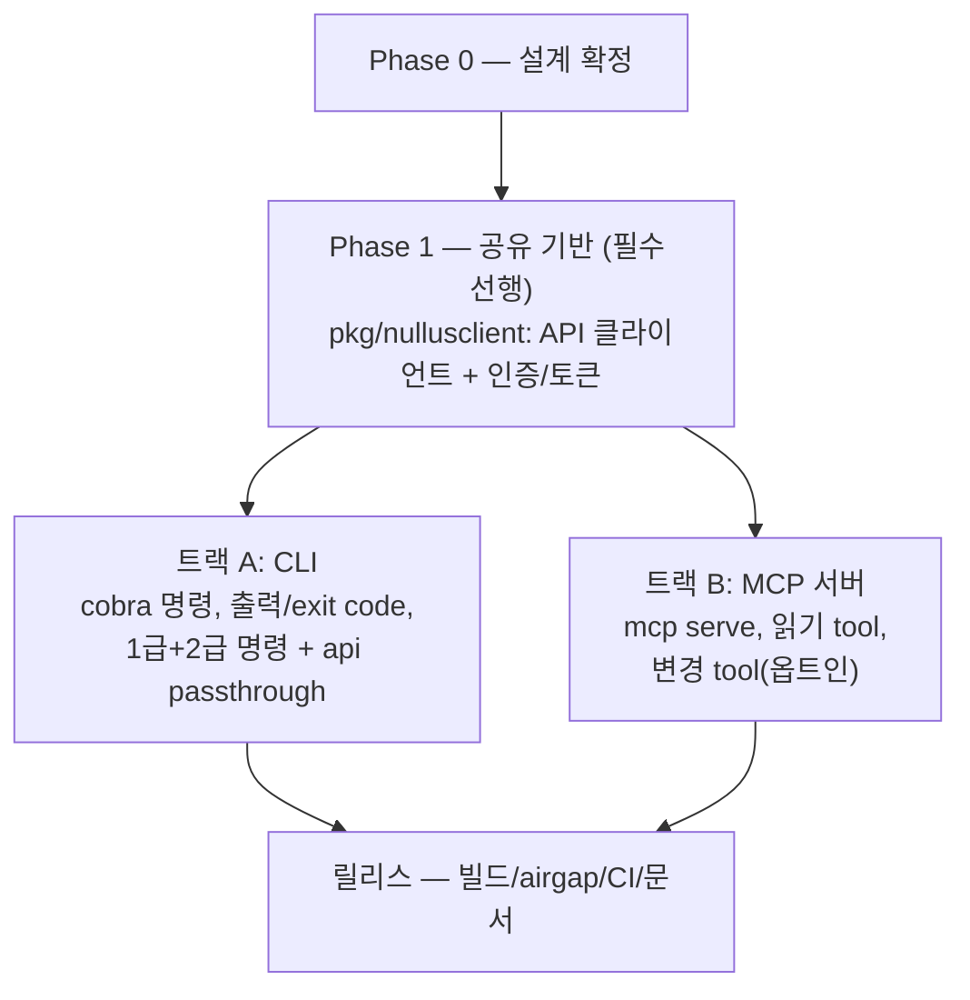

# CLI + MCP 연동 구현 백로그

**작성일**: 2026-08-22 · **갱신**: 2026-08-23 — 2트랙 병행 구조로 재편, 담당 확정, **범위 확장(1급+2급 + `nullus api` passthrough)**
**상태**: 중간점검 결정 반영 — "빠른 시일 내 추가 구현"으로 계획 진행 · **담당**: iamroseyoung
**우선순위 맥락**: [중간점검 피드백 백로그](2026-08-23-중간점검-피드백-백로그.md) P1
**근거 문서**: [Nullus CLI 컨셉](../20_개발가이드/Nullus_CLI_컨셉.md) · [ADR-0001 CLI 구현을 위한 논의](../adr/0001-cli-구현을-위한-논의.md)
**EPIC**: [cloud-nullus/nullus-plan#59](https://github.com/cloud-nullus/nullus-plan/issues/59)
**범위**: 통합 `nullus` CLI — **1급+2급 전용 명령** + 그 외 API는 **`nullus api` passthrough**(gh api 스타일) — + Nullus MCP 서버
**API 커버리지 원칙 (2026-08-23 결정)**: REST 119개 중 전용 명령은 1급(~20개)+2급(~15개)에만 UX를 만들고, 나머지(마법사·조직/멤버·감사로그 등 웹 1차 영역)는 `nullus api <METHOD> <path>` 하나로 인증된 접근을 보장한다. 전용 명령 119개를 만들지 않는다

> 중간점검(2026-08-22)에서 CLI + MCP 연동을 조기 구현하기로 결정했다. 이는 ADR-0001의 착수 시점(F5·F6 안정화 완료 대기)을 앞당기는 결정이므로 ADR 갱신이 Phase 0에 포함된다. MCP 연동은 별도 설계 문서가 아직 없어 설계 확정부터 백로그에 넣는다.

---

## 구조 — 공유 기반 위의 2트랙 병행

CLI와 MCP는 **각각 독립 구현한다.** 필수 결합은 둘 다 사용하는 API 클라이언트·인증 계층뿐이며, 이를 공유 패키지로 선행 구축한 뒤 두 트랙은 서로를 기다리지 않는다. MCP가 CLI보다 먼저 출시되어도 무방하다.

- **CLI = `/api/v1/*` REST의 얇은 클라이언트** (별도 백엔드 없음, 컨셉 문서 §5). MCP도 같은 원칙 — 서버 쪽 신규 API를 만들지 않는다
- 코드 배치: 공유 기반은 `pkg/nullusclient/`, CLI는 `cmd/nullus/` + `internal/cli/`, MCP는 패키징 결정(0-4)에 따라 서브커맨드 또는 `cmd/nullus-mcp/`
- 단일 바이너리 vs 별도 바이너리는 **배포 형태 문제일 뿐 개발 순서를 묶는 이유가 아니다** — 0-4에서 결정

---

## Phase 0 — 설계 확정 (구현 착수 전 필수)

| # | 태스크 | 산출물 / 완료 기준 | 크기 |
|---|--------|-------------------|------|
| 0-1 | ~~**ADR-0001 갱신** — 중간점검 결정(조기 착수) 반영, 상태 Proposed→Accepted~~ ✅ 2026-08-23 완료 | ADR에 착수 시점 변경 사유 기록. F5·F6 API 변경 시 CLI/MCP 추적 비용을 감수한다는 결정 명시 | S |
| 0-2 | ~~**`stack.yaml` 선언형 스키마 설계**~~ ✅ 2026-08-23 완료 — [스키마 문서](../20_개발가이드/Nullus_Stack_YAML_스키마.md) | v1alpha1 확정: config는 API payload와 1:1, 시크릿 파일 금지, 마법사(실제 9탭)→API 대응표 포함. 웹 yaml 내보내기는 A-12로 분리 | M |
| 0-3 | ~~**automation 계약 확정**~~ ✅ 2026-08-23 완료 — [Automation 계약](../20_개발가이드/Nullus_CLI_Automation_계약.md) | exit code 0~7 규약(작업 실패=6/타임아웃=7), stdout=데이터·stderr=사람, `-o json` 서버 절연, `--wait` 시맨틱 확정. 컨셉 §8 갱신 | S |
| 0-4 | ~~**MCP 연동 설계 문서 작성**~~ ✅ 2026-08-23 완료 — [MCP 설계](../11_기능설계/Nullus_MCP_설계.md) | 공식 `modelcontextprotocol/go-sdk`(v1.x) 확정, tool 표면 읽기 6+변경 3, 변경 tool은 미허용 시 미등록, stdio 전용, 시크릿은 tool 인자 금지, **패키징: 단일 바이너리 `nullus mcp serve`** | M |
| 0-5 | ~~**컨벤션 정비**~~ ✅ 2026-08-23 완료 — `cli` 모듈 **추가**로 결정 | 컨벤션 문서 §1.3·CLAUDE.md 반영(#228), 강제 장치(lint-review.yml)는 [PR #229](https://github.com/cloud-nullus/nullus/pull/229) 머지 대기 | S |

## Phase 1 — 공유 기반 (두 트랙의 유일한 공통 선행)

| # | 태스크 | 완료 기준 | 크기 | 의존 |
|---|--------|----------|------|------|
| S-1 | **API 클라이언트 계층** (`pkg/nullusclient`) — REST 공통(인증 헤더, 에러 매핑, 재시도 없음 원칙) | 사용측이 인터페이스로만 의존, `httptest` 목 서버로 단위 테스트 | M | 0-5 |
| S-2 | **설정·토큰 저장**(`~/.nullus/`) — 파일 권한 0600, 서버 주소 설정, `NULLUS_*` env 우선순위 | 권한·우선순위 테스트. 멀티 서버 컨텍스트는 v2로 미룸(구조만 열어둠) | M | — |
| S-3 | **OIDC 토큰 획득·갱신 로직** — 로그인 플로우와 만료/refresh 처리를 라이브러리로 (명령 표면은 트랙 A) | 만료·갱신 시나리오 단위 테스트. dev 모드(`auth.mode=session`)는 토큰 없이 통과 | M | S-2 |
| S-4 | **서버 버전 스큐 검사** — 서버 버전 조회 후 최소 호환 버전 미달 시 경고 | 버전 불일치 시나리오 테스트 | S | S-1 |

## 트랙 A — CLI (트랙 B와 병행, 상호 의존 없음)

| # | 태스크 | 완료 기준 | 크기 | 의존 |
|---|--------|----------|------|------|
| A-1 | `cmd/nullus` + cobra 도입 (direct 의존 승격), `internal/cli` 모듈 골격 | `nullus version` / `nullus --help` 동작 | S | 0-5 |
| A-2 | 출력 계층 — 사람용 표 + `-o json`(0-3 계약 준수), exit code 규약 구현 | 표/JSON 스냅샷 테스트, exit code 매트릭스 테스트 | S | 0-3, A-1 |
| A-3 | `nullus login` + `nullus auth bootstrap issue\|revoke` — S-3 로직에 명령 표면, 기존 `cmd/nullus-bootstrap` 흡수 | 로컬 Keycloak(runbook `--auth=keycloak`) e2e. bootstrap은 기존 도구와 동일 동작(멱등 재발급), `airgap/scripts/29-*` 호환. 구 바이너리는 1개 릴리스 유예 후 제거 | M | S-3, A-1 |
| A-4 | `nullus cluster register -f / verify / ls / get / rm` | 로컬 kind 클러스터로 register→verify e2e | M | S-1, A-2 |
| A-5 | `nullus stack deploy -f stack.yaml` — 0-2 스키마 파싱→생성+배포 API 호출 | 스키마 유효성 검증 에러 UX 포함. 로컬 스택 배포 e2e | L | 0-2, A-4 |
| A-6 | `nullus stack status <id> [--wait]` / `ls / rm / rollback / retry` | `--wait`가 성패를 exit code로 반환(0-3 계약). 목 서버 단위 테스트 + 로컬 e2e | M | A-5 |
| A-7 | `nullus stack logs <id> -f` — WS(`/ws/deployments/:id/logs`) 래핑, 서브프로토콜 인증 통과 | 헤드리스 토큰으로 WS 인증 e2e. `:id/pods`는 범위 밖 기록 | M | A-3, A-6 |
| A-8 | `nullus pipeline deploy <id>` / `nullus app deploy -f` | F5·F6 API 현행 기준 동작. API 변경 추적 비용은 0-1 결정으로 감수 | M | A-5 |
| A-9 | **`nullus api <METHOD> <path>` passthrough** — 전용 명령 없는 나머지 API 전부의 인증된 접근 (gh api 스타일). `--data`/stdin body, 쿼리 파라미터 지원 | 인증 헤더 자동 첨부, raw JSON 출력(`-o json` 계약 준수), 4xx/5xx→exit code 매핑(0-3 규약). WS 엔드포인트는 범위 밖 명시. 목 서버 테스트 | M | 0-3, S-1, A-2 |
| A-10 | 2급 조회 명령 — `nullus stack template ls\|get`, `nullus compat ls` | 표/JSON 출력, 목 서버 단위 테스트 | S | A-2 |
| A-11 | 2급 운영 명령 — `nullus stack config get\|set\|preview`, `nullus token-source ls\|rotate\|reveal`, `nullus alert ls\|create\|rm` | `reveal`은 기본 마스킹 + 명시 플래그로만 평문 출력(감사 로그 남는지 확인 포함). 목 서버 단위 테스트 | M | A-2 |
| A-12 | (선택) 웹 마법사 "Export stack.yaml" — 마법사 확정 구성을 v1alpha1 스키마로 내보내기 | 스키마 문서 §5 결정에 따른 파생. `ui` 모듈 작업으로 CLI 트랙과 독립 — 내보낸 파일이 `stack deploy -f`로 그대로 배포되는 왕복 e2e | S | 0-2 |

## 트랙 B — MCP 서버 (트랙 A와 병행, 상호 의존 없음)

| # | 태스크 | 완료 기준 | 크기 | 의존 |
|---|--------|----------|------|------|
| B-1 | MCP 서버 골격 (stdio) — 공식 SDK 통합, 공유 기반(S-1·S-2·S-3)만 사용. `internal/mcp/` + cobra 얇은 어댑터 | MCP Inspector로 initialize/list_tools 확인 | M | 0-4, S-1, S-2, A-1 |
| B-2 | 읽기 tool v1 — `stack_list` `stack_status` `cluster_list` `template_list` `compat_check` `stack_logs_tail`(스트리밍 아닌 최근 N줄) | tool 스키마 단위 테스트, Claude Code `.mcp.json` 연동 샘플 문서 | M | B-1 |
| B-3 | 변경 tool v1 — `stack_deploy` `stack_rollback` `pipeline_deploy`, **기본 비활성** + `--allow-write` 옵트인 | 옵트인 없이 호출 시 명확한 거부 메시지. 활성 시 로컬 배포 e2e. `stack_deploy` 입력→API payload 변환은 0-2 대응표 재사용(트랙 A 코드에 의존하지 않음) | M | B-2, 0-2 |
| B-4 | MCP 사용 가이드 — 설정 예시(Claude Code/기타 클라이언트), 권한 정책, 트러블슈팅 | `docs/guides/` 문서 1건 | S | B-2 |

## 릴리스 (두 트랙 각각 완료분부터 순차 출시 가능)

| # | 태스크 | 완료 기준 | 크기 | 의존 |
|---|--------|----------|------|------|
| R-1 | 빌드·배포 — 단일 정적 바이너리(다중 OS/arch), Makefile 타깃, 릴리스 파이프라인. 0-4 패키징 결정 반영 | `make build-cli`(및 별도 바이너리 시 `build-mcp`) + CI 릴리스 아티팩트 | M | A-1 또는 B-1 |
| R-2 | airgap 번들 포함 — `airgap/`에 바이너리 동봉, bootstrap 흡수(A-3) 반영 | airgap 설치 스크립트에서 신 바이너리 사용 확인 | S | A-3, R-1 |
| R-3 | CI smoke — 목 서버 기반 CLI 스모크 + MCP list_tools 스모크 | PR CI에서 실행. 완성된 트랙부터 개별 추가 | S | A-6 또는 B-2 |
| R-4 | 문서 현행화 — README 기능 현황에 CLI/MCP 추가, 컨셉 문서 §6 보류 사유 갱신 | 문서 3건 갱신 | S | 전체 |

---

## 범위 밖 (v1에서 하지 않음 — 컨셉 문서·ADR 결정 유지)

- ~~2급 명령~~ → **2026-08-23 범위 편입** (A-10·A-11). 단 `nullus dev`는 제외 유지
- 제외 영역(마법사·조직/멤버·감사로그 등)의 **전용 명령** — `nullus api` passthrough(A-9)로만 접근, 웹 UI가 1차 표면
- `nullus dev`(runbook_local.sh 편입) — ADR-0001 비권장 유지, 스크립트로 존치
- OSS CLI 우산 래퍼(`nullus k`, `nullus argo`) — 컨셉 문서 §7 아이디어로만 유지
- 멀티 서버 컨텍스트 전환 — 저장 구조만 열어두고(S-2) 기능은 v2
- MCP HTTP/SSE transport, 원격 MCP 서버 모드 — stdio만 v1

## 크기 기준·순서

- S ≤ 반나절 · M ≤ 2일 · L ≤ 1주 (리뷰 제외)
- **트랙 A 크리티컬 패스**: 0-2(스키마) → A-5(stack deploy) → A-6 → A-7. A-9~A-11은 크리티컬 패스 밖 — A-2 완료 후 언제든 병행 가능
- **트랙 B 크리티컬 패스**: 0-4(설계) → B-1 → B-2 — 트랙 A와 무관하게 진행, 공유 기반(S-1·S-2)만 선행. B-3만 0-2 대응표를 기다린다
- 두 트랙은 팀을 나눠 동시 진행 가능. 공유 기반(S-1~S-4) 변경은 양 트랙 합의 후 반영
- 전 태스크 TDD(RED→GREEN→REFACTOR), Domain/UseCase는 목 기반으로 DB 없이 테스트 — CLAUDE.md 테스트 전략 준수
- 브랜치: `feat/cli/*` 또는 0-5 결정에 따름
