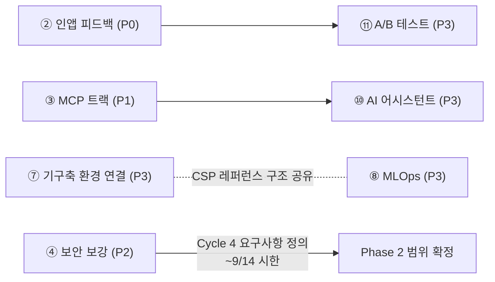

# 중간점검 피드백 백로그

**작성일**: 2026-08-23
**출처**: 중간점검(2026-08-22) 이후 수렴 의견 11건
**관련 문서**: [CLI+MCP 구현 백로그](2026-08-22-cli-mcp-구현-백로그.md) · [ADR-0001](../adr/0001-cli-구현을-위한-논의.md) · [ROADMAP](../70_전략/ROADMAP.md)

> 중간점검 의견 11건을 우선순위 P0~P3로 분류한다. 기준은 **약속 이행 → 시한 있는 결정 → 의존 관계 → 아이디어** 순.
> 현장에서 "바로 반영"을 약속한 2건(P0)과 담당이 확정된 CLI+MCP(P1)는 팀을 나눠 **병행 진행**한다.
> P2 중 보안 보강은 Phase 2 요구사항 정의 기간(Cycle 4, ~9/14) 안에 반영해야 하는 시한이 있다.

---

## 우선순위 총괄

| 순위 | 항목 | 단계 | 담당 | 다음 액션 |
|------|------|------|------|----------|
| 1 | 진행 중 작업 알림 UI | P0 즉시 착수 | 박준희 | 태스크 N-1~N-3 착수 |
| 2 | 인앱 피드백 | P0 즉시 착수 | 박준희 | 선행 결정 3건 확정 → F-1~F-4 착수 |
| 3 | CLI + MCP 연동 | P1 확정 계획 실행 | **iamroseyoung (확정)** | [별도 백로그](2026-08-22-cli-mcp-구현-백로그.md) Phase 0부터 진행 — 0-1(ADR 갱신) 완료 |
| 4 | 보안 보강 (시크릿·BYOK·IdM) | P2 단기 결정 | 전원 | **~9/14 시한** — Phase 2 요구사항 정의에 반영 |
| 5 | 설치 간 용량 제어·리소스 폭주 대응 | P2 단기 결정 | 전원 | 팀 회의 안건 등록 |
| 6 | 설치된 OSS 업그레이드 지원 | P2 단기 결정 | 전원 | 시나리오 정의 문서 → Cycle 계획 편입 |
| 7 | 기구축 환경 연결·제어 | P3 백로그 | 전원 | "레거시 스택 등록" 범위 정의에 합류 |
| 8 | MLOps 로드맵 | P3 백로그 | 박준희 | 내부 논의 → ROADMAP 신규 축 반영 |
| 9 | 환경별 도구 조합 추천 | P3 백로그 | 전원 | 정적 가이드 문서부터 구체화 |
| 10 | AI 어시스턴트 | P3 백로그 (의존 대기) | 전원 | MCP v1 출시 후 재논의 |
| 11 | UI/UX A/B 테스트 | P3 백로그 (의존 대기) | 전원 | 인앱 피드백 출시 후 실험 설계 |

### 의존 관계

---

## P0 — 즉시 착수 (현장 "바로 반영" 약속, 담당: 박준희)

### 1. 진행 중 작업 알림 UI

상단 내비게이션에 종 아이콘을 두고, 백그라운드 작업(스택 설치, CI/CD 배포) 진행 중이면 진행 애니메이션으로 표시한다.

**활용 가능한 기반**: 배포 상태 API + WebSocket 실시간 로그(F4·F6)가 이미 있다. 알림 이력(F7)은 AlertRule 기반 운영 알림이므로 이 인앱 작업 알림과는 **별개 개념** — 용어를 구분한다.

| # | 태스크 | 완료 기준 | 크기 |
|---|--------|----------|------|
| N-1 | 진행 중 작업 집계 방식 결정 — 신규 집계 API vs 기존 스택/파이프라인 상태 API 폴링 vs WS 구독 | 결정 기록(이 문서 갱신). 조직 스코프·권한(RBAC) 필터 포함 | S |
| N-2 | 종 아이콘 + 진행 애니메이션 컴포넌트 — `web/src/features/common/` 상단 내비게이션에 배치 | 진행 중 작업 존재 시 애니메이션, 없으면 정적 아이콘. vitest + testing-library 테스트 | M |
| N-3 | 알림 드롭다운 — 진행 중 작업 목록(이름·단계·경과), 완료/실패 시 상태 전환 표시, 클릭 시 해당 상세 페이지 이동 | 진행→완료/실패 전환 시나리오 테스트, Playwright E2E 1건 | M |

### 2. 인앱 피드백

화면마다 좋아요/싫어요 + 스크린 캡처를 첨부한 개선점을 보낼 수 있게 한다.

**선행 결정 3건**: 수신 채널(자체 DB vs GitHub Issue 연동), 스크린샷 내 민감정보(시크릿·토큰 노출 화면) 처리 정책, airgap 환경 동작 방식.

| # | 태스크 | 완료 기준 | 크기 |
|---|--------|----------|------|
| F-1 | 수신 채널·민감정보·airgap 정책 결정 | 결정 기록(이 문서 갱신). airgap은 자체 DB 저장이 기본값이 될 가능성 높음 | S |
| F-2 | BE: feedback 모듈 — 테이블 + 등록/조회 API (`internal/` 신규 vs admin 모듈 소속 결정 포함) | Domain/UseCase 단위 테스트(DB 없이), Repository는 testcontainers | M |
| F-3 | FE: 피드백 위젯 — 좋아요/싫어요 + 코멘트 + 현재 화면 캡처 첨부(html-to-image 계열, 첨부 전 미리보기·제외 선택) | 캡처 미리보기에서 사용자가 첨부 여부를 선택 가능해야 함. 컴포넌트 테스트 | M |
| F-4 | 관리자 열람 화면 — 피드백 목록/필터 (선택 범위) | admin 메뉴 하위 목록 화면 | S |

---

## P1 — 확정 계획 실행: CLI + MCP 연동 (담당 확정: iamroseyoung)

계획 수립 완료 — **[CLI+MCP 구현 백로그](2026-08-22-cli-mcp-구현-백로그.md)** · [ADR-0001](../adr/0001-cli-구현을-위한-논의.md)로 진행한다. 이 문서에서 태스크를 중복 관리하지 않는다.

- 중간점검에서 "빠른 시일 내 추가 구현"으로 결정, 담당 iamroseyoung 확정 (2026-08-23)
- Phase 0-1(ADR-0001 갱신, Proposed→Accepted) **완료** — 이후 0-2(stack.yaml 스키마)~0-5 순으로 진행
- MCP 트랙 B는 P3의 AI 어시스턴트(⑩)의 기술 기반 — MCP tool 표면이 곧 어시스턴트의 행동 반경

---

## P2 — 단기 결정 필요 (시한·리스크 있는 검토, 전원)

### 4. 보안 보강 — 자체 인프라 시크릿, BYOK 암호화, IdM 연동 ⏰

**시한 있음**: ROADMAP상 Phase 2 요구사항 정의가 Cycle 4(8/18~9/14), 즉 지금 진행 중이다. 이 기간에 반영하지 않으면 Phase 2(2026 Q4)를 놓친다. 이번 할 일은 구현이 아니라 **요구사항 반영**.

- Phase 2 Security의 OpenBao Secret Control Plane(P0)과 합류 — "자체 인프라 시크릿"은 기존 항목의 구체화
- BYOK 암호화·IdM 연동은 Phase 2 범위에 **신규 추가** 필요

### 5. 설치 간 용량 제어·리소스 폭주 대응

- **용량 제어**: 물리적 스펙 한계 내 동시/누적 설치 용량 제어. F10 리소스 관리(`resource_defaults`, 동적 리소스 계산)가 출발점 — 클러스터 잔여 용량 대비 설치 가능 여부 판단·차단까지 확장할지가 쟁점
- **폭주 대응**: 리소스 급증 시 복구·보호. K8s 표준 수단(ResourceQuota, LimitRange, HPA/PDB — ROADMAP W11 hardening과 연결)과 Nullus 레벨 감지·복구 중 역할 범위 결정 필요
- **다음 액션**: 팀 회의 안건 등록 → 결정 후 별도 백로그로 태스크화

### 6. 설치된 OSS 업그레이드 지원

- 운영 모드 전환 후 도구 업그레이드 시나리오 — 검토 항목 중 실사용 임팩트 최대
- ROADMAP Cycle 2 "Stack 업그레이드 전략(canary/blue-green)"과 **합류** — 별도 트랙을 만들지 않는다
- **다음 액션**: 업그레이드 시나리오 정의 문서 작성 → Cycle 계획 편입

---

## P3 — 백로그 (의존 대기 또는 논의 선행, 우선순위 미정)

| 항목 | 요지 | 기존 계획 연계 | 다음 액션 |
|------|------|---------------|----------|
| 기구축 환경 연결·제어 | 기존 구축 환경을 Nullus로 연결·제어, 외부 레퍼런스 파이프라인(AWS/GCP 등) 선택 가능 구조 포함 | ROADMAP Cycle 4·Phase 2 "레거시 스택 등록"과 **합류**, 레퍼런스 파이프라인 선택 구조는 신규 범위 | 레거시 스택 등록 범위 정의 시 함께 검토 |
| MLOps 로드맵 (박준희) | 내부 논의·의견 수렴 후 구체 일정 공유. 파이프라인 구성 시 CSP 레퍼런스(AWS Well-Architected, GCP 등) 참고·선택 구조 검토 | ROADMAP에 **없음 — 신규 축**. "기구축 환경 연결"의 레퍼런스 파이프라인 구조와 공유 지점 있음 | 박준희 주도 내부 논의 → 결과를 ROADMAP 신규 섹션으로 반영 |
| 환경별 도구 조합 추천 | 규모·환경 기반 CNCF 조합 가이드 — 노하우 축적 + AI 활용 | Golden Path 템플릿·호환성 매트릭스(F8)의 자연스러운 확장. **신규** | 정적 가이드 문서 → 추천 기능 순으로 구체화 |
| AI 어시스턴트 | 플랫폼 내 AI 어시스턴트 기능 | 장기 비전 "AI 기반 자동화(2028)"의 앞당김. **MCP v1 출시가 선행 조건** | MCP v1 출시 후 재논의 |
| UI/UX A/B 테스트 | 커뮤니티를 활용한 UI/UX A/B 테스트 | **신규**. **인앱 피드백(P0-2) 출시가 선행 조건** — 피드백 위젯이 데이터 수집 채널 | 피드백 기능 출시 후 커뮤니티 대상 실험 설계 |

---

## 이번 주 할 일 요약

1. **알림 UI 착수** — N-1 집계 방식 결정 → 구현 (박준희)
2. **인앱 피드백 선행 결정 3건** 확정(수신 채널·민감정보·airgap) → 착수 (박준희)
3. **CLI+MCP 진행** — 0-1 완료, 0-2(stack.yaml 스키마)·0-4(MCP 설계) 순 (iamroseyoung)
4. **보안 3키워드**(시크릿·BYOK·IdM)를 Phase 2 요구사항 정의에 반영 ⏰ ~9/14 (전원)
5. **용량 제어·리소스 폭주** 회의 안건 등록 (전원)
