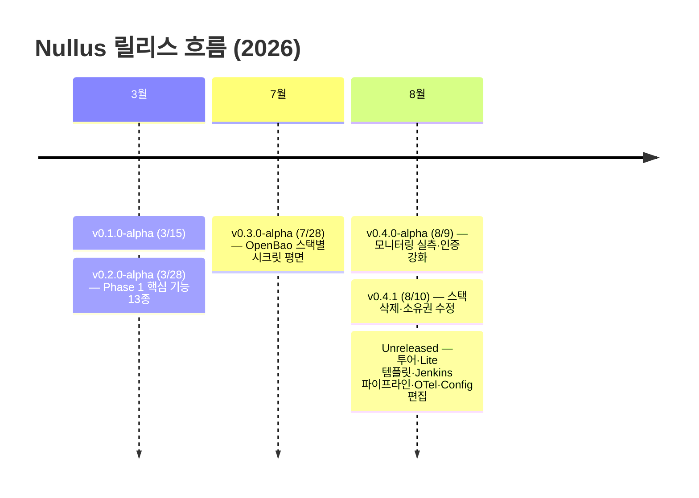
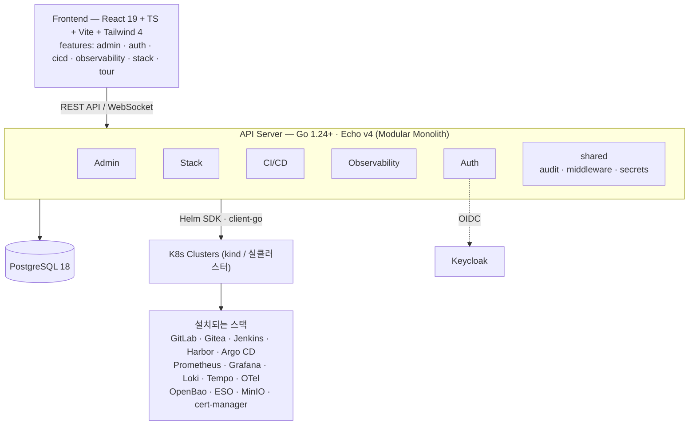
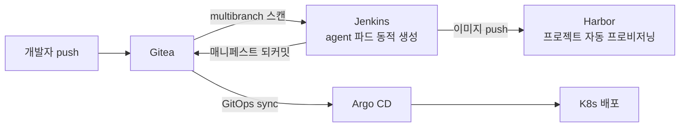
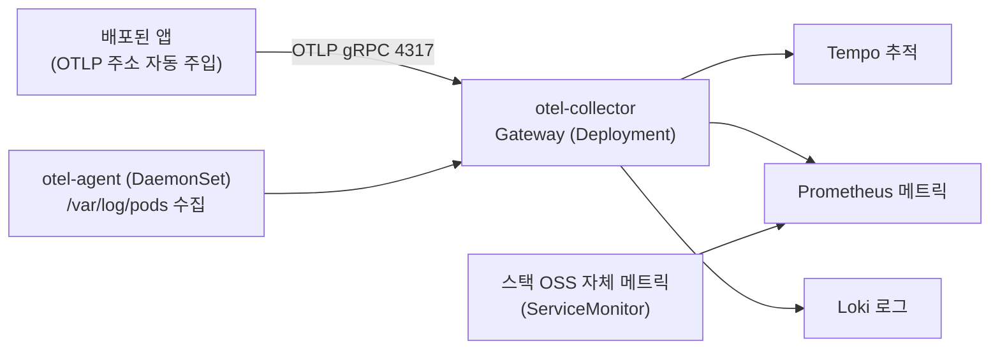
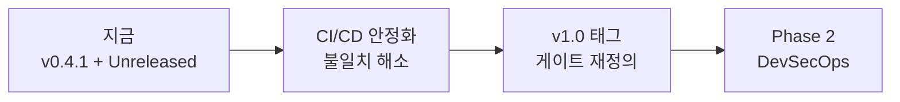

# Nullus — 진행 중간공유

**Cloud Nullus Team | 2026-08-18 | 발표 15분 + Q&A**

> 기준: v0.4.1 (2026-08-10 릴리스) + `main` Unreleased 변경분.
> 수치는 2026-08-11 현황 문서(`docs/80_프로젝트관리/20260811_현황.md`) 실측과
> 2026-08-18 코드 재추출을 병기한다.

---

## 슬라이드 1: 타이틀 (10초)

### Nullus 진행 중간공유

**Kubernetes 기반 DevSecOps 자동화 오픈소스 플랫폼**

Cloud Nullus Team · 2026-08-18

> github.com/cloud-nullus/nullus · 라이브 데모: cloud-nullus.github.io

---

## 슬라이드 2: 한 장 요약 (1분)

### TL;DR — 지금 어디까지 왔나

- **Phase 1 기능 축(F0~F12)은 모두 구현됐고, 일부는 계획을 넘어섰다.**
  Golden Path 템플릿은 목표 3종 대비 **8종**(+Empty), 외부 SCM(GitHub)·시크릿 평면(OpenBao)·토큰 회전 등 계획에 없던 축이 추가됐다.
- **8월 들어 "쓸 수 있는 제품"으로 다듬는 작업에 집중했다.**
  제품 둘러보기 투어(29걸음), 8Gi 단일 노드용 Lite 템플릿, Gitea+Jenkins 파이프라인 실배선, OpenTelemetry 관측 계층, 배포 후 설정 편집(Config 탭). 8/11 이후 **커밋 169건**.
- **정식 v1.0 태그는 아직 없다.** CI/CD 영역(F5·F6)은 안정화 진행 중이며, 설치 로그 영속화·OIDC 콜백 연결 등 알려진 미구현 항목이 남아 있다.

---

## 슬라이드 3: 릴리스 타임라인 (1분)

### 릴리스 흐름 — 3월 계획 대비 실제

- 3월 마스터 플랜(Alpha 3/30 → Beta 4/27 → v1.0 5/25)의 캘린더는 지났지만, **기능 축은 계획을 채우고 넘어섰다.**
- 4~7월 공백 구간은 계획에 없던 확장(GitHub SCM, 시크릿 평면, 토큰 회전)에 쓰였다.
- 릴리스별 변경의 단일 출처는 `CHANGELOG.md`.

---

## 슬라이드 4: 숫자로 보는 현재 (1분)

### 규모 지표

| 항목 | 8/11 실측 | 8/18 현재 |
|------|-----------|-----------|
| 백엔드 Go 프로덕션 파일 | 242개 (약 38,700라인) | — |
| Go 테스트 함수 | 902개 | **1,152개** (+250) |
| 프론트 테스트 | 571개 | **758개** (+187) |
| REST 엔드포인트 | 108개 | 108개+ |
| DB 마이그레이션 | `000061` | **`000072`** |
| Golden Path 템플릿 | 6종 | **8종 + Empty** (OTel·Gitea+Jenkins Lite 추가) |
| CI/CD 파이프라인 템플릿 | 4종 | 4종+ |
| 프론트 페이지 / 기능 모듈 | 28개 | 28개+ / 8모듈 (`tour` 신설) |

- 8/11 이후 일주일간 **커밋 169건** — 기능 추가보다 배선·검증·안정화 비중이 크다.
- 문서 현행화도 병행: API 설계(27→108 엔드포인트), DB 스키마 문서를 실제와 맞춤(PR #129·#130).

---

## 슬라이드 5: 기능 달성도 (1분)

### PRD v1.3 Phase 1 — 기능별 상태

| ID | 기능 | 상태 |
|----|------|------|
| F0 | Organization 설정/멤버 관리 | ✅ 달성 |
| F1 | K8s 클러스터 등록·검증 (kubeconfig AES-256-GCM 암호화) | ✅ 달성 |
| F2 | 노코드 스택 설정 UI (설치 위자드) | ✅ 달성 |
| F3 | Golden Path 템플릿 | ✅ **초과** (목표 3 → 8종) |
| F4 | 스택 자동 설치/재시도/이어하기/롤백/이력 | ✅ 달성 |
| F5 | CI/CD 파이프라인 템플릿 | 🔧 안정화 진행 중 |
| F6 | CI/CD 배포/이력 | 🔧 **초과 + 안정화** (저장소 프로비저닝까지 확장) |
| F7 | 모니터링/알림 | ✅ 달성 |
| F8 | OSS 버전 호환성 | ✅ **초과** (설치 전 게이트로 동작) |
| F9 | UI 권한 체계 (사이드바·라우트·API 3중 검사 + OIDC) | ✅ 달성 |
| F10 | 리소스 예상량 계산 | ✅ 달성 |
| F11 | 기존 사용자 추가 (멀티 조직 멤버십) | ✅ 달성 |
| F12 | 네임스페이스 선택/생성 | ✅ 달성 |

**계획에 없던 확장**: 외부 SCM(GitHub) · 스택별 OpenBao 시크릿 평면 · 토큰 회전 관리(API 9개) · 파이프라인 삭제 시 리소스 정리

---

## 슬라이드 6: 아키텍처 (1분)

### Modular Monolith + Clean Architecture

- 모듈 간 통신은 **port 인터페이스로만** — 이번 CI 단계 정규화(`port/ci_stage.go`)도 이 경계 위에서 이뤄졌다.
- 각 모듈이 자기 테이블을 소유. 감사·알림·시크릿은 `shared`.

---

## 슬라이드 7: 최근 하이라이트 ① — 진입 장벽 낮추기 (2분)

### 처음 온 사람이 10분 안에 흐름을 이해하게

**제품 둘러보기 투어 — 29걸음** (`web/src/features/tour/`)

- 클러스터 등록 → 템플릿 → 설치 마법사 7탭 → 배포 → 스택 목록 → CI/CD 6단계 → 모니터링까지 **화면·팝업·탭을 실제로 열어 가며** 안내.
- 투어 중에는 목록 GET 만 목업으로 갈아 끼워 빈 계정에서도 흐름을 보여 주고, 끝나면 캐시에서 걷어 낸다.
- Playwright 로 **화면을 직접 찍어 가며** 강조 위치·z-index·스크롤 문제를 잡았다.

**8Gi 단일 노드용 Lite 템플릿** (`gitea-jenkins-argocd-lite-v1`)

- 기존 소스+CI+CD 조합은 전부 최소 20Gi — **단일 노드에서 돌려 볼 템플릿이 없었다.**
- Gitea + Jenkins + Harbor + Argo CD 를 실측 기반으로 8Gi 에 맞춰 시드. 레지스트리(Harbor)는 뺄 수 없다 — 빼면 스택은 서는데 아무것도 배포할 수 없다.
- 템플릿에 `planning_profile` 을 얹어 "무엇을 깔지"와 함께 **"얼마나 크게 깔지"** 도 템플릿이 약속한다.

**그 외**: 메인 화면 퀵스타트 CTA · 모바일 반응형(9화면×3뷰포트 자동 점검) · Apache 2.0 라이선스 · **라이브 데모**(cloud-nullus.github.io) · README 현행화

---

## 슬라이드 8: 최근 하이라이트 ② — 두 번째 CI/CD 경로 실배선 (2분)

### Gitea + Jenkins + Harbor + Argo CD — "고를 수만 있던" 도구를 실제로 동작하게

- Gitea·Jenkins 는 설치 마법사에서 **고를 수는 있었지만 배포해도 설치되지 않았다** (`NOT_INSTALLABLE`). 설치 경로와 CI/CD 프로비저닝 경로에 실배선.
- Jenkins 는 GitLab CI 와 트리거 모델이 다르다 — job 이 먼저 존재해야 해서 `CIJobProvisioner` 포트와 multibranch job 생성 단계를 신설.
- CI 자격증명은 **OpenBao → ESO → K8s Secret** 단일 평면 유지 (Jenkins Credentials 사본을 만들지 않는다).
- CI 단계 어휘를 어댑터 경계에서 정규화 — Jenkins/GitLab/GitHub 이 늘어도 도메인·화면은 불변.
- CI 서버 빌드 이력을 실행 통계로 동기화 — GitOps 경로에서 Success Rate 가 0 으로 남던 문제 해소.

---

## 슬라이드 9: 최근 하이라이트 ③ — 관측 계층 완결 (1분 30초)

### 설치한 스택이 스스로를 관측하게

- 마법사의 Exporter/Agent 선택이 **아무 일도 하지 않던** 것을 도메인 설정에 배선. Gateway/Agent 표준 2단 배치.
- 배포되는 앱 매니페스트에 `OTEL_EXPORTER_OTLP_ENDPOINT` 등 표준 env 를 자동 주입 — 수집기 없는 스택에는 넣지 않는다.
- 스택이 설치한 OSS(Argo CD·Loki·MinIO 등)가 자기 메트릭을 Prometheus 에 내주도록 ServiceMonitor 일괄 활성화.
- Golden Path `gitlab-argocd-otel-v1` 시드 + 호환성 매트릭스 등록.

---

## 슬라이드 10: 최근 하이라이트 ④ — 배포 후 운영 루프 (1분 30초)

### 설치가 끝이 아니다 — 고치고, 다시 적용하고, 기록한다

**스택 Config 탭 — 릴리스 values 편집·재적용** (기능분해도 `NULLUS_DSS_040_040` 충족)

- 배포된 스택의 릴리스별 values 를 `live`(배포 전체) / `override`(사용자 커스텀) 두 단위로 편집.
- 적용 순서는 **helm 먼저, DB 나중** — 실패한 설정이 다음 배포에 실리지 않게.
- 플랫폼 소유 경로(Harbor `externalURL`, OIDC 블록 등)는 표시·경고하되 막지 않는다 — 전문가용 탈출구.
- `helm upgrade --dry-run(server)` 미리보기 + Helm SDK 함정 3건(실패 리비전·서브차트 유실·lookup) 해결.

**이력과 감사**

- 적용 직전 스냅샷 → 기존 diff·롤백 경로로 되짚기. 실패한 적용도 기록.
- 감사에는 **건드린 키만 남기고 값은 남기지 않는다** (자격증명 유출 방지).
- OIDC 모드에서 감사 로그 `user_id` 가 비던 문제를 `ActorFromContext` 로 일원화해 해소.

---

## 슬라이드 11: 품질·테스트 (1분)

### 테스트 현황

| 레이어 | 도구 | 규모 (8/18) |
|--------|------|-------------|
| Go 단위/통합 | testing · testify · testcontainers | 테스트 함수 **1,152개** |
| 프론트 단위 | Vitest + testing-library | 테스트 **758개** |
| E2E | Playwright (web/e2e) + Go E2E (e2e/) | 투어 걸음별 스크린샷 검증 포함 |
| 반응형 | `npm run responsive:audit` | 9화면 × 3뷰포트 자동 점검 (이슈 16→0) |
| API | `runbook_local.sh smoke` | 스모크 |

- 테스트 수행 체계 문서화: 수행 가이드 + 둘러보기 시나리오 기록지 (`docs/60_테스트/`) — 둘러보기 시나리오 **전 구간 검증 완료**.
- CI 게이트: PR 컨벤션 검사 · CHANGELOG 검사 · 반응형 점검(exit 1 게이트).
- 실클러스터 검증에서 나온 결함(Harbor 프로젝트 부재, Gitea 재배포 교착, Argo CD 클론 주소 등)을 재현 → 수정 → CHANGELOG 기록으로 처리.

---

## 슬라이드 12: 남은 과제와 알려진 제약 (1분 30초)

### 남은 미구현 (8/11 재검증 기준)

| 영역 | 항목 | 영향 |
|------|------|------|
| 설치 엔진 | 설치 로그 DB 영속화 | API 재기동 시 로그 유실 (메모리 스트리머만 존재) |
| 인증 | `/api/v1/auth` REST 엔드포인트 | 미들웨어·프로바이더만 존재 |
| 프론트 인증 | OIDC 리디렉션/콜백 런타임 연결 | 로컬 기본값 mock |
| 이벤트 | 도메인 이벤트 기반 컨텍스트 동기화 | 현재 포트 직접 호출 |

### 판단이 필요한 불일치 (기록만 된 상태)

- 도달할 수 없는 화면 4개 — 특히 `token-management-page` 는 백엔드 API 9개가 있는데 화면만 끊김. 연결할지 지울지 결정 필요.
- Developer 랜딩(`/cicd/templates`)과 사이드바 노출 불일치 — 한 번 벗어나면 메뉴로 못 돌아간다.

### 운영상 제약 (의도된 것 포함)

- 한 클러스터에 스택 1개 (OpenBao cluster-scoped 소유권 — 의도된 차단)
- 시크릿 평면은 항상 설치 (PostgreSQL·MinIO 가 참조)
- GitHub 호환성은 Phase 2 — 현재 스택 자동화는 GitLab 중심, CI/CD 는 안정화 중

---

## 슬라이드 13: 다음 단계 (1분)

### 앞으로의 우선순위

1. **CI/CD 안정화 마무리 (F5·F6)** — Gitea+Jenkins 경로 실물 검증에서 나온 결함 소진, GitLab 경로와 동등 수준으로.
2. **v1.0 게이트 정의** — 3월 기준(테스트 ≥70%·설치 성공률 ≥90%·조직 검증)을 현재 상태에 맞게 재설정하고 태그.
3. **불일치 해소** — 끊긴 화면 4개(특히 토큰 관리) 연결/제거 판단, Developer 동선 정리.
4. **설치 로그 영속화 + OIDC 콜백 연결** — 남은 미구현 중 사용자 체감이 큰 순서로.
5. **Phase 2 (DevSecOps) 준비** — SAST/DAST 통합, GitHub 호환성 확장, `nullus-cli` 컨셉 구체화 (문서 초안 존재).

---

## 슬라이드 14: 클로징 (30초)

### 정리

- Phase 1 기능은 **채웠고**, 8월은 **쓸 수 있는 제품으로 다듬는 데** 썼다.
- 남은 것은 CI/CD 안정화와 v1.0 게이트 — 기능 추가보다 **소진과 결정**의 단계.

# Nullus

**라이브 데모**: cloud-nullus.github.io · **GitHub**: github.com/cloud-nullus/nullus

감사합니다 — Q&A

---

## 부록: Q&A 대비

| 예상 질문 | 답변 포인트 |
|-----------|------------|
| 왜 v1.0 이 아직 없나? | 기능 축은 채웠지만 CI/CD 안정화·설치 성공률 실측·미구현 항목 소진이 남았다. 게이트를 재정의한 뒤 태그할 계획 |
| 4~7월 공백은? | 계획에 없던 확장에 사용 — GitHub SCM, OpenBao 시크릿 평면, 토큰 회전. v0.3.0-alpha(7/28)로 릴리스 |
| Jenkins 경로와 GitLab 경로의 차이는? | 트리거 모델이 다르다(job 선존재 vs push 자동 감지). 어댑터 경계에서 정규화해 상위 계층은 CI 종류를 모른다 |
| Lite 템플릿은 프로덕션용인가? | 아니다 — 단일 노드 8Gi 에서 전체 흐름을 돌려 보기 위한 것. 규모는 `planning_profile` 로 템플릿이 들고 다닌다 |
| 투어가 실데이터를 건드리나? | 읽기(GET)만 목업으로 가로챈다. 쓰기는 가로채지 않아 실수로 눌린 생성·삭제가 성공한 것처럼 보이는 일이 없고, 종료 시 목업 캐시를 제거한다 |
| 설정 편집으로 스택을 깨뜨릴 수 있지 않나? | 플랫폼 소유 경로를 표시·경고하되 막지 않는다(전문가 탈출구). dry-run 미리보기와 스냅샷·롤백 경로가 안전망 |
| 다음 릴리스는 언제? | Unreleased 축적분(투어·Lite·Jenkins·OTel·Config 편집)이 커서 근시일 내 v0.5.0-alpha 릴리스 예정 |
